10. Salarizare și personal
==========================

Decontările cu personalul reprezintă o succesiune de operații care
trebuie să înceapă cu verificarea reținerilor salariale. Astfel dacă
aceste rețineri salariale (procentele) nu sunt introduse sau dacă sunt
introduse și pur și simplu vrem să modificăm un anume procent vom intra
în meniu la: "***Societatea → Politica de evidență → Rețineri
salariale***"*.*

În cazul nostru observăm că nu avem introduse reținerile, vom accesa
butonul "**Adăugare**".

|image217|

Meniul " Salarizare și personal " debutează prin **Registru de
angajați**, unde este prezentat istoricul angajaților (contractele de
angajare, rezilierea contractelor etc.).

Pentru a adăuga un angajat pentru care ulterior va trebui să-i facem
ștatul de salarii vom intra în meniul: "***Salarizare și personal* →
*Persoane fizice*** *"* și vom adăuga persoana completând datele
personale.

|image218|

Acum că am introdus persoana nou angajată va trebui să-i facem
**contractul de angajare,** pentru aceasta intrăm la meniul "**Contract
de angajare**" unde vom adăuga un nou contract. Vom completa datele
specifice, ca de exemplu: numele, departamentul, funcția, data
încadrării, marca, tipul contractului, salariul, persoanele aflate în
întreținere, norma de lucru de 8 ore sau part-time, ora norma în funcție
de câte ore lucrează pe zi și vom bifa "**calculare automată a
deducerii**".În cazul în care unui angajat i se modifică funcția,
salariul etc., se întocmește un act adițional privind modificarea
făcută. În **1C:Contabilitate** însă, trebuie să adăugați acest act
adițional ca fiind un nou contract, care se poate adăuga prin clonare de
la contractul precedent, făcându-se modificarea de rigoare.

În cazul în care pentru o anumită persoana nu se reține una din
contribuții vom interveni și vom bifa în dreptul contribuției
respective. Odată introduse aceste informații, contractul de angajare
este complet și îl vom valida.

|image219|

Concediile de odihnă le introducem din meniul "***Salarizare si personal
→ Concedii de odihnă***"**,** urmând sa fie completate implicit in stat
daca acestea sunt introduse corect.

|image220|

De asemenea, concediile medicale le găsim în **Salarizare și personal →
Concedii medicale,** acestea fiind preluate în ștat la fel ca și
concediile de odihnă.

|image221|

Pentru fiecare angajat în parte este necesar sa se completeze orarul de
lucru. Acest lucru este posibil din ***Salarizare si personal → Orare de
lucru*.**

Calculare salarii: Vom intra la "**Calculare salarii** (sume totale) ",
în urma adăugării se va deschide o fereastră unde, pentru ușurință vom
accesa butonul "**Completare**". Accesăm butonul "**OK**" și în lista
"**Calculare salarii**" vor fi adăugați salariații din lista cu salariul
calculat pe luna respectivă (vor fi afișați toți salariații, chiar daca
fac parte din mai multe departamente).După cum observăm avem
posibilitatea să alegem un anume departament în cazul în care avem mai
multe, de asemenea putem bifa și afișarea salariaților pe funcție.

**Observație!** Dacă alegem varianta de a adăuga salariații cu ajutorul
butonului "**Adăugare**", vom accesa butonul "**...**" în urma căruia se
va deschide "**Lista de salariați încadrați**" de unde vom selecta
salariatul respectiv.

În ștat, sunt prevăzute și orele de lucru și zilele lucrate săptămânal.
Programul permite spre exemplu ca o persoană să lucreze și sâmbăta.
Norma de lucru este preluată din contractele de angajare, iar în cazul
în care în contractul de angajare nu este specificată, în ștat sunt
completate zilele standard ( 5 zile/săptămâna, 8 ore/zi). Dacă un
angajat lucrează part-time acest lucru trebuie specificat în contract,
respectiv numărul de ore lucrate/zi.

Avem posibilitatea să calculăm ștatul de salarii și cu zecimale. Dacă
dorim acest lucru vom accesa bifa pe "**Calculele vor fi făcute cu
zecimale**", astfel diferențele din rotunjiri vor fi trecute automat în
contul 473.3 și apoi urmăm pașii de mai sus – accesăm butonul
"**Completare**".

|image222|

Calendarul de lucru trebuie salvat neapărat din mediul "***Salarizare si
personal → Calendar*** "**.** Este posibil ca noi înșine să setăm o
anumită zi ca fiind una de sărbătoare astfel: click dreapta pe ziua pe
care dorim să o setăm ca fiind sărbătoare, și setăm zi de sărbătoare.
Ulterior aceasta se colorează cu roșu ceea ce indica faptul că nu este
zi de lucru. Calendarul poate fi setat fie la începutul anului,selectând
de sus anul curent, fie lunar, prin simpla apăsare a butonului salvare.

După completarea calendarului, a concediilor de odihnă, a concediilor
medicale, și a orarului de lucru, se poate genera tabelul de pontaj din
"***Salarizare și personal → Tabel de pontaj-raport***"**.** În acesta,
se pot modifica manual datele dorite.

|image223|

Dacă dorim ca salariații să fie aranjați în ștatul de plată într-o
anumită ordine, putem accesa cele două săgeți de ordonare. Pentru a
vizualiza formulele contabile aferente acestei operațiuni vom accesa
butonul "**Registru contabil**".

|image224|

Pentru a vizualiza ștatul de plată și pentru a-l printa accesăm butonul
"**Printare**"- Ștat de plată și astfel se va deschide următoarea
fereastră: Pentru a lista ștatul de salarii accesăm butonul
"**Printare**" și alegem "**Fluturași**", în urma acestei accesări se va
deschide următoarea fereastră:

|image225|

Programul **1C:Contabilitate** permite întocmirea "**Deciziei de
mutare**", de exemplu dacă la aceeași societate există mai multe
departamente și unul din salariați este mutat de la departamentul "X" la
"Y", vom accesa meniul "**Decizia de mutare**", facem "**Adăugare**" și
vom completa datele de referință ale angajatului mutat și bineînțeles
vom adăuga noul departament unde a fost mutat.

De asemenea, pentru un angajat care demisionează, va trebui să intrăm la
opțiunea "**Încetare contract de muncă**", accesăm "**Adăugare**",
completăm datele necesare, vom selecta angajatul respectiv, introducem
și motivul plecării.

|image226|

***Observație!!!** Dacă pentru un salariat avem în luna respectivă
concediu medical va trebui să introducem manual suma aferentă
concediului și numărul de zile (ore) de concediu.

Modificari aduse blocului de salarii, cu orare de lucru si grafice de lucru
---------------------------------------------------------------------------

“Persoane fizice” -  Se inregistreaza salariatul ca persoana fizica, unde vom completa  toate campurile,  inclusiv Informatiile de contact (adresa angajatului) , pentru a putea fi preluate in rapoartele si documentele necesare generate;

|image20180327_1|

“Registrul de angajati” –  se deschide lista cu toti salariatii societatii si putem  face filtru pe un angajat si vizualizam contractul de munca si toate actele aditionale intocmite pentru acesta, precum si rezilierea contractului;

|image20180327_2|

|image20180327_3|

“Lista sarbatorilor”- Se completeaza cu lista sarbatorilor implicita, iar in momentul in care Guvernul a aprobat o alta zi ca sarbatoare, nelucratoare, se adauga manual in aceasta lista – forma datei este luna-ziua(Ex: 0501-Ziua Muncii

|image20180327_4|

“Setari pentru tipul orelor de lurcru” – Se face completarea catalogului cu valori implicite;

|image20180327_5|

“Grafice de lucru” – Se completeaza lista cu tipul graficelor de lucru, in functie de specific si de contractul fiecarui angajat.  Daca angajatul lucreaza ore suplimentare sau orice fel de ore in afara de cele normale, atunci se poate seta coeficientul de calcul(taxare) in functie de cat acorda angajatorul pentru acele ore;

|image20180327_6|

Se pot face mai multe setari ale graficelor:
-cand angajatul lucreaza numai in anumite zile si are un anumit numar de ore;

|image20180327_7|

|image20180327_8|

|image20180327_9|

-cand angajatul are un timp de lucru neregulat;  In acest caz, se poate filtra sa se vada timpul de lucru de la o anumita data, selectand data:

|image20180327_10|

Pentru ca exportul de fisier xml sa fie corect, trebuie ca la ultimul document al angajatului(Contract de angajare sau Act aditional) sa se completeze toate campurile din aceste documente, obligatoriu. Deasemenea va trebui sa se revalideze Rezilierea contractului.

Pentru generarea corecta a Adeverintelor si Declaratiilor pentru angajati, este necesar sa se completeze la persoana fizica toate campurile de la Date generale, Informatia de contact si Persoane in intretinere daca este cazul.

S-au adaugat campuri noi  la Societatea – Politica contabila - Retineri salariale,  pe fila Angajat, unde fiecare utilizator poate adauga procentele pentru sporuri ore noapte, suplimentare, weekend si sarbatori.

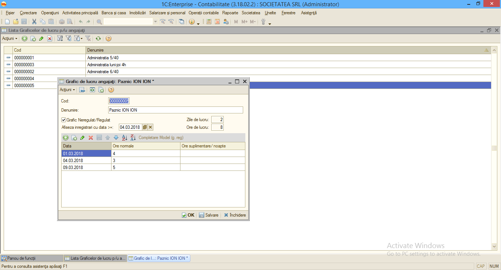
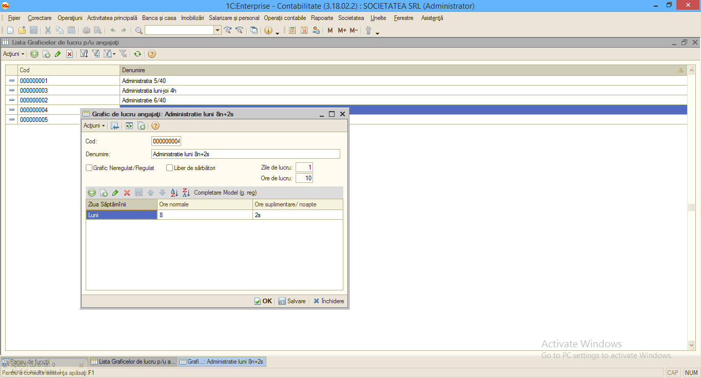
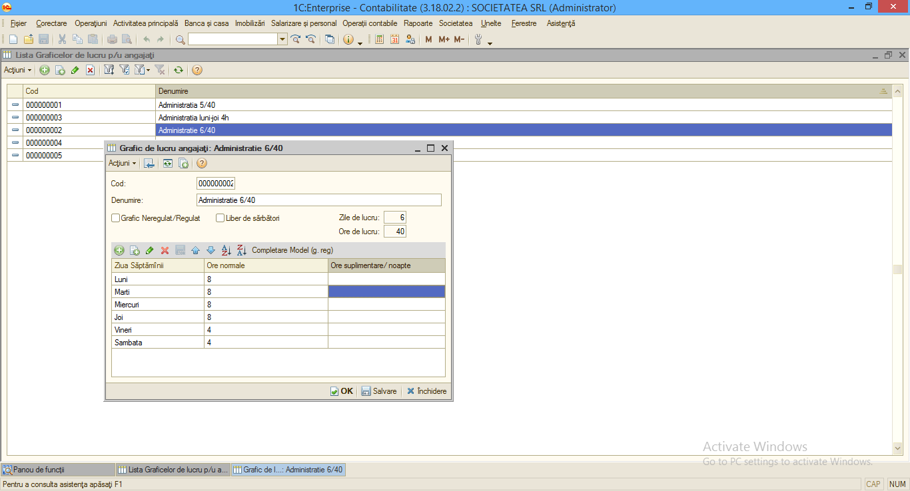
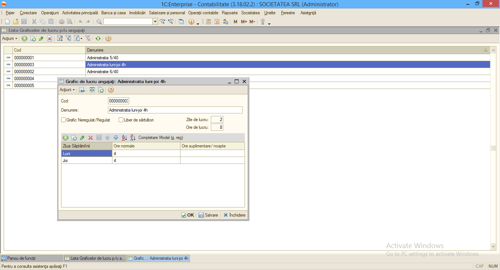
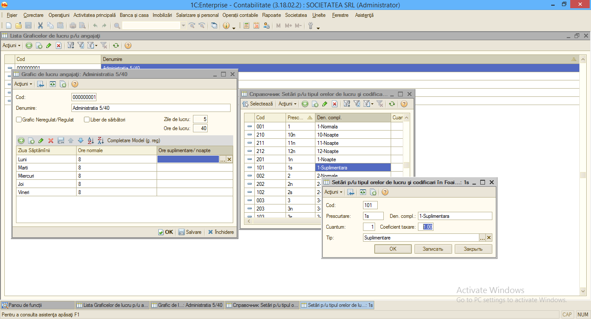
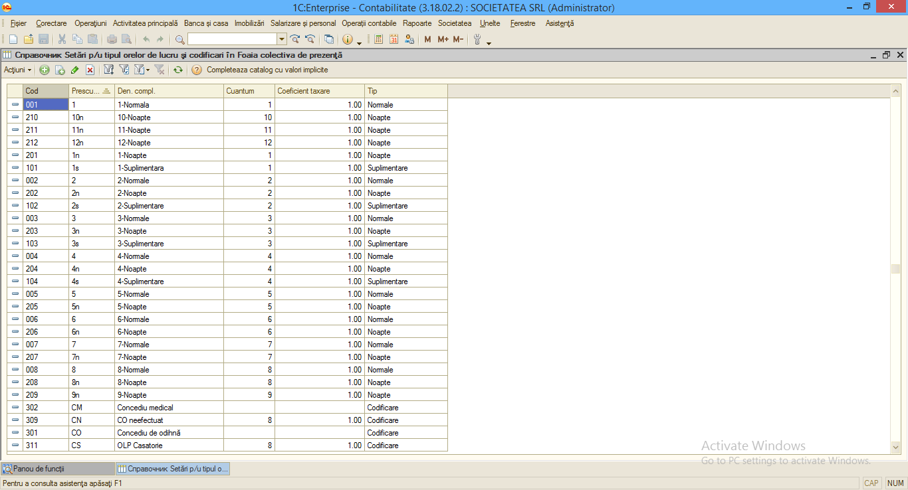
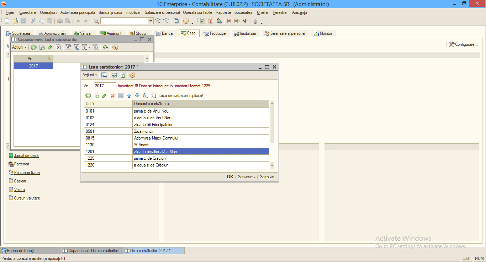
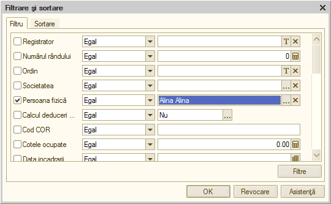
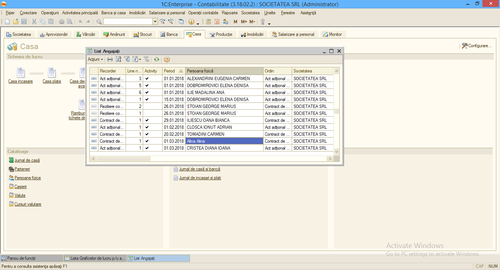
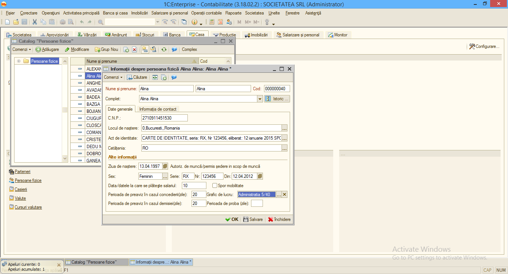
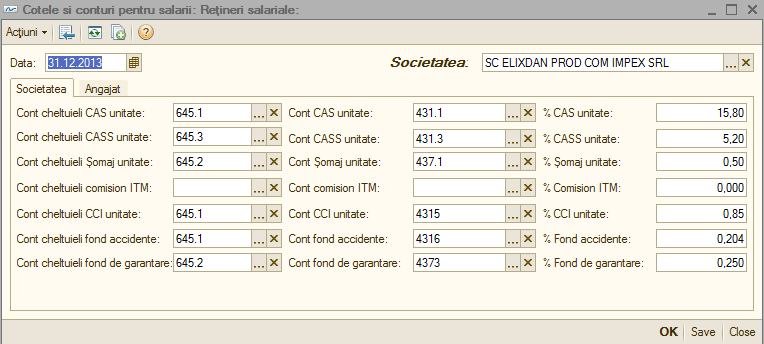
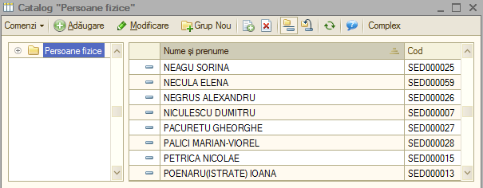
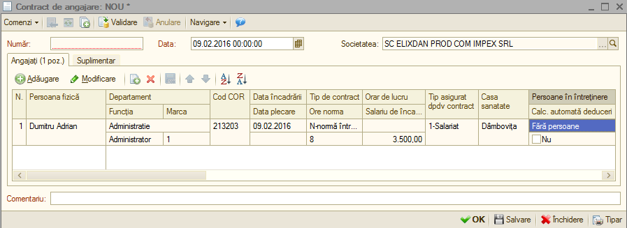
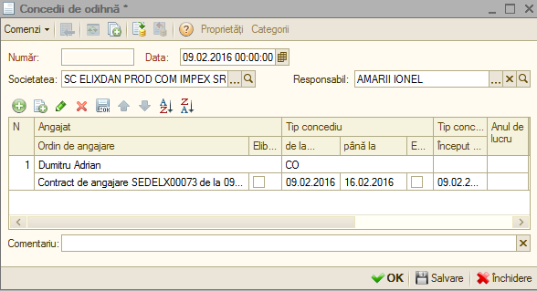
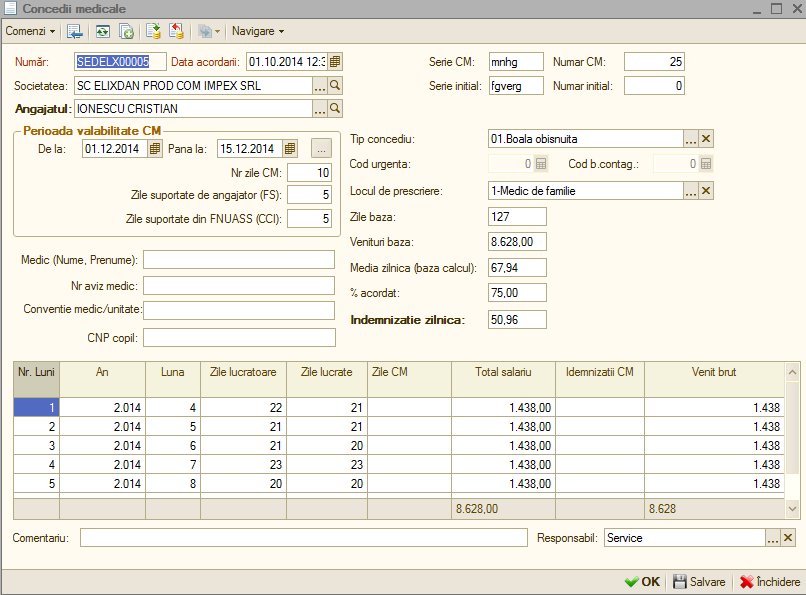
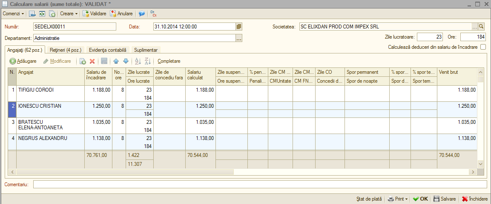
.. |image223| image:: media/image217.png
   :width: 5.84348in
   :height: 2.86282in
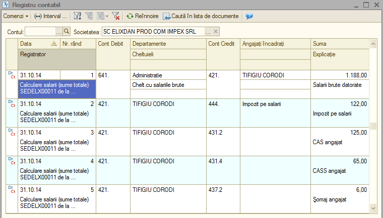
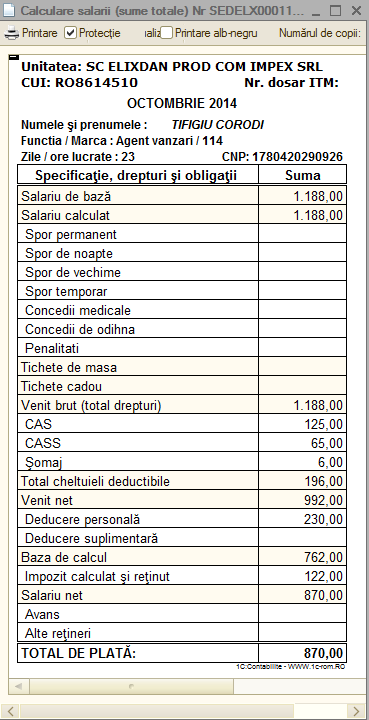
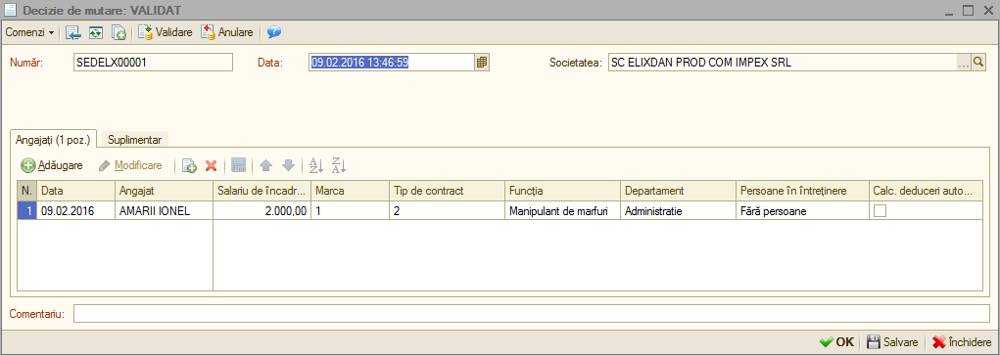
