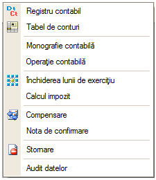
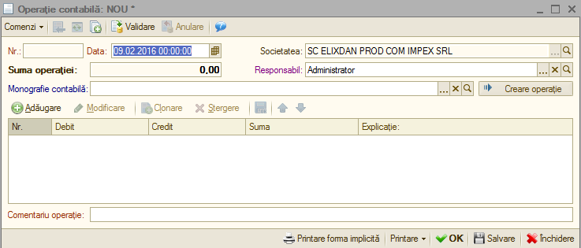
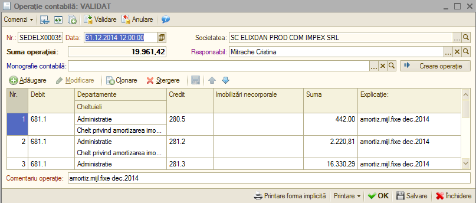
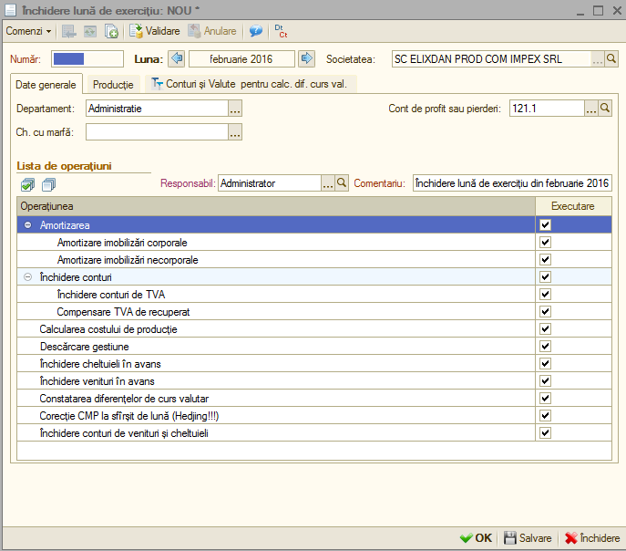
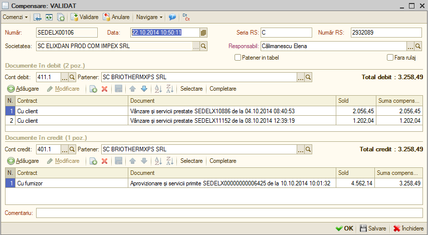

11. Operaţii contabile
======================

Structura meniului "**Operații contabile**" este următoarea:

|image227|

11.1. Operație contabilă
------------------------

Pentru operaţiunile ce nu pot sau nu sunt încă controlate automat de
program va trebui să încărcaţi operaţia contabilă. Selectaţi opţiunea
"**Operaţie contabilă**" (meniu: Operaţii contabile) şi butonul
"**Adăugare**". Pe ecran se va afişa fereastra (imaginea de jos).
Această opţiune de meniu este adresată exclusiv contabililor.
Introduceţi data înregistrării şi apoi notele contabile cu butonul
"**Adăugare**".

|image228|

Puteţi să introduceţi un comentariu pentru o identificare rapidă. O
caracteristică importantă a acestei operaţii contabile este faptul că
lună de lună înregistrările ei în mare parte se repetă, modificându-se
valorile implicate în operaţii.

De exemplu, primirea unei imobilizări de la locator si reflectarea
dobânzii datorate. Astfel, înregistrările contabile aferente sunt
înregistrate astfel:

|image229|

Ţinând cont de acest lucru, programul prezintă posibilitatea
înregistrării unor şabloane a notelor contabile care pot fi preluate
lună de lună şi modificate în sensul precizării valorii operaţiilor şi
adăugării sau ştergerii unor operaţii.

11.2 Închidere perioada de gestiune
-----------------------------------

Reprezintă etapa finală şi are o importanţă deosebită. Această etapă
presupune efectuarea închiderilor lunare propriu-zise.

Prin efectuarea închiderilor unei luni contabile se înţelege:

-  Calcularea amortizării;

-  Închiderea conturilor de TVA;

-  Calcularea costului de producţie;

-  Descărcarea de stocuri (en-detail);

-  Închiderea cheltuielilor în avans;

-  Constatarea diferențelor de curs valutar;

-  Închiderea conturilor de venituri şi cheltuieli.

Toate aceste operaţiuni sunt efectuate în mod automat de către
**1C:Contabilitate** cu documentul "**Închiderea lunii de exercițiu**"
şi apăsați butonul "**Adăugare**". Pe ecran se va afişa fereastra
(imaginea de jos):

|image230|

-  **Primul pas**: selectaţi luna de închidere cu ajutorul butoanelor
ataşate;

-  **Al doilea pas**: veţi selecta poziţiile, cu click, din lista de
operaţiuni. Poziţiile respective presupunând ce închideri trebuie
efectuate;

-  **Al treilea pas**: salvaţi şi validaţi documentul cu butonul
"**OK**" sau combinaţia "**Ctrl + Enter**".

După ce aţi salvat documentul veţi putea vedea formulele contabile. Vom
încerca să descriem mai detaliat acţiunile efectuate de către
**1C:Contabilitate** la validarea documentului pentru fiecare operaţiune
selectată în parte:

-  **Calcularea amortizării**

După ce veţi confirma casieria cu tasta "**Enter**" programul va
solicita să alegeţi partenerul. Fiind deja poziţionat pe acest câmp
aveţi mai multe soluţii de a alege partenerul:

-  **Închiderea conturilor de TVA**

Această opţiune va avea ca efect centralizarea tuturor notelor contabile
care conţin TVA deductibil (4426) şi TVA colectat (4427).

În momentul în care veţi valida documentul se vor calcula şi genera note
contabile de închidere a conturilor de TVA colectat şi TVA deductibil,
iniţial unul pe baza sumelor celuilalt, apoi urmând ca în funcţie de
valoarea cea mai mare să se închidă prin contul TVA de recuperat sau TVA
de plată.

Scopul final este de a solda contul de TVA de colectat şi TVA deductibil
şi de a lăsa cu sold, dacă este cazul, doar unul din conturile TVA de
recuperat şi TVA de plată. Dacă veţi selecta opţiunea de compensare TVA
de recuperat programul va închide unul prin altul în funcţie de soldul
avut anterior şi de valoarea actuală.

-  **Calcularea costului de producţie**

În funcţie de configurarea constantelor, inventarierea producţiei
neterminate şi raportul de producţie se va realiza calculul costului de
producţiei.

-  **Descărcarea de stocuri (en-detail)**

Descărcarea de stocuri en-detail este utilizată doar în cadrul
articolelor care se încarcă într-un depozit de tip "**En-detail**" şi
desigur la un preţ cu amănuntul. Încărcarea la preţ cu amănuntul se va
face la aprovizionare, în cadrul valorii pentru contul de marfă 371.2
încărcându-se şi valoarea contului de adaos comercial 378 şi TVA
neexigibil 4428. Această descărcare va efectua de fapt diminuarea
debitului contului de marfă 371.2 cu valorile conturilor de cheltuieli
de marfă 607, adaos comercial şi TVA neexigibil (toate acestea
aflându-se pe partea de debit).

Generarea efectivă a notei contabile de descărcare se va face pe baza
coeficientului mediu de descărcare al stocului. Formula de calcul a
acestuia este cea aferentă legislaţiei în vigoare. Trebuie precizat
faptul ca această descărcare este făcută doar la nivel valoric, generând
o formulă contabilă compusă din trei note contabile 607=371, 378=371 şi
4428=371.

Dacă doriţi să anulaţi descărcarea deja efectuată veţi deselecta poziţia
respectivă din listă şi veţi revalida documentul cu butonul "**OK**".

-  **Închiderea cheltuielilor în avans**

-  **Închiderea conturilor de venituri şi cheltuieli**

Această opţiune permite închiderea lunară a tuturor conturilor de
cheltuieli si venituri. În mod normal, după efectuarea acestei
operaţiuni toate conturile de venituri şi cheltuieli utilizate în luna
curentă trebuie să aibă sold final 0. După validarea documentului veţi
verifica deosebit de atent situaţia societăţii pe baza rapoartelor.

11.3. Compensare
----------------

Vom descrie compensarea facturii furnizorului. Pentru aceasta trebuie
mai întâi să aveţi introduse cele două tranzacţii în baza de date.

-  **Primul pas**: selectaţi opţiunea "**Compensare**" (meniu: Operaţii
contabile) şi butonul "**Adăugare**".

|image231|

-  **Al doilea pas**: introduceţi data compensării (conform procesului
verbal de compensare) şi selectaţi apoi partenerul debitor.

Acţionaţi butonul "**Selectare**" - pe ecran va fi afişată lista
facturilor, din care putem selecta valoarea unui întreg document, în
vederea compensării, sau preciza doar o parte a ei. Pentru a selecta
factura şi a introduce în același timp o valoare parţială, în lista de
căutare, veţi bifa câmpul "**Suma încasată**" poziţionat în subsolul
listei. Selectaţi întreaga valoare afişată, printr-un DubluClicMouse
asupra poziţiei cu documentul dorit şi după aceea apăsați"**OK**".

Valoarea va fi înscrisă în grila de detaliu a debitului "**Documente în
debit**". Selectaţi partenerul creditor (acelaşi partener), iar din
lista documentelor, deschisă prin intermediul butonului "**Selectare**",
valoarea corespunzătoare celei selectată la partenerul din debit.
Salvaţi înregistrarea şi compensarea a fost încheiată.

