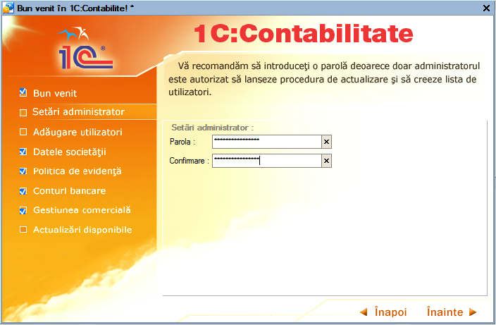
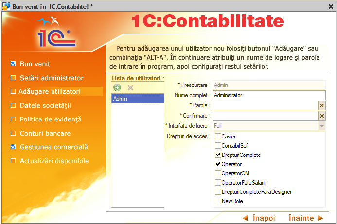
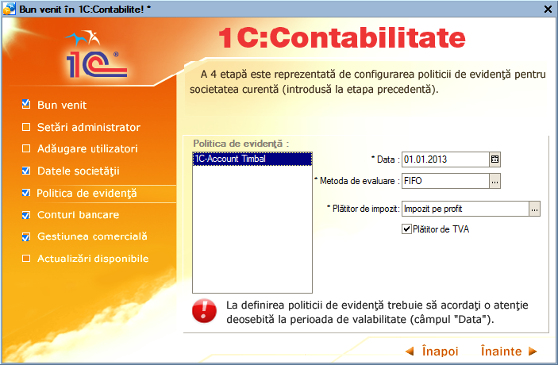
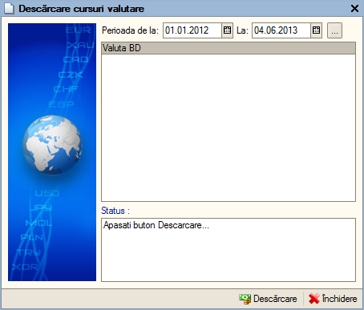

1.Introducere în 1C:Contabilitate
=================================

**1C:Contabilitate** este un sistem integrat, complex și complet
destinat nu numai înregistrării operațiunilor contabile și poate fi
utilizat de alte departamente din cadrul unei firme, cum sunt:
aprovizionarea, gestiunea, producția și vânzarile. De asemenea,
aplicația este concepută să raspundă cerințelor managementului companiei
prin furnizarea de analize, statistici și rapoarte economico-financiare
cât și contabile conform legistlației în vigoare.

Începând cu acest capitol vom descrie modalitatea de operare în
programul **1C:Contabilitate** şi efectuarea unor operaţiuni ce vor avea
drept rezultat introducerea informaţiilor în decursul unei luni de
exercițiu.

***Atenție!** Menţionăm încă de la început că modalităţile prezentate
nu exploatează toate facilităţile oferite de **1C:Contabilitate**, având
drept scop doar familiarizarea cu funcțiile de bază.

Pentru a ajunge la o exploatare cât mai corectă și mai completă a
sistemului, este foarte important primul pas şi anume introducerea
datelor de bază ale societății. Astfel, vom introduce împreună lista de
utilizatori, datele despre societatea nouă, politica de evidenţă, lista
de conturi bancare, lista depozitelor și vom configura gestiunea
comercială.

1.1.Înregistrarea informațiilor de bază ale unei societăți
----------------------------------------------------------

De la prima lansare **1C:Contabilitate** vă permite să parcurgeţi o cale
mai dinamică pentru introducerea datelor de pornire,astfel se va lansa
automat în execuţie un ***ghid de pornire***.

Prima pagină conţine explicaţii generale. În partea stângă sunt afişate
toate paginile care vor trebui parcurse şi este afișată pagina curentă.
Pentru a trece la următoarea pagină trebuie să apăsați butonul
"**Înainte**" sau veţi selecta direct pagina dorită printr-un click pe
denumirea acesteia. Dacă o pagină a fost parcursă şi în acelaşi timp
s-au introdus datele obligatorii, atunci pagina respectivă va apărea ca
bifată. Recomandăm să respectați ordinea acestor pași și să îi
parcurgeți pe toți pentru o bună funcționare a sistemului
**1C:Contabilitate**.

|image1|

Introducerea primelor date în **1C:Contabilitate**. În cadrul acestei
pagini vom defini parola pentru administrator (utilizator cu drepturi de
acces depline). Vă recomandăm să introduceţi o parolă deoarece doar
administratorul este autorizat să lanseze procedura de actualizare şi să
creeze lista de utilizatori. Dacă aţi introdus parola şi aţi reuşit
confirmarea, atunci pentru a trece la crearea listei de utilizatori
trebuie doar să apăsați butonul "**Înainte**".

|image2|

Următoarea pagină vă permite să definiţi lista de utilizatori. Pentru
adăugarea unui utilizator nou puteţi folosi butonul "**Adăugare**" din
bara de navigare sau combinaţia de taste "**ALT-A**".

În continuare trebuie configurate informaţiile generale pentru fiecare
utilizator prin atribuirea unui nume şi a unei parole de acces în
sistem. De asemenea, trebuie să specificați interfaţa de lucru şi să
selectați nivelul de acces pentru fiecare utilizator în parte. Pentru a
defini restul setărilor veţi accesa utilizatorul dorit din catalogul
"**Utilizatori**" (catalogul se află localizat astfel: ***Societatea →
Utilizatori***) *.*

Dacă aţi terminat cu definirea utilizatorilor, urmează să treceţi la
următoarea pagină cu butonul "**Înainte**".

|image3|

În pagina "**Datele societăţii**" vom crea societatea de lucru şi prin
urmare va trebui să introduceţi principalele date informative despre
aceasta (prescurtarea, denumirea completă, codul unic de înregistrare
(CUI) , numărul de înregistrare la Registrul Comerţului (ORC) ,
principalul cod CAEN). Acţionaţi butonul "**Adăugare**" sau combinaţia
"**ALT-A**" ( litera "**A**" din eticheta butonului este subliniată şi
reprezintă un shortcut). După ce societatea a fost creată, va fi
necesară doar selectarea ei din catalogul de societăţi.

Ulterior, pentru a efectua modificări asupra datelor societăţii sau
pentru a introduce restul datelor informative (cum ar fi: adresa,
conturi bancare, prefix documente, etc.), puteţi accesa înregistrarea în
cauză din catalogul de societăţi (catalogul este localizat astfel
"***Societatea → Societăţi***").

|image4|

A patra etapă este reprezentată de configurarea politicii de evidenţă
pentru societatea curentă (introdusă la etapa precedentă). În acest caz
se vor seta:

-  metoda de evaluare stocuri: **FIFO** (First IN → First OUT), **LIFO**
(Last In → First OUT) sau **CMP** (Cost Mediu Ponderat);

-  plătitor de impozit: impozit pe profit sau impozit pe
microîntreprinderi (impozit pe venit) ;

-  dacă societatea curentă este plătitoare de TVA atunci veţi bifa
căsuţa respectivă.

***Atenţie!** La definirea politicii de evidenţă trebuie să acordaţi o
atenţie deosebită la perioada de valabilitate (câmpul "**Data**").
Perioada de valabilitate permite variaţia în timp a taxelor şi
impozitelor (în cazul nostru: metoda de evaluare stocuri, plătitor de
impozit şi TVA, politica de TVA (emitere sau încasare), ceea ce înseamnă
că fiecare valoare este introdusă la o dată exactă şi este valabilă şi
pentru perioada următoare, până nu se fac noi modificări în politica de
evidenţă. Valorile precedente sunt păstrate şi pot fi vizualizate.

|image5|

După ce aţi terminat de definit politica de evidenţă, atunci cu butonul
"**Înainte**" treceţi la următoarea pagină. Introduceţi lista de conturi
bancare pe care societate le deține. La început selectaţi societatea pe
care ați înregistrat-o anterior. Puteţi verifica dacă contul IBAN
introdus este corect acţionând butonul ataşat "lupă". Pentru a completa
câmpul "**Banca**", apăsaţi butonul de selectare "**...**". Selectaţi
banca din listă. Pentru adăugarea unei bănci noi, apăsaţi butonul
"**Adăugare**" sau tastaţi "**INSERT**".

|image6|

Continuați să completați restul câmpurilor respectiv "**Valuta**" şi
"**Tipul de cont**". Dacă aţi terminat de introdus contul bancar, atunci
aţi observat că a fost adăugată o înregistrare în lista de conturi
bancare. Dacă mai există conturi bancare pe care le utilizați în
desfășurarea activității dumneavoastră și nu au fost introduse atunci va
trebui să reluați procedura de adăugare a unei înregistrări noi. Aveţi
posibilitatea să specificaţi valoarea implicită, care va fi preluată din
câmpul "**Contul bancar**" în documentele ce vor fi introduse ulterior.
Pentru aceasta selectaţi din listă contul dorit şi apăsaţi butonul
"**Implicit**". După ce aţi introdus toate conturile bancare ale
societăţii, v-a trebui să apăsați butonul "**Înainte**".

Acum trebuie să definiți lista de depozite (gestiuni) din cadrul
societăţii.

|image7|

În lista de depozite veţi observa că este deja selectat ca implicit
"Depozit", logica existenţei acestei setări este că orice întreprindere
are măcar o gestiune (depozit). Dacă nu aveţi în companie nici un
depozit căruia să i se potrivească această denumire, atunci puteți să
modificaţi această înregistrare. Apăsaţi click pe câmpul "Denumire" și
înlocuiţi acum denumirea depozitului "Depozit" cu ceea ce se dorește, de
exemplu "Magazin". Astfel, denumirea s-a schimbat şi în lista de
depozite. Continuaţi cu alegerea valorii în câmpul "Tipul de depozit".
Dacă evidenţa gestiunii se ţine după metoda global-valorică se va bifa
opţiunea respectivă. În cazul metodei global-valorice programul oferă
posibilitatea să introduceţi la cumpărare şi vânzare fiecare articol din
factură şi apoi să listaţi după caz NIR-ul sau factura fiscală. Deşi
veţi introduce mai multe rânduri în grila documentului, programul va
genera formula contabilă pentru o gestiune global-valorică. Pentru a
utiliza această facilitate accesați meniul "Activitatea principală →
Depozite" selectăm depozitul și pe fila caracteristici selectăm bifa
"Evidența se ține global valoric (cont:371.2)" și bifa "Introducere
articole pentru a lista NIR-ul și factura" ca în imaginea de mai jos .

|image8|

**Atenţie!** Datele introduse pot fi modificate şi completate ulterior.
Catalogul de depozite este localizat în meniul: "**Activitatea
principală / Depozite**".

Dacă în cadrul societății dumneavoastră există şi alte depozite le
puteți introduce cu ajutorul butonului "**Adăugare**". Ultima pagină
oferă informaţii privind versiunea curentă a programului şi
actualizările disponibile. Astfel dacă există o conexiune la internet
aveţi posibilitatea online să verificaţi existenţa lor apăsând butonul
"**Verificare**". Vă reamintim că această fereastră oferă doar
informaţii despre actualizările disponibile şi nu lansează procedura de
actualizare propriu-zisă. Are rolul de a căuta cu ajutorul unei
conexiuni la internet, dacă există actualizări ale versiunii curente de
configurație ce vor putea fi instalate ulterior.

|image9|

De la butonul "**Descărcare cursuri valutare**" se pot descărca automat
cursul valutar al fiecărei zile din perioade selectate de pe site-ul
Băncii Naționale a României și acestea vor fi stocate automat în sistem.

|image10|

După ce se termină descărcarea cursului valutar o să apară mesajul de
mai jos.

|image11|

În partea de jos aţi observat că în loc de butonul "**Înainte**" a
apărut butonul "**Finalizare**".

|image12|

Dacă aţi urmat întocmai îndrumările noastre, ceea ce am realizat în
acest moment este crearea listei de utilizatori, introducerea datelor
principale despre societate, definirea politicii de evidenţă,
introducerea listei de conturi bancare şi depozite. Aşadar apăsaţi
butonul "**Finalizare**" și ca efect, pe ecran va apărea mesajul:
"**Salvaţi modificările efectuate?**". Aveţi la dispoziţie două opţiuni
clare:

-  salvarea datelor introduse apăsând butonul "**Da**" (astfel datele
vor fi salvate în sistem);

-  renunţarea la datele introduse apăsând butonul "**Nu**" (în acest caz
informațiile care le-am introdus anterior nu vor fi salvate), se
consideră că aţi abandonat înregistrarea, iar după aceasta toate
datele trebuie reintroduse.

Dacă nu ați introdus aceste informații sau doriți să efectuați
modificări după ce a fost lansată aplicația **1C:Contabilitate** acest
ghid de pornire se poate accesa din meniul "***Asistența** → **Bun venit
în 1C:Contabilitate!***".

.. |image1| image:: media/image2.png
   :width: 6.48622in
   :height: 4.24921in

.. |image4| image:: media/image5.png
   :width: 6.92283in
   :height: 4.5126in

.. |image6| image:: media/image7.png
   :width: 6.92638in
   :height: 4.53346in
.. |image7| image:: media/image8.png
   :width: 6.49803in
   :height: 4.24842in
.. |image8| image:: media/image9.png
   :width: 4.71929in
   :height: 3.37559in
.. |image9| image:: media/image10.png
   :width: 6.9252in
   :height: 4.57835in

.. |image11| image:: media/image12.png
   :width: 2.35433in
   :height: 1.0311in
.. |image12| image:: media/image10.png
   :width: 6.9252in
   :height: 4.57835in
