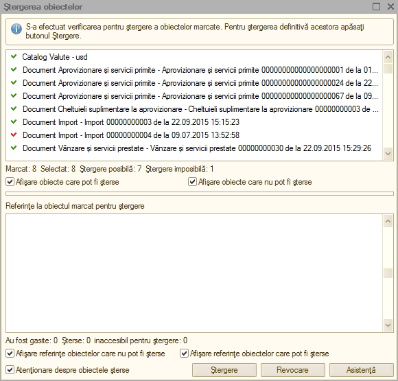
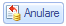
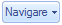
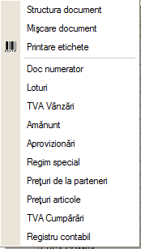
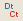
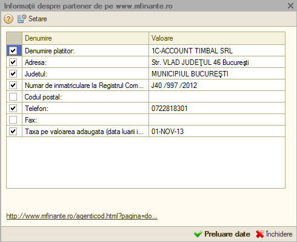
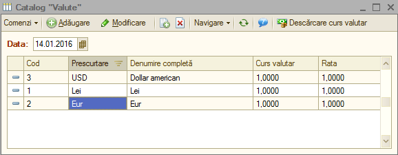
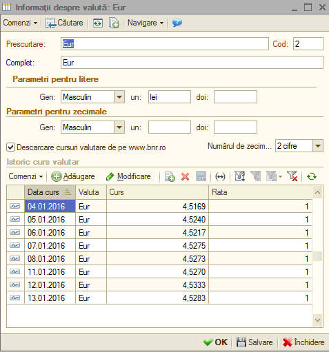

3. Butoane și funcții 1C:Contabilitate
======================================

Pentru a vă familiariza mai rapid cu modul de operare în sistemul
**1C:Contabilitate** va fi benefică cunoaşterea următoarelor explicaţii
cu privire la "butoanele" și funcțiile pe care acestea le îndeplinesc.

3.1. Butoane 1C:Contabilitate
-----------------------------

Astfel, în majoritatea ferestrelor pentru a opera mai eficient în
această aplicație o să fie prezente următoarele butoane:

**1. Butonul** |image15|- "**Adăugare**" **(Insert**) are rolul de a
adăuga nouă înregistrare în listă;

**2. Butonul** |image16|-"**Modificare**" **(F2)** după cum îi este şi
denumirea, este util pentru modificarea anumitor informaţii sau
documente;

**3. Butonul** |image17|-"**Adăugare prin clonare**"(**F9**). Este
folosit pentru uşurarea muncii și economisirea timpului de operare. Se
poate folosi în cazul în care facem adăugarea în listă a unui nou
document pe care îl utilizăm în mod frecvent şi multe informaţii rămân
neschimbate (de exemplu: depozitul, furnizorul sau clientul, suma etc.).

***Atenţie!** Toate informațiile vor fi preluate automat din elementul
/ documentul care a fost selectat în momentul accesări butonului
"**Adăugare prin clonare**". Aceste informații trebuie verificate, iar
cele care nu corespund cerințelor dumneavoastră trebuie modificate (cum
ar fi: data, prețul, cantitatea, partenerul).

**4. Butonul** |image18|-"**Setează marcarea pentru ştergere**"
(**Del**), dar în acelaşi timp este folosit şi pentru anularea acestei
marcări pentru ştergere. Pentru a şterge obiectul marcat pentru
ştergere, trebuie să intrăm la "***Operaţiuni → Ştergerea* *obiectelor
marcate***", vom accesa butonul "**Verificare**".

|image19|

În urma acestei verificări vom vedea dacă obiectul marcat pentru
ştergere poate fi şters (dacă apare bifa de culoare verde obiectul poate
fi șters, iar dacă apare culoarea roşie înseamnă că nu poate fi şters
din cauza că acest obiect poate fi legat de alt document și poate
influența buna funcționare a operaţiilor care urmează a fi
înregistrate).

|image20|

**5. Butonul** |image21|- "**Setează intervalul de timp**" este folosit
pentru setarea intervalului de timp. De exemplu, dacă dorim ca din lista
de facturi de aprovizionare să le vizualizăm doar pe cele dintr-o
anumită perioadă, putem seta perioada dorită.

***Atenţie!** Introducem la "**Interval arbitrar**" perioada care ne
interesează şi accesăm butonul "**OK**".

Pentru a anula această opţiune setată putem accesa din nou butonul cu
setarea perioadei, ştergem perioada introdusă şi accesăm butonul
"**OK**".Altă variantă este aceea de a închide fereastra cu lista de
aprovizionări şi să intrăm din nou în listă.

|image22|

**6. Butonul** |image23|- "**Creare pe baza**" este util pentru
economisirea timpului de introducere a datelor informaționale în
program. Astfel, pe baza unui document creat se pot prelua datele în
alte tipuri de documente nemaifiind necesar să introducem din nou aceste
date. De exemplu, dacă am introdus o factură de la furnizor şi în
acelaşi timp trebuie să introducem plata, putem accesa butonul "**Creare
pe baza**" şi alegem "**Dispoziţie de plată**" (datele din factură se
păstrează, noi vom introduce seria şi numărul chitanţei de plată).
Observăm că am parcurs mai repede paşii, nu a mai fost nevoie să intrăm
la meniul "***Banca si casa → Dispoziţie de plată***" şi să facem o nouă
adăugare. Dacă suntem poziţionaţi cu click pe factura la care dorim să-i
operăm plata şi accesăm butonul "**Creare pe baza**", în urma acestei
accesări se va deschide următorul meniu derulant:

|image24|

***Atenţie!** Acest buton îl întâlnim în mai multe ferestre ale
programului şi are funcţii diferite în funcție de locul unde este
amplasat.

**7. Butonul** |image25|- "**Filtrare**" este folosit pentru filtrarea
şi sortarea unui număr foarte variat de operaţii. De exemplu, putem
filtra lista de aprovizionări, vânzări, dispoziţii de plată / încasare
după un anume depozit, număr NIR, partener, tipul operaţiei sau suma
documentului.

|image26|

**8. Butonul** |image27|- "**Dezactivarea filtrării**" are ca efect
dezactivarea filtrării făcute anterior.

**9. Butonul** |image28|- "**Validare**" este folosit pentru validare
documentelor din sistem, mai exact înregistrarea lor din punct de vedere
contabil făcându-se trecerea în registrul contabil . Documentele pot fi
salvate dar, dacă acestea nu sunt validate și au starea de "**Anulat**"
nu generează note contabile.

**10. Butonul** |image29|- "**Anulare validare**" devalidează
documentele care au fost validate anterior, astfel, sistemul
**1C:Contabilitate** le scoate din evidență până la o eventuală
revalidare.

**11. Butonul** |image30|-"**Navigare**" are o multitudine de
facilităţi, astfel dacă suntem poziţionaţi cu click pe o factură din
lista de aprovizionări sau vânzări şi vrem să ştim dacă a fost achitată
– pentru uşurinţă accesăm butonul "***Navigare** → **Structură document
***" și vom vedea dacă această factură a fost achitată. În urma
accesării butonului "**Navigare**" din lista de aprovizionări apare
următoarea fereastră:

|image31|

**12. Butonul** |image32|- "**Actualizează lista curentă**" care
actualizează lista deasupra căreia este amplasat.

**13. Butonul** |image33| - "**Registru contabil**" este folosit pentru
vizualizarea notelor contabile.

**14.Butonul** |image34| **-** "**Deschidere asistență integrată**" pune
la dispoziția utilizatorului informații suplimentare referitoare la
documentul sau operațiunea pe care ați accesat-o.

**15. Butonul** |image35| **-** "**Printare**"**-** din lista
"**Aprovizionări si servicii primite**" sau "**Vânzare și servicii
prestate**" deschide NIR-ul aferent facturii sau factura fiscală în
varianta de printare fără ca factura respectivă să mai fie deschisă și
vizualizată ușurând astfel munca celui care operează în aplicație.

**16. Butonul** |image36| **-** "**Printare**" - din Catalogul
"**Nomenclator de articole**" are rolul de a afişa "**Fişa de
magazie**","**Mişcare articole**" și stocul minim pentru articolul unde
suntem poziţionaţi . Observăm că este mult mai accesibil folosirea
acestui buton, decât accesarea meniului ''***Rapoarte** → **Stocuri***
→" **Mişcare articole**'' sau ''**Fişa de magazie**''.

**17. Butonul** |image37|- "**Fișiere**" acest buton îl vom folosi
atunci când vom dori să introducem informaţii suplimentare pentru un
anume articol, întrucât avem posibilitatea de a adăuga şi o imagine
pentru un anumit produs.

**18. Butonul** |image38|- "**Imagine**". În cazul în care pentru un
anume produs avem selectată o imagine, dacă ne poziţionăm cu un click pe
produsul respectiv, în urma accesării butonului se va afișa imaginea
produsului.

**19. Butonul** |image39|- "**Mutare element în alt grup**"
(**Ctrl+Shift+M**) îl folosim atunci când se dorește mutarea unui
element dintr-un grup în altul.

**20. Butonul** |image40| "**Adăugare grup**" (**Ctrl+F9**) îl folosim
atunci când vrem să adăugăm un grup nou de articole, de depozite,
parteneri sau imobilizări.

**21. Butonul** |image41|- "**Căutare după număr**", acest buton îl
găsim în lista facturilor de vânzare şi are ca efect căutarea unei
facturi dintr-o anumită perioadă care ne interesează.

**22. Butonul** |image42|- "**Funcțiunea contului**"- îl folosim atunci
când vrem să schimbăm contul şi observăm că acesta nu apare, de exemplu,
în factura de aprovizionare sau de vânzare. Pentru a nu mai accesa acest
buton, de fiecare dată când vrem să schimbăm contul, intrăm la
"***Societatea → Utilizatori*** '', la setări şi punem bifa la
"**Afişare conturi de evidenţă în documente**".

**23. Butonul** |image43|- "**Selectare**" (**F4**) - deschide un
catalog în vederea selectării unui articol sau a unei informații.

**24. Butonul** |image44| **-** "**Deschide**" (**Ctrl+Shift+F4**) -
deschide o filă în care pot fi introduse sau modificate anumite
informații sau detalii.

**25. Butonul** |image45|- "**Afișează informații despre program**" are
ca efect afişarea informaţiilor despre program, de exemplu, versiunea
existentă, sau calea unde este salvată baza de date.

3.2. Funcții ale sistemului 1C:Contabilitate pentru preluarea automată a informațiilor
--------------------------------------------------------------------------------------

Aplicația **1C:Contabilitate** pentru a opera mai simplu și într-un timp
cât mai scurt are integrate câteva funcții de preluare a informațiilor
de pe anumite site-uri oficiale din România:

1. Preluarea automata a informațiilor de contact ale partenerilor,
clienților, clienților potențiali, furnizori, etc. de pe site-ul
`www.mfinante.ro <http://www.mfinante.ro/>`__.

La crearea unui partener nou sau modificarea datelor despre acesta
(denumire, adresă, număr de telefon/fax, număr O.R.C., nu trebuie decât
să introducem CUI-ul (Codul unic de înregistrare) și dăm click pe
butonul "**Deschide** |image46|".

|image47|

Ca urmare a apăsării acestui buton o să se deschidă următoarea
fereastră.

|image48|

Va apărea o fereastră cu informațiile care au fost descărcate despre
partener. Dacă dăm dublu click pe valoare putem edita aceste date precum
și posibilitatea de a bifa ce anume ne dorim ca programul să preia.

În momentul în care am terminat editarea putem apăsa butonul "**Preluare
date**". Efectul apăsării acestui buton va fi ca datele din tabel care
sunt bifate să fie copiate automat pe fila "**Informații despre
partener**".

2. Descărcarea cursurilor valutare a fiecărei zile de pe site-ul oficial
al Băncii Naționale ale României respectiv
`www.bnr.ro <http://www.bnr.ro/>`__. Sunt disponibile două variante:

-Prima varianta este descărcarea cursului din ghidul de pornire
prezentat în capitolul 1.1. la pagina 8, care poate fi deschis din
meniul "***Asistența** → **Bun venit în 1C:Contabilitate!***" iar pe
ultima filă există posibilitatea de a descărca cursul.

-A doua variantă și cea mai folosită de altfel, este din meniul
"***Banca și casa → Cursuri valutare***".

În primă fază trebuie să accesați meniul "***Banca* *și casa →
Valute***" și cu dublu click vom selecta valuta/ele pentru care ne
interesează să descărcăm cursul. Dacă în această listă nu este prezentă
nici o valută o puteți adăuga dând click pe butonul adăugare sau apăsând
tasta "**Insert**" sau butonul "**Adăugare**".

|image49|

După ce selectăm o valută va apărea fereastra de mai jos.Există
posibilitatea descărcării automate a cursului valutar pentru o anumită
perioadă sau zi, însă se poate adăuga și manual în urma consultării
site-ului BNR. Pentru a se descărca automat cursurile valutare trebuie
sa aveți bifat "**Descărcare cursuri valutare de pe
`www.bnr.ro <http://www.bnr.ro/>`__**" și numărul de zecimale de care
aveți nevoie. În imaginea de mai jos este prezentată varianta manuală de
introducere a cursului valutar. După aceasta apăsați "**OK**" pentru
salvare și închidere.

|image50|

Mai departe, pentru a descărca automat cursurile valutare de pe site-ul
BNR, intrăm în meniul "***Banca și casa → Cursuri valutare***".

|image51|

Apăsați butonul "**Descărcare**".Ca urmare a apăsării acestui buton se
va deschide fereastra de mai jos. Se selectează perioada și valuta
pentru care se dorește a fi descărcat cursul valutar.

|image52|

După ce ați terminat de setat perioada și valuta apăsați din nou butonul
"**Descărcare**".

|image53|

După ce s-a terminat procedura de descărcare a cursului o să vă apară
mesajul din imaginea de mai sus "**Cursul valutar a fost descărcat cu
succes!**".Apăsați butonul "**OK**" și "**Închidere**".Vom intra din nou
în meniul "**Banca și casa**" ***→***"**Valute**", selectăm valuta
pentru care s-a dorit descărcarea cursului și vom regăsi lista de
cursuri valutare pentru perioada specificată.

|image54|

Astfel, cursul valutar specific fiecărei valute va fi înregistrat pentru
fiecare zi în parte în sistemul **1C:Contabilitate**.

3. Verificarea politicii de TVA a partenerilor care este prezentată la
capitolul TVA la încasare.

.. |image15| image:: media/image15.png
   :width: 0.86111in
   :height: 0.26944in

.. |image17| image:: media/image17.png
   :width: 0.26944in
   :height: 0.26944in
.. |image18| image:: media/image18.png
   :width: 0.26944in
   :height: 0.26944in
.. |image19| image:: media/image19.png
   :width: 4.82609in
   :height: 4.88819in

.. |image22| image:: media/image22.png
   :width: 3.66929in
   :height: 3.20748in
.. |image23| image:: media/image23.png
   :width: 0.35625in
   :height: 0.27847in
.. |image24| image:: media/image24.png
   :width: 3.02165in
   :height: 3.15709in
.. |image25| image:: media/image25.png
   :width: 0.61736in
   :height: 0.26944in
.. |image26| image:: media/image26.png
   :width: 5.15652in
   :height: 3.29565in
.. |image27| image:: media/image27.png
   :width: 0.26111in
   :height: 0.27847in
.. |image28| image:: media/image28.png
   :width: 0.68681in
   :height: 0.26944in

.. |image32| image:: media/image32.png
   :width: 0.26111in
   :height: 0.24375in

.. |image34| image:: media/image34.png
   :width: 0.26944in
   :height: 0.24375in
.. |image35| image:: media/image35.png
   :width: 0.25in
   :height: 0.23976in

.. |image37| image:: media/image37.png
   :width: 0.25in
   :height: 0.25in
.. |image38| image:: media/image38.png
   :width: 0.25in
   :height: 0.22913in

.. |image40| image:: media/image40.png
   :width: 0.75625in
   :height: 0.24375in
.. |image41| image:: media/image41.png
   :width: 0.26111in
   :height: 0.22639in

.. |image43| image:: media/image43.png
   :width: 0.17717in
   :height: 0.2189in
.. |image44| image:: media/image44.png
   :width: 0.19803in
   :height: 0.23976in

.. |image46| image:: media/image46.png
   :width: 0.16528in
   :height: 0.2in
.. |image47| image:: media/image47.png
   :width: 5.42609in
   :height: 4.77924in

.. |image50| image:: media/image50.png
   :width: 4.38261in
   :height: 3.61914in
.. |image51| image:: media/image51.png
   :width: 4.45217in
   :height: 3.04889in
.. |image52| image:: media/image52.png
   :width: 4.74016in
   :height: 4.03071in
.. |image53| image:: media/image53.png
   :width: 4.31304in
   :height: 3.6552in

