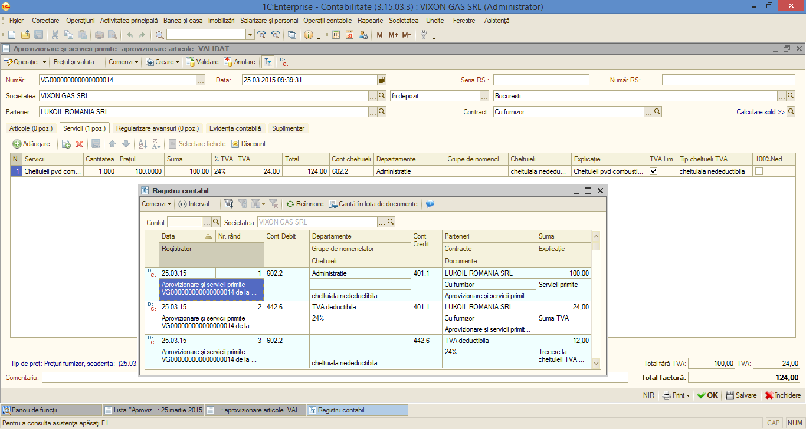

5. TVA nedeductibil și Tva cu deductibilitate limitată
======================================================

Pentru deductibilitatea limitată sau tva nedeductibil total generat în
mod automat în **1C:Contabilitate** se procedează în următorul mod:în
documentul de aprovizionare și servicii primite, pe fila de servicii se
alege serviciul primit, cantitatea, prețul, suma, contul de cheltuială,
tipul de cheltuială. Dacă se optează pentru tva cu deductibilitate
limitată se bifează doar această căsuța, iar la tipul de cheltuieli TVA
, se alege tipul de cheltuială (deductibilă sau nedeductibilă).

|image86|

Dacă se optează pentru tva nedeductibil total, se pune bifa atât la TVA
limitat cat și la 100% nedeductibil.

|image87|

Tva –ul cu deductibilitate limitată funcționează atât pentru servicii
cât și pentru articole și imobilizări.

