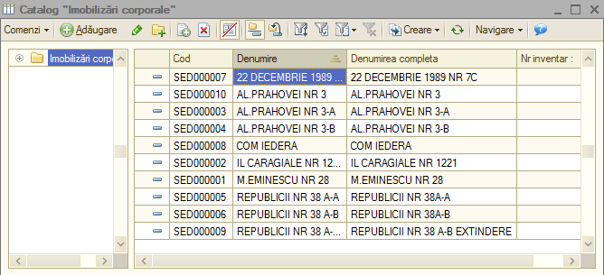
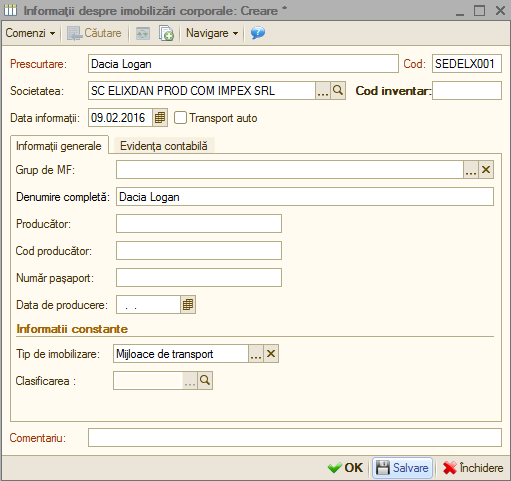
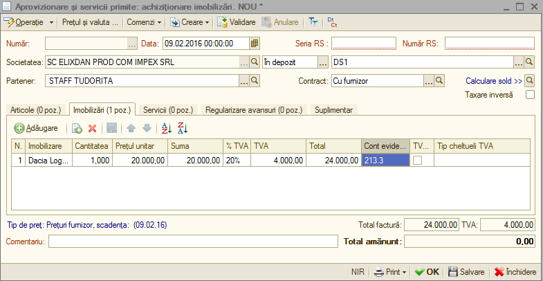

8. Imobilizări
==============

Structura meniului „ **Imobilizări** ” este construită astfel:

-  Catalog „Imobilizări corporale”;

-  Punere in evidența MF;

-  Fișa mijlocului fix

-  Grafic de amortizare MF

-  Jurnal de amortizare.

-  Transfer MF;

-  Modernizare MF;

-  Reevaluare MF

-  Casare MF;

-  Inventarierea MF;

-  Catalog „Imobilizări necorporale”;

-  Punere in evidenta imobilizări necorporale;

-  Casare imobilizări necorporale;

-  Jurnal de amortizare imobilizări necorporale;

-  Parametri de amortizare;

**Catalog „Imobilizări corporale”**

Presupunem următorul exemplu – Vom achiziționa o imobilizare corporală
(în cazul nostru o mașina Dacia Logan) pe care va trebui să o punem în
funcțiune.

Pentru a introduce o imobilizare nouă intrăm la rubrica - Catalog
„ **Imobilizări corporale** ” și accesăm butonul „ **Adăugare** ”;
se va deschide următoarea fereastra unde vom completa datele referitoare
la imobilizarea nouă.

|image228|

Apoi vom intra la *Activitate principală → Aprovizionare și servicii
primite* pentru a face achiziția imobilizării, accesăm butonul
„ **Adăugare** ”, iar de la „ **Operații** ” selectăm
„ **Achiziționare** **imobilizări** ”, completăm antetul facturii,
alegem imobilizarea nou adăugată, completăm suma, contul aferent acestei
operațiuni și apoi vom valida factura.

|image212|

