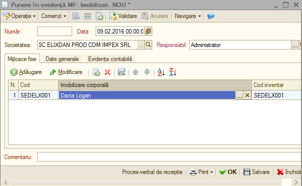
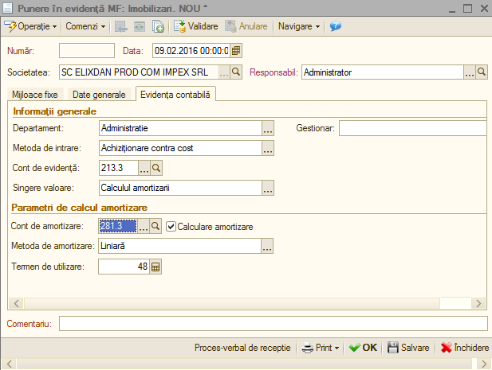
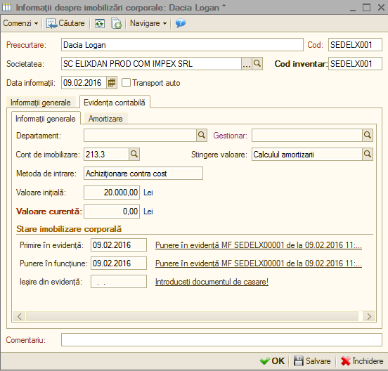

9. Mijloace fixe
================

Următorul pas este punerea în evidență a imobilizării achiziționate,
pentru această va trebui să intrăm la: *Imobilizări → Punere în evidență
MF* unde vom accesa butonul „ **Adăugare** ”, în urma acestei accesări
apare următoarea fereastră unde vom completa filele: mijloace fixe, date
generale și evidența contabilă.

|image213|

La fila „ **Mijloace fixe** ” vom selecta imobilizarea achiziționata.
La „ **Date generale** ” alegem codul de clasificație al imobilizării
, daca punerea în evidența se va face simultan cu punerea în funcțiune
vom bifa aceasta opțiune, iar la evidența cheltuielilor vom apăsa
butonul "**...**", adăugăm „ **Amortizarea** ” unde vom completa:

-  contul de cheltuieli;

-  departamentul;

-  la cheltuieli vom adăuga "cheltuieli cu amortizare" și alegem tipul
de impozitare, de asemenea alegem si tipul de cheltuieli
(Amortizarea);

-  la coeficient, in cazul nostru este introdus procentul de 100,
deoarece imobilizarea se amortizează integral.

Accesam "**OK**" pentru validarea operațiunii, o vom selecta în cadrul
punerii în evidență și operațiunea este soluționată.

|image214|

La "**Evidența contabilă**" avem următoarea fereastră:

|image215|

Alegem departamentul, gestionarul, contul de evidența, contul de
amortizare și validăm prin tasta "**OK**". Observăm că restul datelor
s-au completat implicit (metoda de amortizare și termenul de utilizare).
De asemenea,, la catalog imobilizări , accesând imobilizarea noastră,
observăm că la rubrica "**Evidență contabilă"** are completată valoarea
inițială și curentă, metoda de intrare (achiziționare contra cost)
astfel a fost înregistrată punerea în evidență și în funcțiune.

|image216|

.. |image214| image:: media/image208.png
   :width: 5.66087in
   :height: 3.4827in

