|image0|

**Manual de utilizare al sistemului integrat"1C:Contabilitate"**

S.C. „1C-Account Timbal” S.R.L.

Cuprins:
========

`Cuprins: 2 <#cuprins>`__

`1.Introducere în 1C:Contabilitate
4 <#introducere-în-1ccontabilitate>`__

`1.1.Înregistrarea informațiilor de bază ale unei societăți
4 <#înregistrarea-informațiilor-de-bază-ale-unei-societăți>`__

`2.Etapele de prelucrare 11 <#etapele-de-prelucrare>`__

`3. Butoane și funcții 1C:Contabilitate
13 <#butoane-și-funcții-1ccontabilitate>`__

`3.1. Butoane 1C:Contabilitate 13 <#butoane-1ccontabilitate>`__

`3.2. Funcții ale sistemului 1C:Contabilitate pentru preluarea automată
a informațiilor
17 <#funcții-ale-sistemului-1ccontabilitate-pentru-preluarea-automată-a-informațiilor>`__

`4. Introducerea datelor iniţiale 21 <#introducerea-datelor-iniţiale>`__

`4.1. Politica de evidența 22 <#politica-de-evidența>`__

`4.2. Politica de TVA 22 <#politica-de-tva>`__

`4.2.1. TVA la emitere 23 <#tva-la-emitere>`__

`Această informație se poate seta prin accesarea meniului "Societatea →
Politică de evidență → Politică contabilă".Exsită două posibilități:fie
modificăm câmpul deja existent și adăugăm datele necesare, fie adăugăm o
nouă societate.
23 <#această-informație-se-poate-seta-prin-accesarea-meniului-societatea-politică-de-evidență-politică-contabilă.exsită-două-posibilitățifie-modificăm-câmpul-deja-existent-și-adăugăm-datele-necesare-fie-adăugăm-o-nouă-societate.>`__

`4.2.2. TVA la încasare 24 <#tva-la-încasare>`__

`4.3. Introducere solduri iniţiale din balanţă
25 <#introducere-solduri-iniţiale-din-balanţă>`__

`4.2. Solduri iniţiale partener 32 <#solduri-iniţiale-partener>`__

`4.3. Solduri iniţiale bancă 35 <#solduri-iniţiale-bancă>`__

`4.4. Solduri iniţiale casierii 36 <#solduri-iniţiale-casierii>`__

`4.5. Solduri iniţiale avans de trezorerie
37 <#solduri-iniţiale-avans-de-trezorerie>`__

`4.6. Solduri iniţiale evidenţa cantitativ-valorică
37 <#solduri-iniţiale-evidenţa-cantitativ-valorică>`__

`4.7. Verificare solduri cu balanţa de verificare
39 <#verificare-solduri-cu-balanţa-de-verificare>`__

`5. TVA nedeductibil și Tva cu deductibilitate limitată
42 <#tva-nedeductibil-și-tva-cu-deductibilitate-limitată>`__

`6. Înregistrare operaţii curente 43 <#înregistrare-operaţii-curente>`__

`6.1. Intrări în stocuri 43 <#intrări-în-stocuri>`__

`6.1.1. Aprovizionări și servicii primite (Factura furnizor)
43 <#aprovizionări-și-servicii-primite-factura-furnizor>`__

`6.1.2. Aviz de intrare 52 <#aviz-de-intrare>`__

`6.1.3. Retur la furnizor 53 <#retur-la-furnizor>`__

`6.1.4. Jurnal pentru cumpărări 54 <#jurnal-pentru-cumpărări>`__

`6.2. Import 55 <#import>`__

`6.3. Raportul " Mișcare articole " 60 <#raportul-mișcare-articole>`__

`6.3.1. Transfer între gestiuni 61 <#transfer-între-gestiuni>`__

`6.3.2. Inventariere articole 62 <#inventariere-articole>`__

`6.3.3. Asamblare 63 <#asamblare>`__

`6.3.4. Dezasamblare 63 <#dezasamblare>`__

`6.4. Ieşiri din stoc 64 <#ieşiri-din-stoc>`__

`6.4.1. Vânzare şi servicii prestate
64 <#vânzare-şi-servicii-prestate>`__

`6.4.2. Aviz de ieşire 72 <#aviz-de-ieşire>`__

`6.4.3. Retur de la client 73 <#retur-de-la-client>`__

`6.4.4. Jurnal pentru vânzări 74 <#jurnal-pentru-vânzări>`__

`6.4.5. Controlul prețului de vânzare
75 <#controlul-prețului-de-vânzare>`__

`6.5. Amănunt 76 <#amănunt>`__

`6.6. Export 83 <#export>`__

`6.7. Trezorerie şi Banca 83 <#trezorerie-şi-banca>`__

`6.7.1. Dispoziţie de plată 84 <#dispoziţie-de-plată>`__

`6.7.2. Dispoziţie de încasare 96 <#dispoziţie-de-încasare>`__

`6.7.3.Registrul de casă 104 <#registrul-de-casă>`__

`6.7.4. Extras de cont 105 <#extras-de-cont>`__

`6.7.5. Decont de avans 106 <#decont-de-avans>`__

`7. Producţia 107 <#producţia>`__

`7.1. Configurare constante de funcţionare
108 <#configurare-constante-de-funcţionare>`__

`7.2. Repartizarea cheltuielilor pe departamente
108 <#repartizarea-cheltuielilor-pe-departamente>`__

`7.3. Bonuri de consum 109 <#bonuri-de-consum>`__

`7.5. Raport de producţie 109 <#raport-de-producţie>`__

`7.6. Producţie neterminată 109 <#producţie-neterminată>`__

`7.7. Deductibilitate limitată a cheltuielilor
110 <#deductibilitate-limitată-a-cheltuielilor>`__

`8. Imobilizări 110 <#imobilizări>`__

`9. Mijloace fixe 112 <#mijloace-fixe>`__

`10. Salarizare și personal 114 <#salarizare-și-personal>`__

`11. Operaţii contabile 119 <#operaţii-contabile>`__

`11.1. Operație contabilă 119 <#operație-contabilă>`__

`11.2 Închidere perioada de gestiune
120 <#închidere-perioada-de-gestiune>`__

`11.3. Compensare 122 <#compensare>`__

`12. Schimb automat de date 123 <#schimb-automat-de-date>`__

`13. Echipamente periferice 125 <#echipamente-periferice>`__

`14. Meniul "Asistență" 125 <#meniul-asistență>`__

`15. Intrebari frecvente 126 <#intrebari-frecvente>`__

`16. Concluzie 127 <#concluzie>`__

1.Introducere în 1C:Contabilitate
=================================

**1C:Contabilitate** este un sistem integrat, complex și complet
destinat nu numai înregistrării operațiunilor contabile și poate fi
utilizat de alte departamente din cadrul unei firme, cum sunt:
aprovizionarea, gestiunea, producția și vânzarile. De asemenea,
aplicația este concepută să raspundă cerințelor managementului companiei
prin furnizarea de analize, statistici și rapoarte economico-financiare
cât și contabile conform legistlației în vigoare.

Începând cu acest capitol vom descrie modalitatea de operare în
programul **1C:Contabilitate** şi efectuarea unor operaţiuni ce vor avea
drept rezultat introducerea informaţiilor în decursul unei luni de
exercițiu.

**\*Atenție!** Menţionăm încă de la început că modalităţile prezentate
nu exploatează toate facilităţile oferite de **1C:Contabilitate**, având
drept scop doar familiarizarea cu funcțiile de bază.

Pentru a ajunge la o exploatare cât mai corectă și mai completă a
sistemului, este foarte important primul pas şi anume introducerea
datelor de bază ale societății. Astfel, vom introduce împreună lista de
utilizatori, datele despre societatea nouă, politica de evidenţă, lista
de conturi bancare, lista depozitelor și vom configura gestiunea
comercială.

1.1.Înregistrarea informațiilor de bază ale unei societăți
----------------------------------------------------------

De la prima lansare **1C:Contabilitate** vă permite să parcurgeţi o cale
mai dinamică pentru introducerea datelor de pornire,astfel se va lansa
automat în execuţie un ***ghid de pornire***.

Prima pagină conţine explicaţii generale. În partea stângă sunt afişate
toate paginile care vor trebui parcurse şi este afișată pagina curentă.
Pentru a trece la următoarea pagină trebuie să apăsați butonul
"**Înainte**" sau veţi selecta direct pagina dorită printr-un click pe
denumirea acesteia. Dacă o pagină a fost parcursă şi în acelaşi timp
s-au introdus datele obligatorii, atunci pagina respectivă va apărea ca
bifată. Recomandăm să respectați ordinea acestor pași și să îi
parcurgeți pe toți pentru o bună funcționare a sistemului
**1C:Contabilitate**.

|image1|

Introducerea primelor date în **1C:Contabilitate**. În cadrul acestei
pagini vom defini parola pentru administrator (utilizator cu drepturi de
acces depline). Vă recomandăm să introduceţi o parolă deoarece doar
administratorul este autorizat să lanseze procedura de actualizare şi să
creeze lista de utilizatori. Dacă aţi introdus parola şi aţi reuşit
confirmarea, atunci pentru a trece la crearea listei de utilizatori
trebuie doar să apăsați butonul "**Înainte**".

|image2|

Următoarea pagină vă permite să definiţi lista de utilizatori. Pentru
adăugarea unui utilizator nou puteţi folosi butonul "**Adăugare**" din
bara de navigare sau combinaţia de taste "**ALT-A**".

În continuare trebuie configurate informaţiile generale pentru fiecare
utilizator prin atribuirea unui nume şi a unei parole de acces în
sistem. De asemenea, trebuie să specificați interfaţa de lucru şi să
selectați nivelul de acces pentru fiecare utilizator în parte. Pentru a
defini restul setărilor veţi accesa utilizatorul dorit din catalogul
"**Utilizatori**" (catalogul se află localizat astfel: ***Societatea →
Utilizatori***)\ *.*

Dacă aţi terminat cu definirea utilizatorilor, urmează să treceţi la
următoarea pagină cu butonul "**Înainte**".

|image3|

În pagina "**Datele societăţii**" vom crea societatea de lucru şi prin
urmare va trebui să introduceţi principalele date informative despre
aceasta (prescurtarea, denumirea completă, codul unic de înregistrare
(CUI) , numărul de înregistrare la Registrul Comerţului (ORC) ,
principalul cod CAEN). Acţionaţi butonul "**Adăugare**" sau combinaţia
"**ALT-A**" ( litera "**A**" din eticheta butonului este subliniată şi
reprezintă un shortcut). După ce societatea a fost creată, va fi
necesară doar selectarea ei din catalogul de societăţi.

Ulterior, pentru a efectua modificări asupra datelor societăţii sau
pentru a introduce restul datelor informative (cum ar fi: adresa,
conturi bancare, prefix documente, etc.), puteţi accesa înregistrarea în
cauză din catalogul de societăţi (catalogul este localizat astfel
"***Societatea → Societăţi***").

|image4|

A patra etapă este reprezentată de configurarea politicii de evidenţă
pentru societatea curentă (introdusă la etapa precedentă). În acest caz
se vor seta:

-  metoda de evaluare stocuri: **FIFO** (First IN → First OUT), **LIFO**
   (Last In → First OUT) sau **CMP** (Cost Mediu Ponderat);

-  plătitor de impozit: impozit pe profit sau impozit pe
   microîntreprinderi (impozit pe venit) ;

-  dacă societatea curentă este plătitoare de TVA atunci veţi bifa
   căsuţa respectivă.

**\*Atenţie!** La definirea politicii de evidenţă trebuie să acordaţi o
atenţie deosebită la perioada de valabilitate (câmpul "**Data**").
Perioada de valabilitate permite variaţia în timp a taxelor şi
impozitelor (în cazul nostru: metoda de evaluare stocuri, plătitor de
impozit şi TVA, politica de TVA (emitere sau încasare), ceea ce înseamnă
că fiecare valoare este introdusă la o dată exactă şi este valabilă şi
pentru perioada următoare, până nu se fac noi modificări în politica de
evidenţă. Valorile precedente sunt păstrate şi pot fi vizualizate.

|image5|

După ce aţi terminat de definit politica de evidenţă, atunci cu butonul
"**Înainte**" treceţi la următoarea pagină. Introduceţi lista de conturi
bancare pe care societate le deține. La început selectaţi societatea pe
care ați înregistrat-o anterior. Puteţi verifica dacă contul IBAN
introdus este corect acţionând butonul ataşat "lupă". Pentru a completa
câmpul "**Banca**", apăsaţi butonul de selectare "**...**". Selectaţi
banca din listă. Pentru adăugarea unei bănci noi, apăsaţi butonul
"**Adăugare**" sau tastaţi "**INSERT**".

|image6|

Continuați să completați restul câmpurilor respectiv "**Valuta**" şi
"**Tipul de cont**". Dacă aţi terminat de introdus contul bancar, atunci
aţi observat că a fost adăugată o înregistrare în lista de conturi
bancare. Dacă mai există conturi bancare pe care le utilizați în
desfășurarea activității dumneavoastră și nu au fost introduse atunci va
trebui să reluați procedura de adăugare a unei înregistrări noi. Aveţi
posibilitatea să specificaţi valoarea implicită, care va fi preluată din
câmpul "**Contul bancar**" în documentele ce vor fi introduse ulterior.
Pentru aceasta selectaţi din listă contul dorit şi apăsaţi butonul
"**Implicit**". După ce aţi introdus toate conturile bancare ale
societăţii, v-a trebui să apăsați butonul "**Înainte**".

Acum trebuie să definiți lista de depozite (gestiuni) din cadrul
societăţii.

|image7|

În lista de depozite veţi observa că este deja selectat ca implicit
"Depozit", logica existenţei acestei setări este că orice întreprindere
are măcar o gestiune (depozit). Dacă nu aveţi în companie nici un
depozit căruia să i se potrivească această denumire, atunci puteți să
modificaţi această înregistrare. Apăsaţi click pe câmpul "Denumire" și
înlocuiţi acum denumirea depozitului "Depozit" cu ceea ce se dorește, de
exemplu "Magazin". Astfel, denumirea s-a schimbat şi în lista de
depozite. Continuaţi cu alegerea valorii în câmpul "Tipul de depozit".
Dacă evidenţa gestiunii se ţine după metoda global-valorică se va bifa
opţiunea respectivă. În cazul metodei global-valorice programul oferă
posibilitatea să introduceţi la cumpărare şi vânzare fiecare articol din
factură şi apoi să listaţi după caz NIR-ul sau factura fiscală. Deşi
veţi introduce mai multe rânduri în grila documentului, programul va
genera formula contabilă pentru o gestiune global-valorică. Pentru a
utiliza această facilitate accesați meniul "Activitatea principală →
Depozite" selectăm depozitul și pe fila caracteristici selectăm bifa
"Evidența se ține global valoric (cont:371.2)" și bifa "Introducere
articole pentru a lista NIR-ul și factura" ca în imaginea de mai jos .

|image8|

**Atenţie!** Datele introduse pot fi modificate şi completate ulterior.
Catalogul de depozite este localizat în meniul: "**Activitatea
principală / Depozite**".

Dacă în cadrul societății dumneavoastră există şi alte depozite le
puteți introduce cu ajutorul butonului "**Adăugare**". Ultima pagină
oferă informaţii privind versiunea curentă a programului şi
actualizările disponibile. Astfel dacă există o conexiune la internet
aveţi posibilitatea online să verificaţi existenţa lor apăsând butonul
"**Verificare**". Vă reamintim că această fereastră oferă doar
informaţii despre actualizările disponibile şi nu lansează procedura de
actualizare propriu-zisă. Are rolul de a căuta cu ajutorul unei
conexiuni la internet, dacă există actualizări ale versiunii curente de
configurație ce vor putea fi instalate ulterior.

|image9|

De la butonul "**Descărcare cursuri valutare**" se pot descărca automat
cursul valutar al fiecărei zile din perioade selectate de pe site-ul
Băncii Naționale a României și acestea vor fi stocate automat în sistem.

|image10|

După ce se termină descărcarea cursului valutar o să apară mesajul de
mai jos.

|image11|

În partea de jos aţi observat că în loc de butonul "**Înainte**" a
apărut butonul "**Finalizare**".

|image12|

Dacă aţi urmat întocmai îndrumările noastre, ceea ce am realizat în
acest moment este crearea listei de utilizatori, introducerea datelor
principale despre societate, definirea politicii de evidenţă,
introducerea listei de conturi bancare şi depozite. Aşadar apăsaţi
butonul "**Finalizare**" și ca efect, pe ecran va apărea mesajul:
"**Salvaţi modificările efectuate?**". Aveţi la dispoziţie două opţiuni
clare:

-  salvarea datelor introduse apăsând butonul "**Da**" (astfel datele
   vor fi salvate în sistem);

-  renunţarea la datele introduse apăsând butonul "**Nu**" (în acest caz
   informațiile care le-am introdus anterior nu vor fi salvate), se
   consideră că aţi abandonat înregistrarea, iar după aceasta toate
   datele trebuie reintroduse.

Dacă nu ați introdus aceste informații sau doriți să efectuați
modificări după ce a fost lansată aplicația **1C:Contabilitate** acest
ghid de pornire se poate accesa din meniul "***Asistența** → **Bun venit
în 1C:Contabilitate!***".

2.Etapele de prelucrare
=======================

Pentru a înțelege modul de proiectare şi prelucrare al sistemului
**1C:Contabilitate** trebuie avută în vedere o anumită succesiune logică
a etapelor de lucru. Toate etapele prezentate mai jos au un rol
important în derularea evenimentelor cronologice într-o lună
calendaristică, de la începutul şi până la închiderea acesteia.

***Etapa 1*:** Prima etapă în pornirea prelucrărilor o reprezintă
preluarea datelor contabile anterioare.

**\*Completaţi cu atenţie datele de preluare!**

Funcţionarea corectă a programului depinde foarte mult de modul în care
s-a efectuat preluarea începerii folosirii programului în vederea
asigurării continuităţii, prin urmare se vor introduce următoarele:

-  soldurile şi rulajele anterioare pentru toate conturile cu care s-a
   lucrat anterior achiziţiei programului, soldurile de pornire ale
   partenerilor, deducerile aferente salariaţilor şi amortizările,
   precum şi lunile de amortizare anterioare aferente fiecărui mijloc
   fix în parte;

-  în evidenţa operativă şi cea contabilă datele aferente stocurilor
   existente în societate la data începerii folosirii programului pe
   activităţi şi puncte de lucru / depozite.

***Etapa 2*:** În această etapă se vor efectua efectiv prelucrările
aferente lunii de lucru şi se vor introduce pe rând:

-  intrări de la furnizori (documentul se află localizat astfel:
   "Activitatea principală → Aprovizionări → Factură furnizor ");

-  vânzări către clienţi (documentul se află localizat astfel:
   "Activitatea principală → Vânzări → Factură client");

-  vânzări cu amănuntul (documentul se află localizat astfel:
   "Activitatea principală → Amănunt → Bon fiscal");

-  consumul de materii prime şi materiale (documentul se află localizat
   astfel: "Activitatea principală → Stocuri → Bon de consum");

-  producţia obţinută (documentul se află localizat astfel: "
   Activitatea principală → Producţie → Raport de producţie");

-  transferuri între gestiuni (documentul se află localizat astfel: "
   Activitatea principală → Stocuri → Transfer între gestiuni");

-  operaţiuni de plăţi şi încasări în lei sau valută (documentele se
   află localizate în meniul: "Banca şi casa → Dispoziție de plată sau
   Dispoziție de încasare/Ordin de plată sau Ordin de încasare/Extras de
   cont/Efecte de plătit sau Efecte de primit");

**\*Atenţie!** O atenţie deosebită este necesară la respectarea unei
ordini cronologice a documentelor emise de parteneri şi a plăţilor sau
încasărilor aferente."

-  diverse alte note contabile (documentul se află localizat astfel:
   "Operaţii contabile → Operaţie contabilă");

-  compensări între diverşi parteneri asemănători (documentul se află
   localizat astfel: "Operaţii contabile → Compensare");

-  operaţii salariale (documente localizate în meniul: "Salarizare şi
   personal");

-  evidenţa mijloacelor fixe (documente localizate în meniul:
   "Imobilizări").

***Etapa 3*:** Această etapă este o etapă de verificări anterioare
închiderilor lunare. Se analizează şi se verifică datele centralizate
sau nu, existente în cadrul anumitor situaţii.

Ca rapoarte importante de consultat precizăm următoarele:

-  fişe de cont (raportul se află localizat astfel: "Rapoarte → Fişa de
   cont");

-  balanţa de verificare (raportul se află localizat astfel: "Rapoarte →
   Balanţa de verificare");

-  jurnale de TVA, de cumpărări şi vânzări (rapoarte localizate în
   meniul: "Activitatea principală → Aprovizionări→Jurnal pentru
   cumpărări/Activitate principală → Vânzări → Jurnal pentru vânzări ");

-  registru de casă şi de bancă (rapoarte localizate în meniul: "Banca
   şi casa");

-  situaţia generală a partenerilor (rapoartele sunt localizate în
   meniul: "Rapoarte → Aprovizionări → Jurnal privind decontările cu
   furnizorii" sau Rapoarte → Vânzări → Jurnal privind decontările cu
   clienţii");

-  mişcare articole (raportul se află localizat astfel: "Rapoarte →
   Stocuri → Mişcare articole");

-  jurnal de amortizare atât pentru mijloace fixe, cât și pentru
   imobilizări necorporale (raport localizat în meniul: "Imobilizări").

***Etapa 4*:** Reprezintă etapa finală şi are o importanţă deosebită.
Această etapă este reprezentată de efectuarea închiderilor lunare
propriu-zise. Prin efectuarea închiderilor unei luni contabile se
înţelege efectuarea descărcărilor de stoc (en-gros, en-detail),
închiderea conturilor de TVA, închiderea conturilor de venituri şi
cheltuieli, cheltuielilor în avans şi calcularea amortizării. Toate
aceste operaţiuni sunt efectuate în mod automat de către
**1C:Contabilitate** cu documentul "**Închiderea lunii de exercițiu** "
(document localizat în meniul: "**Operaţii contabile**").

|image13|

***Etapa 5*:** Punctul final al unei luni contabile din punctul de
vedere al programului este de a închide efectiv luna și de a bloca
accesul la modificarea datelor contabile aferente lunii respective.

**\*Atenţie!** După ce s-a efectuat descărcarea de marfă nu se mai pot
efectua modificări în documentele care au condus la prelucrarea de
stocuri (documente de cumpărare, vânzare, producţie, consum, etc.).

Pentru a efectua modificări pentru o lună precedentă va trebui să
**devalidaţi** documentele de închidere pentru toată perioada necesară.
În continuare veţi efectua modificările dorite şi apoi trebuie să
**revalidați** documentele de închidere.Este recomandabil ca închiderile
sa se facă parțial.

|image14|

3. Butoane și funcții 1C:Contabilitate
======================================

Pentru a vă familiariza mai rapid cu modul de operare în sistemul
**1C:Contabilitate** va fi benefică cunoaşterea următoarelor explicaţii
cu privire la "butoanele" și funcțiile pe care acestea le îndeplinesc.

3.1. Butoane 1C:Contabilitate
-----------------------------

Astfel, în majoritatea ferestrelor pentru a opera mai eficient în
această aplicație o să fie prezente următoarele butoane:

**1. Butonul** |image15|- "**Adăugare**" **(Insert**) are rolul de a
adăuga nouă înregistrare în listă;

**2. Butonul** |image16|-"**Modificare**" **(F2)** după cum îi este şi
denumirea, este util pentru modificarea anumitor informaţii sau
documente;

**3. Butonul** |image17|-"**Adăugare prin clonare**"(**F9**). Este
folosit pentru uşurarea muncii și economisirea timpului de operare. Se
poate folosi în cazul în care facem adăugarea în listă a unui nou
document pe care îl utilizăm în mod frecvent şi multe informaţii rămân
neschimbate (de exemplu: depozitul, furnizorul sau clientul, suma etc.).

**\*Atenţie!** Toate informațiile vor fi preluate automat din elementul
/ documentul care a fost selectat în momentul accesări butonului
"**Adăugare prin clonare**". Aceste informații trebuie verificate, iar
cele care nu corespund cerințelor dumneavoastră trebuie modificate (cum
ar fi: data, prețul, cantitatea, partenerul).

**4. Butonul** |image18|-"**Setează marcarea pentru ştergere**"
(**Del**), dar în acelaşi timp este folosit şi pentru anularea acestei
marcări pentru ştergere. Pentru a şterge obiectul marcat pentru
ştergere, trebuie să intrăm la "***Operaţiuni → Ştergerea* *obiectelor
marcate***", vom accesa butonul "**Verificare**".

|image19|

În urma acestei verificări vom vedea dacă obiectul marcat pentru
ştergere poate fi şters (dacă apare bifa de culoare verde obiectul poate
fi șters, iar dacă apare culoarea roşie înseamnă că nu poate fi şters
din cauza că acest obiect poate fi legat de alt document și poate
influența buna funcționare a operaţiilor care urmează a fi
înregistrate).

|image20|

**5. Butonul** |image21|- "**Setează intervalul de timp**" este folosit
pentru setarea intervalului de timp. De exemplu, dacă dorim ca din lista
de facturi de aprovizionare să le vizualizăm doar pe cele dintr-o
anumită perioadă, putem seta perioada dorită.

**\*Atenţie!** Introducem la "**Interval arbitrar**" perioada care ne
interesează şi accesăm butonul "**OK**".

Pentru a anula această opţiune setată putem accesa din nou butonul cu
setarea perioadei, ştergem perioada introdusă şi accesăm butonul
"**OK**".Altă variantă este aceea de a închide fereastra cu lista de
aprovizionări şi să intrăm din nou în listă.

|image22|

**6. Butonul** |image23|- "**Creare pe baza**" este util pentru
economisirea timpului de introducere a datelor informaționale în
program. Astfel, pe baza unui document creat se pot prelua datele în
alte tipuri de documente nemaifiind necesar să introducem din nou aceste
date. De exemplu, dacă am introdus o factură de la furnizor şi în
acelaşi timp trebuie să introducem plata, putem accesa butonul "**Creare
pe baza**" şi alegem "**Dispoziţie de plată**" (datele din factură se
păstrează, noi vom introduce seria şi numărul chitanţei de plată).
Observăm că am parcurs mai repede paşii, nu a mai fost nevoie să intrăm
la meniul "***Banca si casa → Dispoziţie de plată***" şi să facem o nouă
adăugare. Dacă suntem poziţionaţi cu click pe factura la care dorim să-i
operăm plata şi accesăm butonul "**Creare pe baza**", în urma acestei
accesări se va deschide următorul meniu derulant:

|image24|

**\*Atenţie!** Acest buton îl întâlnim în mai multe ferestre ale
programului şi are funcţii diferite în funcție de locul unde este
amplasat.

**7. Butonul** |image25|- "**Filtrare**" este folosit pentru filtrarea
şi sortarea unui număr foarte variat de operaţii. De exemplu, putem
filtra lista de aprovizionări, vânzări, dispoziţii de plată / încasare
după un anume depozit, număr NIR, partener, tipul operaţiei sau suma
documentului.

|image26|

**8. Butonul** |image27|- "**Dezactivarea filtrării**" are ca efect
dezactivarea filtrării făcute anterior.

**9. Butonul** |image28|- "**Validare**" este folosit pentru validare
documentelor din sistem, mai exact înregistrarea lor din punct de vedere
contabil făcându-se trecerea în registrul contabil . Documentele pot fi
salvate dar, dacă acestea nu sunt validate și au starea de "**Anulat**"
nu generează note contabile.

**10. Butonul** |image29|- "**Anulare validare**" devalidează
documentele care au fost validate anterior, astfel, sistemul
**1C:Contabilitate** le scoate din evidență până la o eventuală
revalidare.

**11. Butonul** |image30|-"**Navigare**" are o multitudine de
facilităţi, astfel dacă suntem poziţionaţi cu click pe o factură din
lista de aprovizionări sau vânzări şi vrem să ştim dacă a fost achitată
– pentru uşurinţă accesăm butonul "***Navigare** → **Structură document
***" și vom vedea dacă această factură a fost achitată. În urma
accesării butonului "**Navigare**" din lista de aprovizionări apare
următoarea fereastră:

|image31|

**12. Butonul** |image32|- "**Actualizează lista curentă**" care
actualizează lista deasupra căreia este amplasat.

**13. Butonul** |image33| - "**Registru contabil**" este folosit pentru
vizualizarea notelor contabile.

**14.Butonul** |image34| **-** "**Deschidere asistență integrată**" pune
la dispoziția utilizatorului informații suplimentare referitoare la
documentul sau operațiunea pe care ați accesat-o.

**15. Butonul** |image35|\ **-** "**Printare**"**-** din lista
"**Aprovizionări si servicii primite**" sau "**Vânzare și servicii
prestate**" deschide NIR-ul aferent facturii sau factura fiscală în
varianta de printare fără ca factura respectivă să mai fie deschisă și
vizualizată ușurând astfel munca celui care operează în aplicație.

**16. Butonul** |image36|\ **-** "**Printare**" - din Catalogul
"**Nomenclator de articole**" are rolul de a afişa "**Fişa de
magazie**","**Mişcare articole**" și stocul minim pentru articolul unde
suntem poziţionaţi . Observăm că este mult mai accesibil folosirea
acestui buton, decât accesarea meniului ''***Rapoarte** → **Stocuri***
→"\ **Mişcare articole**'' sau ''**Fişa de magazie**''.

**17. Butonul** |image37|- "**Fișiere**" acest buton îl vom folosi
atunci când vom dori să introducem informaţii suplimentare pentru un
anume articol, întrucât avem posibilitatea de a adăuga şi o imagine
pentru un anumit produs.

**18. Butonul** |image38|- "**Imagine**". În cazul în care pentru un
anume produs avem selectată o imagine, dacă ne poziţionăm cu un click pe
produsul respectiv, în urma accesării butonului se va afișa imaginea
produsului.

**19. Butonul** |image39|- "**Mutare element în alt grup**"
(**Ctrl+Shift+M**) îl folosim atunci când se dorește mutarea unui
element dintr-un grup în altul.

**20. Butonul**\ |image40| "**Adăugare grup**" (**Ctrl+F9**) îl folosim
atunci când vrem să adăugăm un grup nou de articole, de depozite,
parteneri sau imobilizări.

**21. Butonul** |image41|- "**Căutare după număr**", acest buton îl
găsim în lista facturilor de vânzare şi are ca efect căutarea unei
facturi dintr-o anumită perioadă care ne interesează.

**22. Butonul** |image42|- "**Funcțiunea contului**"- îl folosim atunci
când vrem să schimbăm contul şi observăm că acesta nu apare, de exemplu,
în factura de aprovizionare sau de vânzare. Pentru a nu mai accesa acest
buton, de fiecare dată când vrem să schimbăm contul, intrăm la
"***Societatea → Utilizatori*** '', la setări şi punem bifa la
"**Afişare conturi de evidenţă în documente**".

**23. Butonul** |image43|- "**Selectare**" (**F4**) - deschide un
catalog în vederea selectării unui articol sau a unei informații.

**24. Butonul** |image44|\ **-** "**Deschide**" (**Ctrl+Shift+F4**) -
deschide o filă în care pot fi introduse sau modificate anumite
informații sau detalii.

**25. Butonul** |image45|- "**Afișează informații despre program**" are
ca efect afişarea informaţiilor despre program, de exemplu, versiunea
existentă, sau calea unde este salvată baza de date.

3.2. Funcții ale sistemului 1C:Contabilitate pentru preluarea automată a informațiilor
--------------------------------------------------------------------------------------

Aplicația **1C:Contabilitate** pentru a opera mai simplu și într-un timp
cât mai scurt are integrate câteva funcții de preluare a informațiilor
de pe anumite site-uri oficiale din România:

1. Preluarea automata a informațiilor de contact ale partenerilor,
clienților, clienților potențiali, furnizori, etc. de pe site-ul
`www.mfinante.ro <http://www.mfinante.ro/>`__.

La crearea unui partener nou sau modificarea datelor despre acesta
(denumire, adresă, număr de telefon/fax, număr O.R.C., nu trebuie decât
să introducem CUI-ul (Codul unic de înregistrare) și dăm click pe
butonul "**Deschide** |image46|".

|image47|

Ca urmare a apăsării acestui buton o să se deschidă următoarea
fereastră.

|image48|

Va apărea o fereastră cu informațiile care au fost descărcate despre
partener. Dacă dăm dublu click pe valoare putem edita aceste date precum
și posibilitatea de a bifa ce anume ne dorim ca programul să preia.

În momentul în care am terminat editarea putem apăsa butonul "**Preluare
date**". Efectul apăsării acestui buton va fi ca datele din tabel care
sunt bifate să fie copiate automat pe fila "**Informații despre
partener**".

2. Descărcarea cursurilor valutare a fiecărei zile de pe site-ul oficial
al Băncii Naționale ale României respectiv
`www.bnr.ro <http://www.bnr.ro/>`__. Sunt disponibile două variante:

-Prima varianta este descărcarea cursului din ghidul de pornire
prezentat în capitolul 1.1. la pagina 8, care poate fi deschis din
meniul "***Asistența** → **Bun venit în 1C:Contabilitate!***" iar pe
ultima filă există posibilitatea de a descărca cursul.

-A doua variantă și cea mai folosită de altfel, este din meniul
"***Banca și casa → Cursuri valutare***".

În primă fază trebuie să accesați meniul "***Banca* *și casa →
Valute***" și cu dublu click vom selecta valuta/ele pentru care ne
interesează să descărcăm cursul. Dacă în această listă nu este prezentă
nici o valută o puteți adăuga dând click pe butonul adăugare sau apăsând
tasta "**Insert**" sau butonul "**Adăugare**".

|image49|

După ce selectăm o valută va apărea fereastra de mai jos.Există
posibilitatea descărcării automate a cursului valutar pentru o anumită
perioadă sau zi, însă se poate adăuga și manual în urma consultării
site-ului BNR. Pentru a se descărca automat cursurile valutare trebuie
sa aveți bifat "**Descărcare cursuri valutare de pe
`www.bnr.ro <http://www.bnr.ro/>`__**" și numărul de zecimale de care
aveți nevoie. În imaginea de mai jos este prezentată varianta manuală de
introducere a cursului valutar. După aceasta apăsați "**OK**" pentru
salvare și închidere.

|image50|

Mai departe, pentru a descărca automat cursurile valutare de pe site-ul
BNR, intrăm în meniul "***Banca și casa → Cursuri valutare***".

|image51|

Apăsați butonul "**Descărcare**".Ca urmare a apăsării acestui buton se
va deschide fereastra de mai jos. Se selectează perioada și valuta
pentru care se dorește a fi descărcat cursul valutar.

|image52|

După ce ați terminat de setat perioada și valuta apăsați din nou butonul
"**Descărcare**".

|image53|

După ce s-a terminat procedura de descărcare a cursului o să vă apară
mesajul din imaginea de mai sus "**Cursul valutar a fost descărcat cu
succes!**".Apăsați butonul "**OK**" și "**Închidere**".Vom intra din nou
în meniul "**Banca și casa**" ***→***"**Valute**", selectăm valuta
pentru care s-a dorit descărcarea cursului și vom regăsi lista de
cursuri valutare pentru perioada specificată.

|image54|

Astfel, cursul valutar specific fiecărei valute va fi înregistrat pentru
fiecare zi în parte în sistemul **1C:Contabilitate**.

3. Verificarea politicii de TVA a partenerilor care este prezentată la
capitolul TVA la încasare.

4. Introducerea datelor iniţiale
================================

Introducerea datelor iniţiale cuprinde două etape şi anume: completarea
cataloagelor: parteneri, depozite, nomenclatorul de articole şi
introducerea soldurilor.

Un catalog reprezintă o serie de elemente (înregistrări) de aceeaşi
natură. Catalogul de parteneri cuprinde toţi partenerii adăugaţi din
lista de parteneri ai firmei, nomenclatorul de articole cuprinde toată
gama de mărfuri, produse, ambalaje, etc.

Modul de funcţionare introdus de **1C:Contabilitate**, permite însă, pe
lângă traseul descris mai sus, o cale mai dinamică, în sensul că
dezvoltarea cataloagelor poate fi făcută pe măsura introducerii
soldurilor (cu alte cuvinte, nu este necesară descrierea în prealabil a
cataloagelor în cauză).

La înființarea unei firme noi, cataloagele particulare ale firmei sunt
în mod normal goale, urmând a se completa pe măsura introducerii datelor
în program. Există însă unele excepţii. De exemplu, planul de conturi,
catalogul de valute, unităţi de măsură şi altele, sunt aproape la fel în
orice firmă. În această situaţie, cataloagele vor fi pregătite de lucru,
cu înregistrări implicite.

Dacă veţi constata că o parte dintre aceste înregistrări nu corespund
firmei dumneavoastră, aveţi posibilitatea de a le modifica în ansamblu,
prin ştergerea înregistrărilor de prisos, adăugarea de înregistrări noi
sau modificarea înregistrărilor existente. Pe parcursul introducerii
datelor iniţiale vom învăţa cum pot fi introduse şi poziţii noi în
cataloage.

4.1. Politica de evidența
-------------------------

Politica de evidența se află în meniul "Societatea → Politica de
evidența", la acesarea acestuia se deschide meniul derulant ca în
imaginea de mai jos:

|image55|

Pentru a seta, adăuga sau modifica politica contabilă a societății
trebuie să selectăm butonul "**Politica contabilă**" din meniul
derulant.

În meniul "**Politica contabilă**" se pot adăuga politici contabile
diferite customizate pentru fiecare perioada de timp în parte în funcție
de legislația în vigoare și de politica pe care compania care utilizează
sistemul **1C:Contabilitate** o are. Astfel trebuie introduse: data de
la care să fie valabilă această politica ,societatea pentru care să fie
valabilă, metoda de evaluare stocuri, plătitor de TVA, capitalul social,
perioada de plată TVA , politică de TVA și alte informații.

|image56|

4.2. Politica de TVA
--------------------

Există două tipuri de politică de TVA ce pot fi selectate în
**1C:Contabilitate**: TVA la emitere și TVA la încasare conform
legislației din România.

4.2.1. TVA la emitere
~~~~~~~~~~~~~~~~~~~~~

 Această informație se poate seta prin accesarea meniului "Societatea → Politică de evidență → Politică contabilă".Exsită două posibilități:fie modificăm câmpul deja existent și adăugăm datele necesare, fie adăugăm o nouă societate.
~~~~~~~~~~~~~~~~~~~~~~~~~~~~~~~~~~~~~~~~~~~~~~~~~~~~~~~~~~~~~~~~~~~~~~~~~~~~~~~~~~~~~~~~~~~~~~~~~~~~~~~~~~~~~~~~~~~~~~~~~~~~~~~~~~~~~~~~~~~~~~~~~~~~~~~~~~~~~~~~~~~~~~~~~~~~~~~~~~~~~~~~~~~~~~~~~~~~~~~~~~~~~~~~~~~~~~~~~~~~~~~~~~~~~~~~

|image57|

Pentru a adăuga capitalul social, accesăm **"Societatea → Introducere
solduri inițiale → Introducere solduri"**, apăsăm butonul
**"Adăugare"**, selectăm perioada (de exemplu dacă introducem soldurile
inițiale pentru luna ianuarie, anul 2013, perioada de introducere a
soldurilor inițiale va fi luna decembrie, anul 2012).Vom adăuga contul
**"101.2 Capital subscris vărsat"**, apăsăm butonul **"Adăugare"** și
introducem suma capitalului social.

|image58|

După ce se introduce capitalul social sub forma soldului inițial,
preluarea sumei poate fi verificată în **"Politica contabilă"** a
companiei.

4.2.2. TVA la încasare
~~~~~~~~~~~~~~~~~~~~~~

Politica de TVA la încasare a intrat în vigoare de la 1 ianuarie 2013
fiind necesară o modificare a aplicației **1C:Contabilitate**.

Regula principală a sistemului de TVA la încasare, introdus în codul
fiscal prin OG nr. 15/2012, este aceea ca exigibilitatea taxei intervine
la momentul încasării contravalorii livrărilor/prestarilor efectuate
sau, în cazul facturilor neîncasate, în cea de-a 90 a zi calendaristică
de la data emiterii facturilor.

Toate facturile de vânzare-cumpărare vor fi cu TVA la încasare pentru
societățile care folosesc această politică de TVA.Conform legii
nr.227/2015 pot aplica sistemul de TVA la încasare persoanele impozabile
înregistrate în scopuri de TVA, care au sediul activității economice în
România și a căror cifră de afaceri în anul calendaristic precedent nu a
depășit plafonul de 2.250.000 lei. De asemenea există posibilitatea de a
modifica politica de TVA a facturilor direct din document de la fila **"
Cont evidență contabilă "**, sau modificând politica de TVA a companiei.

|image59|

Verificarea politicii de TVA a partenerilor se poate realiza din
Activitatea principală → Parteneri, se introduce CUI-ul și astfel
programul 1C:Contabilitate poate verifica pe site-ul
`www.anaf.ro <http://www.anaf.ro/>`__ politica de TVA a partenerilor și
completează automat informațiile.Se mai poate apăsa butonului
"**Verificare Politica TVA**".

|image60|

Apăsarea butonului va avea ca efect deschiderea ferestrei de mai jos.

|image61|

Introduceți codul Captcha și apăsați butonul **"OK".**

Ca rezultat va fi afișat un mesaj de serviciu în care va fi precizat ce
politică de TVA aplică partenerul respectiv într-un mesaj asemănător cu
cel de mai jos.

|image62|

4.3. Introducere solduri iniţiale din balanţă
---------------------------------------------

În practică pot apărea trei variante de introducere a soldurilor:

-  **societatea este nou înfiinţată şi începe lucrul cu programul de la
   zero**. În acest caz nu se introduc nici un fel de solduri de pornire
   şi se trece direct la introducerea documentelor. Aici există și
   posibilitatea ca firma să fie înfiinţată în anul curent şi automat ea
   nu va avea sold de pornire la 1 ianuarie ci doar sume anterioare (se
   va selecta perioada de pornire "Solduri şi rulaje în cursul anului");

   |image63|

-  **societatea are deja cel puţin un an de activitate şi începe lucrul
   în program de la 1 ianuarie.** În acest caz se vor introduce doar
   soldurile de pornire de la 1 ianuarie (se va selecta perioada de
   pornire "Solduri la început de an"). Tot la această variantă există
   posibilitatea ca firma să aibă anii anteriori închişi şi să pornească
   operarea cu programul într-o oarecare lună a anului curent. În acest
   caz, se introduc soldurile de la 1 ianuarie şi rulajele anterioare
   până la luna cu care începe (se va selecta perioada de pornire
   "**Solduri şi rulaje în cursul anului**");

-  **societatea are anii anteriori închişi, se află cu activitatea de
   contabilitate în mijlocul anului, dar nu are soldurile conturilor
   defalcate la 1 ianuarie şi rulaj anterior anului curent**. În acest
   caz ar fi eficient ca pe baza balanţei de verificare a ultimei luni
   din anul anterior şi a balanţei de verificare a ultimei luni lucrate
   să se calculeze manual aceste două tipuri de solduri şi să se
   introducă defalcat.

Introducerea soldurilor se realizează în documentul "**Introducere
solduri**", aşa încât va trebui să lansaţi în execuţie lista de
documente. Din meniul principal, alegeţi opţiunea "**Societate**",în
continuare, se va selecta submeniul "**Introducere solduri iniţiale**"
şi printre opţiunile acestui meniu se găseşte şi opţiunea "**Introducere
solduri**"**.**

|image64|

Ca efect, pe ecran va apărea lista de documente, denumită în continuare
"**Introducere solduri**"**.**

|image65|

Explicaţiile pe care le vom da în ceea ce priveşte funcţionarea listei
"**Introducere solduri**" vor fi valabile şi în cazul celorlalte liste
de documente. Pentru adăugarea unui document nou, apăsaţi butonul
"**Adăugare**". Puteţi apăsa în acest scop şi combinaţia "**ALT-A**"
(litera "**A**" din eticheta butonului este subliniată şi reprezintă un
shortcut). Propunerea noastră este de a încerca să utilizaţi cu
încredere shortcut-urile: cu alte cuvinte, apăsaţi "**ALT-A**". În cazul
acţionării butonului de adăugare, pe ecran va apărea documentul de
adăugare a datelor (imaginea de jos).

|image66|

În ceea ce urmează se va descrie cum utilizăm această fereastră pentru a
introduce datele despre un cont preluat din balanţă. Elementele active
ale acestui document (ferestre) sunt de 4 feluri:

-  câmp de editare (zone dreptunghiulare);

-  etichetele câmpurilor de editare (aşezate în apropierea acestora);

-  tabel (grilă), fiecare rând din această grilă reprezintă o
   înregistrare;

-  grup de butoane de diferite forme.

Navigarea printre câmpurile de date, butoane şi alte elemente ale
dialogurilor se poate face folosind tasta "**Tab**" pentru deplasare în
câmpul "**Înainte**" şi "**Shift Tab**" pentru deplasare în câmpul
anterior. Acest mod de deplasare este util atunci când se doreşte
deplasarea "pas cu pas", trecând prin toate elementele activabile ale
ferestrei.

Câmpul de editare vă permite să furnizaţi informaţii prin introducerea
unui şir de caractere de la tastatură. În funcţie de necesităţi,
câmpurile de editare pot fi:

-  câmpuri numerice (permit doar introducerea de cifre);

-  câmpuri alfanumerice (acceptă orice caracter);

-  câmpuri de tip data (permit introducerea datei calendaristice).

Majoritatea câmpurilor de editare din **1C:Contabilitate** au ca
rezolvare o selectare dintr-un catalog. Selectările se vor face similar
în toate cazurile, astfel încât explicaţiile pe care le vom da vor fi
valabile şi în cazul tuturor documentelor de acest tip.

Veţi recunoaşte un câmp, valoarea căruia poate fi selectată, prin două
elemente: are un buton ataşat de forma "..." (apăsarea butonului sau
tastarea "F4" va permite deschiderea şi apoi selectarea datelor dintr-un
catalog) sau de forma " " (apăsarea acestui buton sau tastarea F4 va
permite selectarea datelor dintr-o listă rapidă).

Pentru rapiditatea operării, în cazul în care aţi apăsat butonul de
selectare sau aţi tastat "F4" se recomandă să efectuaţi o căutare care
poate fi făcută în două feluri:

-  folosind săgeţile sus/jos de pe tastatură, eventual
   Home/End/PageUp/PageDown pentru deplasare mai rapidă în catalog;

-  pentru cataloage lungi, puteţi scrie la tastatură denumirea căutată;
   pe măsură ce apăsaţi tastele, **1C:Contabilitate** va deplasa
   cursorul pe rândul cu denumirea căruia, coincide cu caracterele
   scrise.

Combinând ultimul mod de căutare cu deplasarea din săgeţile tastaturii
sus/jos veţi putea identifica rapid valoarea dorită. Dacă aţi găsit ceea
ce căutaţi, selectarea se consideră acceptată dacă vă poziţionaţi cu
mouse-ul pe valoarea dorită şi tastaţi "**Enter**" sau efectuaţi un
DubluClickMouse pe valoarea respectivă. Fiind la începutul lucrului cu
programul, cataloagele nu vor fi bogate în informaţii. În acest caz
căutarea este de prisos, astfel încât este uşor de realizat pasul
următor: se vor adăuga înregistrări (elemente) noi în catalog. Apăsaţi
butonul "Adăugare" din bara superioară de navigare sau utilizaţi
shortcut-ul: apăsaţi "**Alt-A**".

Am terminat descrierea generală a câmpurilor, explicaţiile privind
selectarea datelor dintr-un catalog şi adăugarea unor înregistrări noi.
Aşadar, acum suntem pregătiţi pentru a începe introducerea datelor.

**Introducerea valorilor soldurilor iniţiale se începe cu alegerea
anului sau lunii de preluare.**

|image67|

**\*Atenţie! Alegeţi corect anul sau luna de preluare a soldurilor**.
Pentru selectarea anului sau lunii dorite folosind ClickMouse, apăsaţi
primul buton din dreapta-sus din bara superioară de navigare.

Primul câmp din document este "**Număr**". La adăugarea unui document
nou acest câmp va fi completat în mod automat de către program, dar
aveţi posibilitatea să-l modificaţi. Înainte de câmp este
"**Perioada**", care ia în considerare anul sau luna de preluare.
Astfel, veţi selecta perioada cu ajutorul butoanelor ataşate. În cazul
în care evidenţa se ţine doar pentru o societate atunci programul va
completa automat valoarea pentru câmpul "**Societatea**" (câmpul va fi
inactiv) şi va trece peste acest câmp la prima introducere.

În continuare trebuie să selectaţi contul din planul de conturi. Soluţia
cea mai rapidă este căutarea contului în planul de conturi prin tastarea
şirului de caractere dorit. O a doua modalitate ar fi să scrieți direct
primele caractere dorite în câmp, fără deschiderea planului de conturi.
Apoi apăsaţi "**Enter**" şi din lista rapidă afişată selectaţi contul
dorit.

Dacă doriţi să căutaţi în planul de conturi un anumit cont, de exemplu
"**411 – Clienți**" aveţi la dispoziţie posibilităţile de mai jos:

-  apăsaţi "**PageDown**" până când pe ecran va apărea contul "**411**",
   urmează să deplasaţi cursorul cu săgeţile din tastatură până vă
   poziţionaţi pe contul dorit;

-  soluţia rapidă: începeţi să scrieţi de la tastatură simbolul contului
   ales (planul de conturi este aranjat în ordinea simbolurilor de
   cont). Efectul apăsării tastei "**4**" este deplasarea cursorului pe
   primul cont al cărui simbol începe cu "**4**" (şi anume pe contul
   401), iar pe coloana de cont, în subsolul de grilă, se află deja
   scris primul caracter tastat.

Dacă în continuare apăsaţi al doilea simbol al contului (adică "**1**"),
textul din chenarul coloanei devine "**41**", iar cursorul de selecţie
s-a deplasat deja pe primul cont al cărui simbol începe cu grupul de
caractere "**41**".

**\*Atenție!** În cazul conturilor care au analitice trebuie să
selectați analiticul (de ex: pentru contul 411 alegeți analiticul 411.1.

|image68|

Dacă aţi găsit ceea ce căutaţi, selectarea se consideră acceptată dacă
tastaţi "**Enter**" sau DubluClickMouse pe elementul ales. Dacă planul
general de conturi nu conţine contul dorit atunci contul respectiv poate
fi adăugat. Astfel, se pot adăuga atât conturi sintetice noi cât şi un
număr nelimitat de conturi analitice (de grad I sau II) aferente unui
anumit cont sintetic.

Pentru a crea un cont nou trebuie să apăsaţi butonul **"Adăugare"** în
planul de conturi. În acest moment pe ecran va apărea o nouă fereastră
în care se va introduce simbolul noului cont sintetic creat, precum şi
denumirea contului, funcţia acestuia, caracteristicile, lista de
analitice (subconturi). Aveţi posibilitatea de a interzice utilizarea
acestui cont în formule contabile (se va bifa în cazul în care acest
cont conţine conturi sintetice). Pentru un cont sintetic de grad II nou
se va specifica în câmpul "**Părinte**" contul de grad I din care face
parte.

|image69|

Insistenţa cu care explicăm funcţionarea acestui prim document de
introducere de date este justificată de faptul că, în marea lor
majoritate, documentele **1C:Contabilitate** folosesc aceleaşi câmpuri
de editare standard. Odată înţeleasă funcţionarea lor, explicaţiile
necesare înţelegerii celorlalte documente vor fi mult simplificate.

Grupul de câmpuri **"Sold la început de an"** va conţine câmpuri active
în funcţie de contul specificat. Astfel, în situaţia în care contul are
funcţia de activ atunci câmpul "**Sold Dt**" va fi activ, iar "**Sold
Cr**" – inactiv şi viceversa. Soldul la început de an (debitor sau
creditor) reprezintă de fapt soldul final al anului anterior încheiat.
Acest sold poate fi debitor sau creditor.

Grupul de câmpuri "**Rulaje de la început de an**" va fi activ doar în
cazul în care aţi specificat ca perioadă de introducere solduri -
"**Solduri şi rulaje în cursul anului**". Rulajul debitor sau creditor
de la început de perioadă (anterior lunii curente) reprezintă totalul
rulajelor efectuate în anul curent până la luna de lucru de la care se
va începe lucrul cu programul.

**\*Atenţie!** Este foarte important de reţinut faptul că în rulajele
anului curent nu trebuie incluse soldurile de la 1 ianuarie deoarece
soldul la 1 ianuarie împreună cu rulajul anterior reprezintă total sume
anterioare.

**1C:Contabilitate** permite să înregistraţi nu doar soldurile dar şi
analiticele, care trebuie trecute "**pe rând**" în grilă (tabel).
Fiecare rând din această grilă reprezintă o înregistrare analitică a
contului. Informaţiile vor fi afişate pe linie, astfel:

-  **"Solduri la început de an"** – sold debitor sau creditor.

-  **"Solduri şi rulaje în cursul anului"** – suplimentar vor apărea
   coloanele "**Rulaj Dt**"(Rulaj Debitor) şi **"Rulaj Cr"(**\ Rulaj
   Creditor).

Valoarea în câmpul "**Responsabil**" va fi completată, în mod automat,
ea va corespunde cu utilizatorul care a operat acest document şi este
responsabil pentru datele introduse.

Deoarece aţi terminat cu introducerea soldurilor pentru acest cont,
urmează să salvaţi documentul apăsând butonul "**OK**" sau utilizând în
acest scop shortcut-ul "**Ctrl-Enter**" (care acţionează butonul
"**OK**") şi trebuie să confirmați cu "**DA**".

Am ajuns astfel în faţa listei de documente "**Introducere solduri**" în
care se poate observa efectul adăugării: lista conţine acum un document.
Ordinea unui document în lista de documente este determinată de ordinea
de sortare.

Aşadar aţi introdus soldul iniţial pentru un cont din balanţă şi aţi
salvat documentul. În continuare introduceţi similar toate soldurile
iniţiale pentru fiecare cont din balanţă prin adăugarea de fiecare dată
a documentului "**Introducere solduri**".

|image70|

În cazul introducerii unor solduri iniţiale cu evidenţă
cantitativ-valorică de tip en-detail se va utiliza un alt document şi
anume "**Introducere** **solduri amănunt**".

|image71|

Dacă doriţi să faceţi vreo corecţie la datele introduse va trebui să
selectaţi documentul dorit din lista de documente "**Introducere
solduri**" şi să apăsaţi "**Modificare**". După efectuarea modificărilor
urmează în mod firesc să apăsaţi butonul "**OK**".

|image72|

4.2. Solduri iniţiale partener
------------------------------

În ceea ce urmează vom descrie mai detaliat cum pot fi introduse
soldurile iniţiale pentru parteneri. Vom aplica cunoştinţele deja
acumulate, deci pentru adăugarea unui document nou, apăsaţi butonul
"**Adăugare**" aflat pe bara superioară a listei de documente
"**Introducere solduri**". Deoarece un client al firmei poate fi în
acelaşi timp şi furnizor, catalogul de parteneri cuprinde atât clienţi
cât şi furnizori. În această situaţie, iniţializarea soldurilor de
clienţi şi furnizori este tratată unitar, diferenţierea dintre cele două
categorii distincte de parteneri făcându-se prin contul de caracterizare
al soldului.

De exemplu să introducem soldul de 412,56 lei pentru furnizorul "**ADS
Trading SRL**" (cont 401.1). Pentru început selectaţi perioada de
pornire: "**Solduri la început de an**" sau "**Solduri** **şi rulaje în
cursul anului**" cu primul buton din bara superioară şi apoi specificaţi
perioada cu butoanele ataşate la câmpul "**Perioada**".

Dacă aţi specificat perioada, deplasaţi cursorul pe câmpul "**Cont**" şi
începeţi să introduceţi de la tastatură contul 401.1, pentru acceptare
apăsaţi tasta "**Enter**".

|image73|

Apăsaţi "**Alt-A**" sau "**Insert**" pentru a introduce primul rând în
grilă. Cu ajutorul grilei avem posibilitatea de a specifica componenţa
soldului defalcat pe furnizori. Pentru a completa câmpul "**Partener**"
din grilă, apăsaţi butonul de selectare "**...**". Selectaţi partenerul
din listă. Pentru adăugarea unui partener nou, apăsaţi butonul
"**Adăugare**". Introduceţi prescurtarea "**ADS Trading SRL**" în
fereastra elementului din catalogul de parteneri.

**\*Atenţie!** De regulă pentru câmpul "**Prescurtarea**" se introduce
denumirea partenerului fără a se mai specifica forma sa de organizare
sau alte informaţii suplimentare. Identificarea ulterioară a
partenerilor în listele de căutare folosind căutarea rapidă prin
tastatură impune ca prescurtările introduse să nu aibă pe primele
poziţii grupuri de caractere identice.

Cu alte cuvinte, dacă introduceţi cu consecvenţă la prescurtarea
partenerului "**S.C**." pe prima poziţie ("**S.C. ADS Trading
S.R.L**."), atunci în lista de căutare vor apărea constant pe prima
poziţie aceste caractere, iar căutarea rapidă vă va impune să tastaţi
prescurtarea partenerului precedată de acest grup de caractere. Prin
urmare vă recomandăm la câmpul "**Prescurtarea**" să renunţaţi la
"**S.C**." din faţă.

|image74|

Pagina "**Date generale**" cuprinde informaţii generale, în timp ce
datele de pe pagina "**Informaţia de contact**" oferă informaţii mai
amănunţite privind adresa, telefoane, lista persoanelor de contact etc.,
pagina **"Conturi bancare şi contracte"** cuprinde lista de conturi şi
contracte încheiate.

Dacă aţi introdus denumirea partenerului, începeţi introducerea datelor
de pe pagina "**Date generale**" şi selectaţi grupul de parteneri
(categoria din care face parte partenerul, în cazul nostru
"**Furnizori**"), tipul contractului implicit, completaţi codul fiscal /
codul unic de înregistrare şi numărul din Registrul Comerţului.

Deocamdată, vom lăsa deoparte celelalte pagini şi să presupunem
adăugarea primului partener încheiată, astfel încât ar fi timpul să
lansaţi secvenţă "**Ctrl-Enter**", prin urmare butonul "**OK**".

Dacă aţi procedat aşa, atunci datele sunt deja salvate şi aţi şi ieşit
din fereastra elementului. În lista de selectare există acum elementul
"**ADS Trading SRL**". Apăsaţi "**Enter**" pentru a-l selecta. Iată-ne
din nou pe grila de introducere a soldurilor de parteneri. După
introducerea partenerului în câmpul "**Contract**" selectați căsuța cu
trei punctulețe si căutați în lista de contracte tipul contractului. În
cazul nostru va fi contract cu furnizor.

Observaţi următoarele coloane vor apărea în funcţie de perioada de
introducere, astfel:

-  în cazul "**Solduri la început de an**" – va fi activă coloana
   "**Sold creditor**";

-  în cazul "**Solduri şi rulaje în cursul anului**" – suplimentar va fi
   activă coloana "**Rulaj Creditor**".

Dacă doriţi să introduceţi doar solduri atunci bifaţi "**Introducere
numai solduri pentru analitice**". În coloana "**Sold creditor**"
introduceţi soldul de 412.56 lei.

|image75|

În rest, despre soldurile partenerilor nu sunt prea multe de spus:
introduceţi rând pe rând în grilă toate datele de pornire pentru
parteneri, cu observaţia că la introducerea soldurilor iniţiale,valoarea
pentru câmpul "**Documente**" trebuie să lipsească, iar valoarea
soldului să se refere la întreaga sumă din fişa partenerului respectiv.

Se salvează documentul prin pasarea tastei "**OK"**. În continuare
introduceţi soldurile iniţiale pentru clienţi în acelaşi fel, prin
adăugarea unui document nou ( veţi alege contul "**411**").

4.3. Solduri iniţiale bancă
---------------------------

Cunoaşteţi deja modul de funcţionare: pentru început vom adăuga un
document nou "**Introducere solduri**", apăsaţi butonul "**Adăugare**"
aflat pe bara superioară a listei de documente "**Lista Introducere
solduri**". Va trebui să acţionaţi primul buton de selectare din bara
superioară pentru a selecta perioada de pornire: "**Solduri la început
de an**" sau "**Solduri şi rulaje în cursul anului**" şi apoi să
specificaţi perioada cu butoanele ataşate la câmpul "**Perioada**".

Deplasaţi cursorul pe câmpul "**Cont**" şi începeţi să introduceţi de la
tastatură contul 512, apăsaţi tasta "**Enter**" şi din lista rapidă
afişată selectaţi contul analitic dorit (vezi imaginea de mai jos).

Acceptarea contului are ca efect apariţia coloanelor "**Conturi
bancare**", "**Sold Cr**" şi "**Sold Dt**" în grilă.

|image76|

De asemenea daca nu se cunoaște simbolul contului,acesta poate fi
selectat și din lista derulantă a planului de conturi .

|image77|

Acum trebuie să apăsaţi "**ALT-A**", "**INSERT**" sau "**Adăugare**"
(din bara de navigare a grilei) pentru a introduce primul rând în grilă.
În continuare acţionaţi butonul de selectare "…" pentru câmpul "**Cont
bancar**" din grilă, iar din listă se va selecta contul bancar dorit (în
care deja aveţi conturile bancare introduse la ghidul de pornire).

Dacă, contul bancar dorit încă nu este introdus atunci acţionaţi butonul
"**Adăugare**". Introduceţi contul IBAN, puteţi verifica corectitudinea
introducerii cu butonul "**Verificare**".

Poziţionaţi cursorul pe câmpul "**Banca**". Butonul de selectare "…" vă
permite să selectaţi din catalog banca unde este deschis contul în
cauză. Dacă banca lipseşte veţi introduce o bancă nouă în catalog cu
ajutorul butonului "**Adăugare**" sau "**Insert**". Apoi veţi selecta
valuta contului bancar cu butonul "…" din câmpul respectiv, iar
denumirea va fi generată.

Dacă aţi introdus contul IBAN, banca şi valuta atunci apăsaţi combinaţia
"**Ctrl+Enter**", sau butonul "**OK**". Dacă aţi procedat aşa, atunci
datele sunt deja salvate şi aţi ieşit din fereastra elementului. În
lista de selectare s-a adăugat un cont bancar. Apăsaţi "**Enter**"
pentru a-l selecta. Introduceţi soldul în câmpul "**Sold Cr**" sau
"**Sold Dt**". După ce aţi introdus valoarea apăsaţi tasta "**Enter**"
pentru acceptare. Cursorul a trecut pe al doilea rând, unde puteţi
continua cu introducerea datelor pentru al doilea cont bancar. Puteţi
introduce oricât de multe conturi bancare doriți.

Dacă doriţi să ştergeţi unul dintre rândurile deja introduse în grilă,
va trebui să poziţionaţi cursorul grilei pe unul din rândurile în cauză,
apoi să apăsaţi butonul "**Ştergere**" cu ClickMouse sau să apăsaţi
"**Del**" de la tastatură. Încheiaţi acţiunea de iniţializare a soldului
de bancă apăsând "**OK**" sau secvenţa "**Ctrl+Enter**". Pentru conturi
bancare în valută se va introduce un document nou şi la câmpul
"**Cont**" se va selecta 512.4."**Conturi curente la bănci în valută**"
şi se vor relua modalităţile de completare descrise mai sus.

4.4. Solduri iniţiale casierii
------------------------------

Modalitatea de completare seamănă cu cea descrisă la capitolele
precedente, singura diferenţă fiind introducerea contului de casă la
câmpul respectiv. Trebuie să adăugăm un document nou în lista de
documente "**Lista Introducere** **solduri**". Astfel, din meniul
principal alegeţi opţiunea "**Societate**", în continuare, se va selecta
submeniul "**Introducere solduri iniţiale**" şi printre opţiunile
acestui meniu se găseşte şi opţiunea "**Introducere solduri**". Prin
urmare, pe ecran va apărea lista de documente, denumită în continuare
"Lista Introducere solduri". Deci, cu butonul "**Adăugare**" vom adăuga
un document nou. Introduceţi în mod similar cu celelalte solduri:
perioada de pornire, apoi va trebui să deplasaţi cursorul pe câmpul
"**Cont**" şi să introduceţi de la tastatură contul 531, apăsaţi tasta
"**Enter**" şi din lista rapidă afişată selectaţi contul sintetic
"**531.1 Casa în lei**". Grila are, după cum puteţi observa, o coloană
nouă "**Casierii**" pe lângă coloana "**Sold Dt**".

Acum ne aflăm în faţa unei grile, apăsăm butonul de selectare al
casieriei "…" din dreptul câmpului respectiv. Deoarece casieria se află
deja introdusă în catalog (ne-am gândit că orice firmă are măcar o
casierie în lei), nu ne rămâne decât să acţionăm butonul "**Enter**" sau
Dublu Click Mouse pentru acceptare. În continuare aşadar introduceţi
soldul de numerar. Şi cu aceasta aţi terminat introducerea.

Salvaţi şi validaţi documentul ("**OK**" sau "**Ctrl-Enter**").

4.5. Solduri iniţiale avans de trezorerie
-----------------------------------------

Alegeţi din meniul principal "**Societate**" / "**Introducere solduri
iniţiale**" / "**Introducere solduri**". Ca urmare a alegerii opţiunii
"**Introducere solduri**", pe ecran va apărea o listă de documente. În
continuare există o singură posibilitate: butonul "**Adăugare**",
"**Alt-A**"sau "**Insert**". De exemplu, să realizam introducerea
soldului de 1.700,12 lei pentru "**Dumitru Adrian**", sold care
reprezintă avans de trezorerie nejustificat. Pentru început selectaţi
perioada de pornire şi apoi introduceţi de la tastatură contul 542,
pentru acceptare apăsaţi tasta "**Enter**".

Să pornim cu ceea ce ştim deja: să selectăm din catalogul de persoane
fizice, folosind butonul de selectare "**…**", persoana "**Dumitru
Adrian**". Apoi va apărea, lista de selectare a catalogului de persoane
fizice. Catalogul este gol, deocamdată nu a fost adăugat nici un
element; acţionaţi "**Adăugare**" sau combinaţia "**Alt-A**".

|image78|

Dacă aţi introdus numele, prenumele şi marca, începeţi introducerea
datelor de pe pagina "**Date generale**". În cazul în care această
pagină nu este "în faţă", atunci apăsaţi ClickMouse pe denumirea ei,
apoi completaţi codul numeric personal, locul de naştere, actul de
identitate, cetăţenia, ziua de naştere şi sexul. Pentru salvarea fişei
apăsaţi butonul "**OK**" sau combinaţia "**Ctrl + Enter**". Acum pentru
acceptarea persoanei în document apăsaţi "**Enter**" sau DubluClickMouse
pe poziţia respectivă. Iar la câmpul "**Sold Dt**" introduceţi valoarea
1.700,12 lei. Încheiaţi acţiunea de introducere a soldului de avans de
trezorerie apăsând "**OK**", sau combinaţia "**Ctrl-Enter**".

4.6. Solduri iniţiale evidenţa cantitativ-valorică
--------------------------------------------------

Am ajuns la ultimul capitol al iniţializării anume "**Stocuri cu
evidenţa cantitativ-valorică**". Aceste stocuri se introduc în program
cu un document diferit de cel prezentat până acum, şi anume
"**Introducere solduri amănunt**". Alegeţi din meniu opţiunea
"***Societatea → Introducere solduri inițiale → Introducere solduri
amănunt***". Veţi observa o listă de documente care nu diferă cu nimic
faţă de ***"Lista Introducere solduri"*** descrisă mai devreme, acum nu
vă mai poate speria! Dimpotrivă, ea devine chiar familiară: acelaşi grup
de butoane pentru navigare, tot un buton de adăugare la început, iarăşi
o grilă cu documente şi comentariul curent afişat în subsol! Pentru a
introduce un document nou apăsaţi aşadar butonul "**Adăugare**" sau
combinaţia "**ALT-A**".

|image79|

Pentru început veţi specifica perioada de pornire. Apoi continuaţi cu
specificarea depozitului. Apăsaţi aşadar butonul de selectare "**…**" al
depozitului. În lista de căutare veţi observa poziţiile introduse la
ghidul de pornire. Apăsaţi aşadar DubluClickMouse pe poziţia dorită
(ceea ce este echivalent cu deplasarea cursorului pe poziţie şi apăsarea
tastei "**Enter**").

Aici mai există o singură întrebare majoră care trebuie explicată pe
larg şi anume problema tipului contabil. În datele iniţiale se vorbeşte
despre marfă la preţ de amănunt, deci cu TVA neexigibil şi diferenţe de
preţ incluse. Va trebui să reuşim să "înghesuim" într-o singură grilă o
mulţime de informaţii cum ar fi: cantitatea, contul de stoc (371.1),
contul de diferenţe de preţ (378), cota de TVA şi faptul că are TVA
neexigibil (442.8) pe toată valoarea.

La fel ca şi la celelalte iniţializări, pe prima poziţie se află un
buton de adăugare a unui rând nou în grilă. Apăsaţi secvenţa "**ALT-A**"
sau ClickMouse pe butonul "**Adăugare**". În lista de selectare a
nomenclatorului de articole observaţi, ca la majoritatea cataloagelor:
lipsa înregistrărilor şi mai nou existenţa unor grupuri. Ideea de la
care se porneşte este că informaţiile pot fi grupate după specificul
lor.

**1C:Contabilitate** permite împărţirea (gruparea) articolelor pe grupe.
De exemplu, pentru a uşura căutarea în nomenclatorul de articole (cu
timpul acestea vor fi foarte multe!), puteţi descrie câteva clase de
caracterizare, să zicem grupe, precum: "**Materii prime**", "**Produse
finite**", "**Semifabricate**" etc. Cu o asemenea structură a
nomenclatorului de articole, fiecare articol ar fi în una din grupele
descrise. În această situaţie, se poate stabili o caracterizare
contabilă "pe grupe". În acest fel, în momentul în care veţi selecta un
articol, conturile vor fi completate implicit în documente.

Acest mod de operare este valabil, de asemenea, pentru parteneri şi
depozite. Modul de structurare a grupelor ţine de nevoile dumneavoastră.
Acum apăsaţi butonul "**Adăugare**" sau secvenţa "**ALT-A**".

Sunteţi în faţa ferestrei care permite descrierea articolelor de stoc.
Cursorul clipitor din linia de editare etichetată "**Prescurtare**" vă
anunţă că acest câmp este selectat şi puteţi introduce prescurtarea.

**\*Atenţie!** Cum am mai menţionat, pentru câmpul "**Prescurtarea**" se
introduce doar denumirea articolului fără a se mai specifica alte
informaţii suplimentare. Menţiuni suplimentare se pot introduce la
câmpul "Denumirea completă", aceasta din urmă va fi folosită la listare.

Dacă este cazul se va selecta în câmpul precedent cu ajutorul mouse-lui
grupul de articole din care face parte articolul respectiv. Am explicat
deja că există posibilitatea grupării articolelor pe grupe (clase) de
caracterizare. Această încadrare nu rezolvă însă toate problemele legate
de diversitatea variantelor de articole. Grupele au fost introduse
pentru a uşura gestionarea evidenţei contabile a articolelor şi căutarea
lor în catalog.

|image80|

Câmpul "**Cod articol**" nu este unul obligatoriu, se va utiliza în caz
de necesitate, să zicem articolul trebuie să conţină un cod special (de
exemplu: cod folosit la exportul la casele de marcat sau un cod special
intern). Pentru a utiliza acest cod trebuie să bifaţi căsuţa **"Se va
utiliza cod articol"** localizată în parametri de evidenţă la fila
**"Articole"**. Trebuie menţionat că în nomenclatorul de articole, pe
lângă înregistrările obişnuite care se referă la stocuri, există
posibilitatea de a introduce şi elemente care vizează diverse servicii
"primite" sau "prestate". Astfel în cazul în care elementul reprezintă
un serviciu se va bifa căsuţa "**Serviciu**".

**\*Atenţie!** Dacă doriţi să introduceţi coduri de bare atunci pentru
început veţi bifa căsuţa **"Se va ține evidenţa după coduri de bare"**
localizată în **"Parametri de evidenţă"** la fila **"Coduri de bare"**.
În continuare în fereastra articolului va apărea fila "**Coduri de
bare**" unde veţi specifica codurile de bare. **1C:Contabilitate**
permite să introduceţi mai multe coduri de bare pentru un singur
articol. De asemenea, aveţi posibilitatea să definiţi unitatea de măsură
pentru fiecare cod de bare în parte.

Celelalte date despre articol trebuie introduse în filele "**Unităţi de
măsură**", "**Date generale**", "**Caracterizare contabilă**" şi
"**Coduri de bare**" (după caz) aflate în fereastra articolului. Ne vom
concentra deocamdată asupra filelor "**Unităţi de măsură**" şi "**Date
generale**". În fila "**Unităţi de măsură**" va trebui să alegeţi
neapărat unitatea de măsură de bază a articolului folosind lista de
selectare ataşată butonului "**UM de bază**". Dacă pentru utilizatorul
curent s-a indicat o unitate de măsură implicită în setări, atunci la
introducerea unui articol nou câmpul va fi automat completat cu valoarea
respectivă. Să explicăm mai detaliat cum **1C:Contabilitate** operează
cu unităţile de măsură. În mod normal în această filă se definesc toate
unităţile de măsură utilizate la comercializarea articolului.
**1C:Contabilitate** permite convertirea automată dintr-o unitate de
măsură în alta pe baza unui coeficient. Pentru început veţi defini
***unitatea de măsură de bază***. UM de bază reprezintă acea unitate de
măsură în raport cu care vor fi calculate celelalte unităţi de măsură.

Ca rezultat, dacă veţi defini în grilă mai multe unităţi de măsură
atunci trebuie să specificaţi în care din unităţile de măsură introduse
se va ţine evidenţa stocului (***UM stocuri***). În a doua filă "**Date
generale**" pentru început se va specifica cota de TVA. Dacă pentru
utilizatorul curent s-a indicat o cotă de TVA implicită în setări,
atunci la introducerea unui articol nou câmpul va fi automat completat
cu valoarea respectivă.

4.7. Verificare solduri cu balanţa de verificare
------------------------------------------------

Pentru a verifica corectitudinea datelor introduse,se procedează la
analiza valorii TVA atât în Jurnalul de cumpărare, cât și în Jurnalul de
vânzare.Aceste sume sunt comparate cu cele din "**Balanţa de
verificare**" **("*Rapoarte* *→Balanță de verificare*")** . Toate
operaţiunile necesare vă sunt deja cunoscute:

-  intraţi în meniu "**Rapoarte**" (ClickMouse pe opţiunea
   "**Rapoarte**");

-  folosind ClickMouse sau tastatura, alegeţi opţiunea "**Balanţa de
   verificare**".

Așa arată primul raport **1C:Contabilitate.**

|image81|

În cadrul acestei ferestre veţi defini perioada de afişare, societatea
şi pentru întocmire veţi apăsa butonul "**Creare**".

|image82|

Dacă la totalul soldului iniţial există egalitate debit-credit atunci
înseamnă că înregistrările sunt corecte.Aceeași procedură se aplică
pentru **Rulajul debitor și creditor**, **Total sume** și **Sold
final**. Dacă însă totalul nu corespunde, va trebui să căutaţi în lista
de documente "Introducere solduri", soldul iniţial care nu corespunde şi
să încercaţi corectarea sa (evident, la opţiunea din meniu
"***Societatea → Introducere solduri iniţiale***").

De asemenea, **"Balanța de verificare"** poate fi afișată pe anumite
intervale de conturi. Pentru a fi posibil acest lucru trebuie setat
acest interval. Putem face acest lucru selectând din meniul raportului
butonul **"Configurare"**. Se va deschide fereastra de mai jos, mergem
pe fila **"Filtre"** unde putem seta intervalul din planul de conturi.
Se poate bifa "Doar conturi valutare" pentru a face o sortare
suplimentară care să aducă în balanță doar conturile în valută.

|image83|

De exemplu, vom face o filtare de la contul [100.1] până la contul
[214]. Aceast filtru va simplifica modul de lucru al utilizatorilor.

|image84|

Un alt raport de verificare a soldurilor este **"Balanța de verificare
pe cont"** unde putem vedea pe o perioadă definită de noi soldurile ,
rulajul și soldul final pentru un anumit cont.

|image85|

5. TVA nedeductibil și Tva cu deductibilitate limitată
======================================================

Pentru deductibilitatea limitată sau tva nedeductibil total generat în
mod automat în **1C:Contabilitate** se procedează în următorul mod:în
documentul de aprovizionare și servicii primite, pe fila de servicii se
alege serviciul primit, cantitatea, prețul, suma, contul de cheltuială,
tipul de cheltuială. Dacă se optează pentru tva cu deductibilitate
limitată se bifează doar această căsuța, iar la tipul de cheltuieli TVA
, se alege tipul de cheltuială (deductibilă sau nedeductibilă).

|image86|

Dacă se optează pentru tva nedeductibil total, se pune bifa atât la TVA
limitat cat și la 100% nedeductibil.

|image87|

Tva –ul cu deductibilitate limitată funcționează atât pentru servicii
cât și pentru articole și imobilizări.

6. Înregistrare operaţii curente
================================

Am parcurs împreună capitolul de introducere a datelor iniţiale şi v-aţi
acomodat cu documentele (prin intermediul cărora datele sunt introduse
în **1C:Contabilitate)**, cataloagele şi elementele din care se compun
ele. Acum vom trece la înregistrarea operaţiilor curente. Lansaţi în
execuţie programul **1C:Contabilitate** , conform metodologiei
prezentate în capitolul "**Lansare în execuţie**", subcapitolul "**Prima
lansare în execuţie**".

Din cele 12 opţiuni ale barei de meniu, 7 se referă la înregistrarea,
modificarea sau ştergerea a diverselor categorii de operaţii curente din
cursul unei luni.

Cele şapte opţiuni sunt:

-  **Intrări** (documente localizate astfel: Activitatea principala /
   Aprovizionare);

-  **Interne** (documente localizate astfel: Activitatea principala /
   Stocuri);

-  **Ieşiri** (documente localizate astfel: Activitatea principala /
   Vânzări);

-  **Banca şi casa** (documente localizate astfel: Banca şi casa);

-  **Imobilizări corporale şi necorporale** (documente localizate
   astfel: Imobilizări);

-  **Salarizare şi personal** (documente localizate astfel: Salarizare
   si personal);

-  **Contabile** (documente localizate astfel: Operaţii contabile).

6.1. Intrări în stocuri
-----------------------

Înregistrarea operaţiilor curente referitoare la intrările în stocuri se
poate face selectând opţiunea "**Activitatea de bază → Aprovizionare**"
din bara de meniu.

6.1.1. Aprovizionări și servicii primite (Factura furnizor)
~~~~~~~~~~~~~~~~~~~~~~~~~~~~~~~~~~~~~~~~~~~~~~~~~~~~~~~~~~~

***Activitatea principală → Aprovizionări → Factura furnizor**.* Meniul
derulant se prezintă ca o structură ce conţine mai multe documente de
intrare din care se pot culege datele referitoare la aprovizionare. După
cum puteţi observa una din opţiuni este "**Factura furnizor**" care se
referă la intrări de articole în stoc. Prin urmare, documentul
"**Factura furnizor**" permite introducerea tuturor documentelor primite
de la furnizori, cu sau fără TVA. Cum aţi putut observa din denumire,
documentul permite de asemenea introducerea facturilor de servicii
primite de la furnizori. Opţiunea "**Factura furnizor**" va fi prima
opţiune tratată.

Pentru început, lansaţi lista de documente "**Aprovizionări**" prin
selectarea ei din meniu ("**Activitatea principală → Aprovizionări →
Factura furnizor**"). Rezultatul va fi afişarea pe ecran a unei liste de
documente a cărei structură a fost prezentată pe scurt la introducerea
soldurilor iniţiale (vezi subcapitolul 4.1.). Selectând butonul
"**Adăugare**" cu ajutorul mouse-ului sau tastând "**ALT-A**" veţi putea
introduce un document nou "**Aprovizionări - Factura furnizor**". Pe
ecran va fi afişat documentul "**Aprovizionări**" în care vor fi
completate automat doar următoarele câmpuri: **"Număr"** (numărul intern
al documentului), "**Data**" şi alte valori setate ca implicite pentru
utilizatorul curent (cum ar putea fi: societatea, depozitul etc.).În
factură mai trebuie completate coloanele **"Nomenclator"**,
**"Cantitatea"**, **"Prețul unitar"**, procentul de **"TVA"** și nu în
ultimul rând **"Contul de evidență contabilă"**.

**\*Atenţie!** Noile reglementări legislative au adus o reducere a cotei
de TVA de la 24% la 20%.Aceste modificări au fost realizate și în
programul 1C:Contabilitate prin utilizarea unei procesări de schimbare
cotă TVA la toate mărfurile.Noile documente vor fi întocmite cu
posibilitatea alegerii în câmpul %TVA a cotei de 20%.

|image88|

În continuare vor fi câteva lucruri de explicat şi anume tipurile de
facturi fiscale ce pot fi înregistrate în cadrul acestui document. Ele
se împart în următoarele categorii:

-  facturi de intrare mărfuri (se va selecta Operaţie: aprovizionare
   articole);

-  facturi de intrare materii prime (Operaţie: prelucrare);

-  facturi de prestări servicii, de exemplu: servicii telefonie,
   transport, chirie etc. În acest caz serviciile vor fi introduse
   într-o grilă distinctă faţă de articole, pe fila "**Servicii**";

-  facturi de achiziţie mijloace fixe (Operaţie: achiziţionare
   imobilizări);

-  facturi de avans către furnizor (Operaţie: avans furnizor). Această
   factură de avans va fi introdusă la fila "**Servicii**".

**\*Atenţie!** Pentru a specifica categoria de factură de intrare dorită
trebuie să apăsaţi primul buton "**Operaţie**" şi din meniul derulant să
selectaţi opţiunea dorită.

Dacă aţi specificat operaţia, să trecem acum la completarea datelor în
document. Primul câmp din document este "**Număr**". La adăugarea unui
document acesta va fi completat în mod automat de către program, dar
aveţi posibilitatea să-l modificaţi. Numărul va fi format din prefix
(dacă este specificat unul în catalogul "**Societăţi**" sau dacă se
efectuează schimb de date între puncte de lucru).Pentru rapiditatea
introducerii, acest câmp este sărit deoarece se presupune că numărul
propus va fi acceptat implicit.

În continuare vor fi câteva lucruri de explicat şi anume tipurile de
facturi fiscale ce pot fi înregistrate în cadrul acestui document. Ele
se împart în următoarele categorii:

-  facturi de intrare mărfuri (se va selecta Operaţie: aprovizionare
   articole);

-  facturi de intrare materii prime (Operaţie: prelucrare);

-  facturi de prestări servicii, de exemplu: servicii telefonie,
   transport, chirie etc. În acest caz serviciile vor fi introduse
   într-o grilă distinctă faţă de articole - pe fila „Servicii”

-  facturi de achiziţie mijloace fixe (Operaţie: achiziţionare
   imobilizări);

-  facturi de avans către furnizor (Operaţie: avans furnizor). Această
   factură de avans va fi introdusă la fila "**Servicii**".

**\*Atenţie!** Pentru a specifica categoria de factură de intrare dorită
trebuie să apăsaţi primul buton "**Operaţie**" şi din meniul derulant să
selectaţi opţiunea dorită.

Dacă aţi specificat operaţia, să trecem acum la completarea datelor în
document. Primul câmp din document este "**Număr**". La adăugarea unui
document acesta va fi completat în mod automat de către program, dar
aveţi posibilitatea să-l modificaţi. Numărul va fi format din prefix
(dacă este specificat unul în catalogul "**Societăţi**" sau dacă se
efectuează schimb de date între puncte de lucru). Pentru rapiditatea
introducerii, acest câmp este sărit deoarece se presupune că numărul
propus va fi acceptat implicit.

Dacă operaţia introdusă presupune listarea unui NIR, atunci după
validarea documentului programul va genera înainte un număr al NIR-ului.
Numerotarea şi evidenţa NIR-ului se efectuează distinct de numerele
interne ale documentelor. Numărul NIR va fi afişat în acelaşi câmp cu
numărul intern, astfel: număr intern document / număr NIR. Veţi
introduce de la tastatură data, luna şi veţi tasta "**Enter**"
(programul va complete automat anul - cu cel curent). În mod asemănător
puteţi culege de la tastatură doar ziua şi pentru acceptare să tastaţi
"**Enter**" în acest caz programul va completa automat luna şi anul
curent.

|image89|

Acum veţi introduce de la tastatură seria facturii primite de la
furnizor în câmpul "**Seria RS**" şi respectiv numărul facturii la -
"**Număr RS**" (RS – document cu regim special). Dacă ţineţi o evidenţă
doar pentru o societate atunci programul va prelua automat valoarea din
catalogul de societăţi (în acest caz câmpul va fi inactiv) şi cursorul
va trece la câmpul Înainte. În cazul în care sunt mai multe societăţi
atunci veţi apăsa butonul de selectare şi veţi selecta societatea
dorită. Pentru a uşura munca vă recomandăm să indicaţi societatea
implicită în setări pentru fiecare utilizator ceea ce va duce la
completarea automată a câmpului "**Societatea**".Observați o listă
poziţionată imediat după câmpul "**Societatea**" care conţine două
opţiuni: "**în depozit**" şi "**conform aviz**".

Opţiunea "**conform aviz**" se va selecta doar dacă a sosit o factură
pentru un aviz de intrare. Astfel se va specifica, dintr-o procesare,
avizul de intrare pentru care a sosit factura. Dacă aţi primit o factură
care n-a sosit în baza unui aviz atunci nu veţi modifica opţiunea (va
rămâne: "**în depozit**") şi deci în câmpul ataşat veţi specifica deja
depozitul. De asemenea în setările utilizatorului se poate indica un
depozit implicit. Pentru a specifica depozitul trebuie să apăsaţi aşadar
butonul de selectare "…" din câmpul respectiv. În lista de căutare veţi
observa depozitele introduse cu ajutorul ghidului de pornire. Dacă nu
aţi definit la ghidul de pornire nici un depozit sau caracteristicele
depozitului definit nu corespund cu cele reale, atunci va trebui să
modificaţi această înregistrare. Apăsaţi aşadar, să zicem,
DubluClickMouse pe acest element (ceea ce este echivalent cu apăsarea
butonului "**Modificare**").

|image90|

În aceasta fereastră sunt prezente informaţiile referitoare la depozit.
Înlocuiţi acum denumirea depozitului "**Depozit**" cu "**Magazin**" şi
după caz modificaţi caracteristicele "**Tipul de depozit**", "**Tipul de
preţ**" şi după caz "**Evidenţă global-valorică**". Salvaţi
înregistrarea cu combinaţia "**Ctrl + Enter**".

**\*Atenţie!** Depozitul pentru care a fost introdus cel puţin un
document în program, ulterior, următoarele caracteristici: "**Tipul de
depozit**" şi "**Evidenţa global-valorică**" nu vor putea fi modificate.
Denumirea s-a schimbat şi în lista de selectare a depozitului. Apăsaţi
"**Enter**" (sau DubluClickMouse) pe elementul "**Magazin**".

**\*Atenţie!** Dacă recepţia se face simultan în mai multe depozite
atunci veţi apăsa butonul "Depozite" din rândul de butoane mai sus de
grilă. Ca efect în grilă va fi adăugată coloana depozit. În continuare
veţi putea specifica gestiunea în care este recepţionat fiecare articol
în parte.

Dacă lista de parteneri n-a fost deschisă în mod automat atunci, pentru
a completa câmpul "**Partener**" din grilă, apăsaţi butonul de
selectare, iar în lista de selectare efectuaţi o căutare rapidă pentru a
găsi partenerul dorit. În situaţia în care partenerul dorit nu există
deocamdată în catalog, atunci acţionaţi butonul "**Adăugare**".
Introduceţi prescurtarea "**ADS Trading SRL**" în fereastra elementului
din catalogul de parteneri.

|image91|

Fila "**Date generale**" cuprinde datele care se completează frecvent,
în timp ce datele de pe fila "**Informaţia de contact**" oferă
informaţii de contact şi lista de persoane de contact, fila "**Conturi
bancare şi contracte**" cuprinde lista de conturi şi contracte
încheiate, adică informaţii cu caracter facultativ. Dacă aţi introdus
denumirea partenerului, începeţi introducerea datelor de pe fila
"**Date** **generale**" şi anume selectaţi grupul de parteneri (grupul
din care face parte partenerul, în cazul nostru "**Furnizori**"), tipul
contractului implicit şi completaţi codul fiscal şi numărul din
Registrul Comerţului.

Deocamdată vom lăsa deoparte celelalte file şi să presupunem adăugarea
primului partener încheiată, astfel încât ar fi timpul să lansaţi
binecunoscuta secvenţă "**Ctrl + Enter**", prin urmare butonul "**OK**".
Dacă aţi procedat aşa, atunci datele sunt deja salvate şi aţi şi ieşit
din fereastra elementului. În lista de selectare există acum partenerul
"**ADS Trading SRL**". Apăsaţi "**Enter**" pentru a-l selecta. La prima
salvare a partenerului, în funcţie de tipul de contract implicit pe care
l-aţi indicat, **1C:Contabilitate** va crea automat un contract implicit
de evidenţă a decontărilor. Acest contract va fi automat indicat ca
implicit. În cazul unui furnizor suplimentar în contract va fi automat
adăugat şi tipul de preţ.

Această facilitate vă permite în viitor salvarea automată a preţurilor
primite de la furnizori pentru fiecare articol în parte. Astfel la a
doua cumpărare a unui articol de la acelaşi furnizor preţul va fi
automat introdus în document. Prin urmare **1C:Contabilitate** permite
să salvaţi preţurile de la furnizori pentru fiecare articol şi furnizor
în parte. După introducerea partenerului, se va completa campul
"**Contract**" care va fi completat automat cu tipul de contract
implicit. În caz de necesitate puteţi apăsa butonul de selectare şi să
specificaţi alt contract.

Înainte de a explica modalităţile de introducere a articolelor în grilă
trebuie să fie explicate unele aspecte privind depozitul indicat în
document. Deoarece în funcţie de caracteristicile depozitului specificat
conţinutul grilei se va modifica în mod automat.

Astfel pot exista următoarele patru situaţii:

-  pentru un depozit de tip "**en-gros**" – grila nu va conţine
   coloanele privind adaosul comercial precum: "**%adaos**",
   "**Adaos**", "**Preţul cu amănuntul**" şi "**Total amănunt**". În
   situaţia în care contractul partenerului are specificat tipul de
   preţ, atunci programul va înregistra în mod automat preţurile primite
   de la acest furnizor;

-  pentru un depozit de tip "**en-detail**" (atenţie, căsuţa privind
   **evidenţa globală nu este bifată**) deci **1C:Contabilitate** va
   ţine o evidenţă cantitativă – pentru acest caz, grila va conţine
   suplimentar coloanele: "**%adaos**", "**Adaos**", "**Preţul cu
   amănuntul**" şi "**Total amănunt**".

   Deoarece depozitul este de tip en-detail la caracteristici va fi
   indicat, în mod obligatoriu, tipul de preţ. Ca urmare
   1C:Contabilitate va introduce în grilă în mod automat pentru fiecare
   articol introdus preţul cu amănuntul;

-  pentru un depozit de tip "**En-detail**" pentru care evidenţa se va
   ţine global valoric (atenţie, căsuţa privind **evidenţa globală este
   bifată**) – grila va conţine coloane doar pentru totaluri precum:
   "**Suma**" (valoarea facturii fără TVA), "**%TVA**", "**TVA**",
   "**Total**" (total factură cu TVA), "Adaos" şi "Suma amănunt";

-  pentru un depozit de tip "**En-detail**" pentru care evidenţa se va
   ţine global valoric cu posibilitatea de a lista NIR-ul şi facturi
   fiscale (atenţie suplimentar **este bifată** căsuţa "**Introducere
   articole pentru a lista NIR-ul și factura**") – grila va conţine
   coloanele privind adaosul comercial mai puţin coloana "**Preţul cu
   amănunt**". Astfel veţi introduce articole în grilă şi apoi aveţi
   posibilitatea de a lista NIR-ul şi în cazul unei vânzări – factura
   fiscală.

Programul se va poziţiona pe primul rând şi pe prima filă. De exemplu,
dacă aţi selectat operaţia: aprovizionare articole, atunci prima grilă
va fi "**Articole**". Dacă doriţi să introduceţi datele în altă grilă
atunci cu ClickMouse veţi apăsa pe denumirea ei şi astfel veţi accesa o
altă grilă. Introducerea articolelor în grilă se va efectua pentru toate
tipurile de depozit mai puţin pentru un depozit en-detail cu evidenţa
global-valorică fără posibilitatea de a lista NIR-ul. Astfel, vom da
explicaţii pentru restul depozitelor cum pot fi introduse articolele în
grilă.

Pentru a introduce primul rând în grilă aveţi la dispoziţie
posibilităţile de mai jos:

-  apăsaţi secvenţa "**ALT-A**";

-  apăsaţi butonul "**Adăugare**" din colţul din stânga al barei de
   navigare pentru grila respectivă;

-  soluţia rapidă: apăsaţi butonul "**Selectare**" din bara grilei, cu
   ClickMouse. Efectul apăsării va fi afişarea, în colţul din dreapta, a
   nomenclatorului de articole pe care l-aţi încărcat.

Alegeţi acum, rând pe rând, toate articolele din factură. După fiecare
selecţie lista de căutare rămâne pe ecran pentru o nouă alegere. De
asemenea aveţi posibilitatea de a efectua căutări după prescurtare,
denumire, cod intern şi după caz după cod articol şi cod de bare. Când
aţi terminat, tastaţi "**ESC**" pentru a închide lista de articole.

**\*Atenţie!** Procesarea "**Selectare articole**" permite 3 modalităţi
de încărcare a articolelor într-o factură de vânzare:

-  după nomenclator – această modalitate va încărca toate articolele
   introduse în nomenclator;

-  după preţuri partener – pentru articolele care au mai fost cumpărate
   de la partenerul respectiv (furnizorul indicat în document) vor fi
   încărcate preţurile de intrare primite de la acest furnizor;

-  după stoc şi preţuri articole – pentru articolele aflate în stoc va
   fi afişat stocul la data specificată în procesare şi preţurile
   primite de la furnizorul indicat în document.

Dacă n-aţi optat pentru soluţia rapidă, ar trebui să deschideţi
nomenclatorul de articole pentru fiecare rând din document, ceea ce este
în acelaşi timp obositor şi plictisitor. În acest caz pentru a selecta
un articol apăsaţi butonul de selectare "**…**" din câmpul respectiv sau
tasta "**F4**". Ca efect pe ecran va fi afişat nomenclatorul de
articole.

**\*Atenţie!** Dacă articolele din factura furnizorului n-au fost
introduse la etapa introducerii soldului iniţial sau n-au fost
inventarierate, prin urmare n-au fost operate până acum, atunci
nomenclatorul de articole nu va conţine aceste articole. În acest caz
căutarea este de prisos, astfel încât este uşor de hotărât pasul
următor: adăugarea unui articol nou în catalog. Apăsaţi butonul
"**Adăugare**" din bara de sus a grilei.

Acum sunteţi în faţa ferestrei care permite descrierea articolelor de
stoc. Cursorul clipitor din linia de editare etichetată
"**Prescurtare**" vă anunţă că acest câmp este selectat şi că puteţi
introduce deja prescurtarea articolului de stoc. Metodologia de
completare a câmpurilor ce urmează a fost prezentată la introducerea
soldurilor iniţiale evidenţa cantitativ-valorică (vezi capitolul 5.6.).
După selectarea articolului de stoc și completarea unității de măsură în
mod obişnuit cursorul va trece la următoarea coloană din grilă şi anume
"**Cantitatea**". Aici veţi introduce cantitatea din factură.

|image92|

În continuare programul va prelua din nomenclator unitatea de măsură în
care se ţine stocul şi va introduce în mod automat coeficientul (UM)
pentru articolul indicat. Dacă aprovizionarea se efectuează în altă
unitate de măsură decât cea indicată în document, atunci veţi selecta
manual la câmpul respectiv unitatea dorită şi coeficientul va fi
completat automat. Dacă lista de unităţi de măsură nu conţine unitatea
de măsură necesară, atunci veţi deschide fereastra articolului şi în
grila de unităţi de măsură veţi introduce un rând nou cu unitatea
dorită. Atenţie deosebită la introducerea coeficientului (acest
coeficient va fi calculat în mod automat în raport cu unitatea de bază
indicată).

În câmpul Înainte se va introduce preţul de achiziţie unitar. Dacă
articolul respectiv a mai fost cel puţin o dată cumpărat de la
furnizorul indicat atunci programul va introduce ultimul preţ de
achiziţie primit de la acest furnizor. În mod automat va fi calculat
"**Total fără TVA**" apoi se va introduce "**Cota de TVA**" şi se va
calcula: "**TVA**" şi "**Total cu TVA**".

Dacă se operează o intrare pentru un depozit de tip en-detail având o
evidenţă cantitativă (prin urmare căsuţa privind evidenţa
global-valorică nu este bifată) sau este bifată căsuţa privind
posibilitatea de a lista NIR-ul şi facturi, atunci veţi continua să
completaţi câmpurile "% **Adaos**", "**Adaos**" şi "**Preţ amănunt**".
Există o mare probabilitate să găsiţi câmpurile deja completate deoarece
**1C:Contabilitate** va completa coloana "**Preţ cu amănunt**", în mod
automat, pentru fiecare articol. Dacă veţi modifica preţul în câmpul
"**Preţ cu amănunt**" atunci **1C:Contabilitate** va haşura linia
respectivă din grilă cu o nuanţă roşie. **1C:Contabilitate** ţine o
evidenţă a preţurilor de vânzare cu amănuntul şi nu permite modificarea
lor directă. În această situaţie apăsaţi butonul "**Preţ amănunt**"
(apărut în bara de comenzi).

Programul va crea un document de schimbare de preţ şi vă permite
listarea procesului verbal de modificare de preţ. La validarea
documentului programul va modifica adaosul şi TVA-ul pentru fiecare lot
de articole aflat în stoc.

**\*Atenţie!** Aţi observat în rândul de butoane mai sus de grilă,
butonul "**Discount**", care a fost tot timpul pe ecran şi pe care îl
veţi folosi doar dacă furnizorul a acordat un discount de preţuri.

Astfel, la apăsarea lui, ca efect sub grilă vor fi afişate câmpuri
pentru introducerea discountului.

**\*Atenție!** Atunci când discountul este înregistrat ca reducere
financiară, vom accesa fila "**Evidenţa contabilă**" şi vom bifa
"**Reducere financiară "**\ pentru factura de achiziție.

În cazul în care fila "**Evidenţa contabilă**" nu apare în datele
facturii vom accesa butonul |image93|.

|image94|

După ce am introdus toate articolele din factură şi am operat discountul
(dacă este cazul), nu mai rămâne decât să salvaţi documentul selectând
una din opţiunile puse la dispoziţie de program:

-  butonul "**Salvare**" – datele vor fi salvate în program, însă
   formulele contabile nu vor fi generate;

-  butonul "**OK**" (secvenţa "**Ctrl + Enter**") – datele vor fi
   salvate şi validate (formulele contabile vor fi generate).
   Suplimentar programul va închide în mod automat documentul;

-  butonul "**Validare**" (din bara de navigare a documentului) –
   documentul va fi salvat şi validat. Spre deosebire de opţiunea
   precedentă fereastra documentului nu va fi închisă.

Dacă doriţi în acelaşi timp să listaţi NIR-ul, atunci vă recomandăm să
optaţi pentru ultima variantă (butonul "**Validare**"). La utilizarea
primei opţiuni după ce veţi lista NIR-ul va trebui să selectaţi din nou
o opţiune (a doua sau ultima) pentru a valida documentul. Salvarea şi
validarea fiind făcută, avem posibilitatea de a lista NIR-ul selectând
butonul "**Printare**" şi alegând opţiunea "**NIR**". Formularul de NIR
va fi listat în funcţie de depozit. Există o soluţie mai rapidă de
listare a NIR-ului pentru un document introdus şi nesalvat. Astfel,
apăsaţi direct butonul "**Printare**" şi alegeţi opţiunea "**NIR**".
Deoarece documentul nu este salvat programul va afişa un mesaj în acest
sens. Veţi confirma acţiunea de salvare cu butonul "**Da**".

Astfel, documentul va avea starea ANULAT deoarece acesta este doar
salvat şi nevalidat. Ulterior, documentul trebuie să fie validat. Dacă
doriţi în NIR-ul listat să fie specificat "**Numele şi prenumele
gestionarului**" veţi accesa ultima filă "**Suplimentar**" şi la câmpul
"**Gestionar**" veţi selecta angajatul.

|image95|

A doua posibilitate oferită de validarea unui document este cea de
vizualizare a formulelor contabile corespunzătoare tranzacţiei
înregistrate. Pentru aceasta selectaţi iconiţa |image96|\ din bara de
comenzi a documentului, iar pe ecran va fi afişat "**Registru
contabil**". Aceasta este doar o fereastră de consultare și nu puteţi
adăuga sau modifica nimic şi nici nu o puteţi lista.Aici apar formulele
contabilele din spatele documentelor.

|image97|

Corectitudinea conturilor automate afişate depinde de caracterizarea
contabilă a articolelor şi caracteristicile gestiunii care fac subiectul
tranzacţiei, precum şi de cea a furnizorului. După ce aţi consultat
registrul contabil pentru a reveni în document veţi închide această
fereastră. Urmează să închideţi documentul validat şi ecranul va arăta,
în final, lista de documente "**Lista aprovizionare şi servicii
primite**". Veţi observa, că această listă conţine acum documentul
introdus.

**\*Atenţie!** Aveţi posibilitatea de a opera automat dispoziţia de
plată, ordinul de plată, înregistrarea unui retur către furnizorul
respectiv sau de a introduce un bon de consum. Astfel din această listă
de documente, selectaţi opţiunea "**Creare**". Prin urmare din lista
apărută veţi selecta tipul de document dorit.

6.1.2. Aviz de intrare
~~~~~~~~~~~~~~~~~~~~~~

***Activitatea principală → Aprovizionări → Aviz de intrare***

Nu vom mai intra în detalii legate de introducerea datelor pe acest tip
de document, aşa cum am făcut în cazul facturii (aprovizionare),
deoarece metodologia este foarte asemănătoare în cele două situaţii. În
ce constau însă diferenţele? După cum se ştie, avizul produce o
obligaţie de facturare din partea furnizorului, obligaţie pe care
programul o va urmări în mod automat.Inițial se adaugă un aviz de
intrare, se completează datele necesare, similare facturii de
aprovizionare.

|image98|

Aţi remarcat următoarea particularitate selectând opţiunea "**Creare**"
cu ClickMouse pe Iconiţa |C:\Users\CristinaBulat\Desktop\Prt Scr Manual
Contablitate\Image 41.png|\ din bara de comenzi, aveţi posibilitatea de
a opera direct doar aprovizionarea (factură sosită) şi lipsesc
dispoziţia de plată şi ordinul de plată, deoarece avizul de intrare este
un document care nu produce obligaţii de plată. În schimb listarea
NIR-ului este identică cu cea de la facturi.

|image100|

.. _section-1:

6.1.3. Retur la furnizor
~~~~~~~~~~~~~~~~~~~~~~~~

***Activitatea principală→ Aprovizionări → Retur la furnizor***

Îmbinând cunoştinţele acumulate prin parcurgerea metodologiei de
introducere prezentate la capitolul "**Intrări de stocuri**", veţi reuşi
să vă descurcaţi pe documentul "**Retur la furnizor**" şi chiar pe
oricare din restul documentelor existente pentru operarea intrărilor de
stocuri, nemaifiind necesară prezentarea lor în continuare. Este necesar
să menţionăm o particularitate a documentului "**Retur la furnizor**" şi
anume posibilitatea de a completa integral grila cu articolele returnate
către un furnizor în cazul unui depozit cu evidenţa cantitativ -
valorică. Pentru început veţi specifica depozitul, apoi partenerul
(furnizorul) și se va activa butonul "**Completare**", **"Adaugă
document"** conferă posibilitatea alegerii documentului de aprovizionare
inițial.Odată ales documentul de aprovizionare, grila de retur va fi
completată automat cu produsele facturii.Daca se dorește returul doar
anumitor articole, se vor șterge celelalte produse.La final se apasă
butonul "OK". La apăsarea butonului respectiv veţi avea posibilitatea de
a selecta şi indica cantitatea returnată pentru fiecare articol în
parte. Lista va conţine doar articole aflate în stoc în depozitul
indicat şi cumpărate de la furnizorul respectiv.

|image101|

Astfel, pe ecran va fi afişată o listă cu toate facturile sosite de la
furnizor şi lista de articole detaliate pe facturi. Cu ajutorul unui
DubluClickMouse puteţi selecta rândul cu factura furnizorului la toate
articolele cumpărate pe baza acestei facturi unde se va completa
cantitatea returnată cu cea din stoc. Dacă doriţi să modificaţi
cantitatea returnată atunci veţi efectua un DubluClickMouse pe rândul cu
articolul dorit şi în fereastra deschisă veţi introduce cantitatea
returnată. Această procesare ne va permite să preluăm şi să vizualizăm
toate informaţiile necesare pentru întocmirea unui retur, cum ar fi,
cantitatea cumpărată (aflată în stoc), cea returnată, preţul de
achiziţie etc.

|image102|

6.1.4. Jurnal pentru cumpărări
~~~~~~~~~~~~~~~~~~~~~~~~~~~~~~

Raportul "**Jurnal pentru cumpărări**" serveşte la înregistrarea
operativă a cumpărărilor, pe baza actelor justificative, având forma
cerută de Ministerul Finanţelor. Acest jurnal se arhivează de către
unitate, care este obligată să-l păstreze împreună cu documentele
justificative care au stat la baza întocmirii lui. Pentru a lista
"**Jurnal pentru cumpărări**", va trebui să deschideţi submeniul
"**Activitatea** **principală → Aprovizionări → Jurnal pentru
cumpărări**". Fereastra raportului va conţine 3 componente: bara de
comenzi, parametrii raportului şi secţiunea de afişare (rezultatele
obţinute). Prin urmare în cadrul ferestrei veţi defini perioada de
afişare, la apăsarea butonului "..." se poate uşor selecta o perioadă
prestabilită (lună, trimestru, semestru, an etc.). În continuare veţi
specifica societatea şi pentru întocmire veţi apăsa butonul "**Creare**"
din bara de comenzi sau combinaţia **Ctrl + Enter**.

Jurnalul de cumpărări conține mai multe tipuri de operațiuni:achiziții
de bunuri și servicii în țară și în străinătate care cuprinde la rândul
său cele patru tipuri de cote TVA (cota de 19%, 20% conform noilor
reglementări legislative, vechea cotă de 24%, 9% pentru alimente,
inclusiv băuturi (cu excepţia băuturilor alcoolice) destinate consumului
uman şi animal, animale şi păsări vii din specii domestice, seminţe,
plante şi ingrediente utilizate în prepararea alimentelor și cota de 5%
aplicată începând cu 1.01.2016 pentru cărți și locuințe la prețul de
achiziție de 450.000 RON, operațiuni exigibile, operațiuni neexigibile
(TVA încasare), achiziții intracomunitare de bunuri:taxabile, scutite,
neimpozabile, etc. Pentru ca în jurnalul de achiziție să apară toate
operațiunile existente este necesară accsarea bifei |image103|.

**Secţiunea de afişare** permite obţinerea informaţiilor detaliate
pentru orice document sau operaţie contabilă din jurnal. Prin urmare,
trebuie să poziţionaţi mouse-ul pe înregistrarea dorită astfel încât
cursorul să arate sub forma unei *lupe*, pentru detaliere se va face
dublu click sau tastaţi "**Enter"**.

|image104|

6.2. Import
-----------

***Activitatea principală / Aprovizionări / Import – Declaraţie
vamală***

Documentele care sunt legate direct de efectuarea unui import sunt:
"**Factura externă**" (Invoice), "**Factura de transport**" (dacă
aceasta nu este deja inclusă în Factura externă) şi "**Declaraţia Vamală
de Import**". Pe lângă acestea mai pot apărea diverse servicii auxiliare
legate direct de import pe care **1C:Contabilitate** le numeşte
"**Cheltuieli suplimentare**" şi care pot fi incluse în valoarea
mărfurilor/produselor importate. **1C:Contabilitate** urmăreşte
succesiunea acestor documente şi face uşoară înregistrarea lor într-un
singur document, astfel încât la finalul operării să se poată obţine un
cost complet al mărfurilor / produselor importate aflate deja în
depozitul propriu (datorită repartizării cheltuielilor suplimentare pe
produse, folosindu-se ca bază de repartiţie “valoarea” sau
“cantitatea”), precum şi completarea "**Jurnalului de cumpărări**" cu
facturile de servicii aferente importului, listarea NIR-ului şi
înregistrarea formulelor contabile.

Soluţia oferită de **1C:Contabilitate** pentru gestionarea importurilor
se realizează prin parcurgerea următoarelor etape:

• din meniul principal, veţi acţiona submeniul "**Activitatea
principală** → **Aprovizionări → Import → Declaraţie vamală**". Ca
efect, pe ecran va apărea lista unde se vor stoca toate importurile
efectuate de către societate;

|image105|

• în "**Lista import**" se apasă butonul "**Adăugare**" sau tastă
"**Insert**" şi apare zona de lucru pentru introducerea unui import nou.
În partea superioară a ecranului sub câmpurile "**Data / Seria / Numărul
/ Societatea / Depozit**" apar următoarele file:

|image106|

**1.** "**Factura externă**" – această filă se deschide implicit în
momentul apăsării butonului "**Adăugare**" din "**Lista import**". La
rândul ei, pentru a respecta natura elementelor importate, această filă
este structurată în subfilele următoare:

**a).** "**Articole**" – se preiau articolele aprovizionate din factura
emisă de către furnizorul extern. Pentru fiecare furnizor programul
generează un contract implicit.

|image107|

Acesta poate fi modificat, sau se poate adăuga un contract nou în lei
sau valută prin butonul **"Adăugare"**. Se specifică valuta dorită,
apăsăm butonul "**Modificare**" și se introduce cursul respectiv.

|image108|

**b).** "**Cheltuieli în factură**" – preia serviciile facturate de
același furnizor extern, care sunt trecute distinct în factură, ca
serviciu (ex: transport). Această filă se foloseşte pentru a putea
repartiza automat pe produse orice serviciu care apare în factura de la
furnizorul extern.

Modalitatea de realizare a acestei repartizări este prin adăugarea în
această filă a serviciului facturat distinct, întoarcerea în fila
"**Articole**", prezentată anterior şi apăsarea butonului "**Cheltuieli
în factură**". Veţi vedea cum se face instantaneu repartiţia acestei
cheltuieli pe fiecare produs, baza de repartizare va fi implicit după
valoare.

Din punct de vedere contabil, valoarea serviciilor apărute în această
filă nu vor fi duse într-un cont de cheltuieli (clasa 6), ci va fi
trecută asupra elementelor aprovizionate (în general stocuri – clasa 3).

|image109|

**c).** "**Servicii**" – această filă se completează când se face import
de servicii. Este primordial de respectat natura elementelor importate
pentru a nu denatura stocurile.

**d).** "**Avansuri**" - această filă conţine facturile de avans pentru
importul introdus.

**\*Atenție!** Moneda în care se calculează toate cheltuielile este cea
specificată în contractul cu furnizorul extern, cursul valutar fiind cel
descărcat de pe pagina oficială a BNR (vezi **Banca şi casa**/ **Cursuri
valutare / Descărcare**) sau introdus manual la opţiunea "**Preţul şi
valuta**" aflată în partea superioară a zonei de lucru.

**2.** "**Cheltuieli suplimentare**" – în această filă se introduc
facturile de servicii legate direct de import. Diferenţele dintre
această filă şi fila "**Cheltuieli în factură**" sunt următoarele: fila
curentă reprezintă o factură separată faţă de factura de import;
furnizorul diferă faţă de cel inițial; factura trebuie să se regăsească
cu elementele de identificare în "**Jurnalul de cumpărări**". Prin
apăsarea butonului "**Adăugare**" apare un format standard de factură de
aprovizionare. După completarea facturii se apasă fila "**Articole** ",
se selectează din partea dreaptă baza de repartizare a cheltuielilor,
apoi se apasă butonul "**Repartizare**", ce are ca efect repartizarea pe
fiecare produs a cheltuielilor înregistrate. Se validează documentul, cu
ajutorul butonului "Validare" şi se continuă operarea importului prin
parcurgerea următoarei etape. Valoarea serviciilor va fi repartizată
asupra costului elementelor aprovizionate.

**\*Atenție!** Dacă se doreşte ca serviciul trecut în fila "**Cheltuieli
suplimentare**" să fie luat în considerare la baza de calcul a
obligaţiilor în vamă, atunci trebuie să se bifeze opţiunea
"**transport**".Dacă această opţiune nu este aleasă atunci valoarea
serviciului va fi repartizată pe mărfuri, dar nu va face parte din baza
de calcul pentru TVA-ul datorat în vamă. De obicei, se foloseşte pentru
anumite servicii care sunt legate de import, dar pe factura emisă este
deja trecută valoarea TVA (ex: factura de la comisionarul vamal).

|image110|

**3.** "**Declaraţia vamală**" **–** în această filă se stabilesc
obligaţiile de plată generate de import, respectiv taxele şi
comisioanele vamale, precum şi taxa pe valoarea adăugată. Taxele şi
comisioanele vamale se includ în valoarea elementelor aprovizionate,
ceea ce înseamnă că din nou va trebui să le repartizăm pe produse.
Astfel, odată ce câmpurile privitoare la serie, număr, dată, partener
sunt completate, se scriu cotele de taxe şi comisioane vamale în
conformitate cu DVI-ul emis de unitatea vamală şi apoi se apasă butonul
"**Repartizare**". Dacă se aplică şi cote de accizare, acestea trebuie
trecute în dreptul lor în coloana "**Accize**".

**\*Atenție!** Dacă în aceeaşi factură se întâlnesc diferite cote de
taxe sau de comisioane vamale, atunci se formează "**Grupe DVI**",
existând posibilitatea ca fiecărei grupe să i se aloce o cotă diferită,
după care se apasă butonul "**Repartizare**". Ştergerea unei "**Grupe
DVI**" se face prin selectarea ei, după care se apasă butonul "**Grupe
DVI / Ştergere**"**.**

|image111|

**4.** "**Evidenţa contabilă**" – în cadrul acestei file se stabilesc
conturile contabile folosite pentru evidenţierea obligaţiilor vamale
generate de import. **1C:Contabilitate** nu impune o soluţie contabilă,
utilizatorul putând alege contul pe care să îl folosească.

|image112|

**5.** "**Suplimentar**" – se completează date despre "**Responsabil,
Gestionar**" cât şi despre "**Departament**".

|image113|

6.3. Raportul " Mișcare articole " 
-----------------------------------

Introducerea tranzacţiilor referitoare la mişcările interne de stocuri,
se poate face selectând "**Rapoarte**", "**Stocuri**", "**Mișcare
articole**". Acest raport oferă informații despre mișcarea mărfurilor
(cont 371), cu posibilitatea de a pune filtru pe depozitul unde se
dorește generarea raportului.Trebuie să fie bifat "**Afișare preț**". La
final se apasă butonul **"Creare"**.

|image114|

6.3.1. Transfer între gestiuni
~~~~~~~~~~~~~~~~~~~~~~~~~~~~~~

Prima opţiune "**Transfer între gestiuni**" din submeniul "**Stocuri**"
permite introducerea notelor de transfer între gestiuni.

|image115|

Metodologia de introducere a acestor note de transfer este asemănătoare
cu cea de la introducerea facturilor, dar ceva mai simplă. În partea
superioară a ferestrei veţi specifica între ce gestiuni se va efectua
transferul. Apoi apăsaţi butonul "**Adăugare**" sau combinaţia "**Alt +
A**" şi în grilă veţi introduce pe rând toate articolele transferate.
Inclusiv, veţi specifica restul datelor despre transfer cum ar fi:
unitatea de măsură, cantitatea transferată, contul de evidenţă şi noul
cont de evidenţă contabilă. Soluţie rapidă: apăsaţi butonul
"**Selectare**" din bara de sus a grilei. În cazul acţionării butonului
în cauză, pe ecran va apărea lista de selectare a nomenclatorului de
articole. Efectuaţi acum, pe rând, selectarea tuturor articolelor. Când
aţi terminat de introdus toate articolele, pentru a închide lista de
căutare tastaţi "**Esc**".

Dacă aţi terminat de introdus articolele, atunci urmează să salvaţi
documentul selectând butonul "**OK**" sau tastaţi shortcut-ul
"**Ctrl-Enter**". Pentru un transfer dintr-o gestiune en-gros în una cu
amănuntul, programul va genera numărul NIR-ului şi permite listarea lui.

**\*Atenţie!** Descărcarea din stoc se va face ţinându-se cont de
conturile de evidenţă specificate pentru fiecare articol şi metoda de
gestiune utilizată de depozitul expeditor şi cel beneficiar.

6.3.2. Inventariere articole
~~~~~~~~~~~~~~~~~~~~~~~~~~~~

Documentul "**Inventariere articole**" localizat în meniul
"**Activitatea principală** - **Stocuri**" vă permite să înregistraţi
rezultatul unei inventarieri efectuate de către societatea
dumneavoastră. Această inventariere poate fi efectuată nu doar într-o
gestiune de tip: en-gros, ci și en-detail. Desigur în cazul unui punct
comercial neautomatizat inventarierea se poate efectua doar în preţuri
cu amănunt.

|image116|

Acest tip de document este utilizat mai rar, în mod normal, la fiecare
semestru pentru verificare şi, în caz de necesitate, pentru a regulariza
stocul de articole. Se poate observa că grila conţine mai multe coloane
în comparaţie cu celelalte tipuri de documente. Aceasta se datorează
faptului că în grilă se introduc nu doar datele faptice ci şi cele
scriptice (rezultate din evidenţa contabilă). Astfel rezultatele faptice
ale inventarierii vor fi automat comparate cu datele scriptice,
ajustările cantitative şi valorice efectuându-se în consecinţă.

După cum ştiţi butonul "**Completare**" conţine o listă de comenzi care
permite completarea automată a grilei cu diverse date din evidenţă. În
cazul nostru grila poate fi completată conform cu stocul scriptic
rezultat la data documentului introdus şi pentru depozitul specificat.
Deşi la validarea documentului nu vor fi generate formule contabile, în
continuare vom avea posibilitatea, pe baza rezultatelor obţinute la
inventar să introducem documente subordonate: "**Mărire stoc de
articole**" şi "**Diminuare stoc de articole**". Conţinutul acestor
documente vor fi completate automat în funcţie de rezultatele
inventarului, prin urmare grila din documentul "**Mărire stoc de
articole**" va conţine doar cantitatea în plus a articolelor, pe când în
grila din documentul "**Diminuare stoc de articole**" vor fi trecute
acele poziţii ale articolelor, care trebuie scăzute pe baza inventarului
efectuat. După validarea acestor documente, cantitatea articolelor în
depozite va fi egală cu cea faptică.

6.3.3. Asamblare
~~~~~~~~~~~~~~~~

Acest document oferă posibilitatea transformării unei serii de mărfuri
într-un produs unitar.

Ex: asamblarea unui calculator din piese componente aflate în depozit.
Astfel, pentru introducerea acestui document, vom accesa "**Activitatea
principală** → **Stocuri** → **Asamblare**". Ca efect, va apărea lista
"**Asamblare**", în care vom acţiona butonul "**Adăugare**" şi pe ecran
apare zona de lucru care va fi împărțită în două ferestre. În fereastra
din partea superioară a ecranului se adaugă elementul pe care vrem sa-l
obţinem, ex: Calculator. În fereastra de jos se va completa lista
componentelor necesare pentru obţinerea ansamblului , ex: placă de bază,
procesor, hard-disk, etc. **1C:Contabilitate** va descărca automat
gestiunea la apăsarea butonului "**Validare**" cu subansamblele
consumate şi va încărca gestiunea cu ansamblul obţinut.

|image117|

6.3.4. Dezasamblare
~~~~~~~~~~~~~~~~~~~

Este procesul invers al asamblării, adică dintr-un “tot” se vor obţine
mărfuri/produse – părţile componente ale acestuia. Dacă la asamblare
valoarea ansamblului este dată de suma elementelor componente, la
dezasamblare valoarea pieselor componente se regăseşte ca procent din
valoarea ansamblului.

|image118|

6.4. Ieşiri din stoc
--------------------

Introducerea tranzacţiilor curente, corespunzătoare ieşirilor din
stocuri, se poate face selectând submeniul "**Activitatea principală**",
opţiunea "**Vânzări**".

6.4.1. Vânzare şi servicii prestate
~~~~~~~~~~~~~~~~~~~~~~~~~~~~~~~~~~~

Selectaţi opţiunea "**Factură client**" din submeniul "**Activitatea
principală → Vânzări**" iar în lista de documente ce se afişează veţi
acţiona butonul "**Adăugare**". Pe ecran va fi afişată prima fereastră a
documentului de facturare "**Factură client**".

|image119|

Astfel, documentul "**Factura client**" ne va permite să introducem
toate elementele care definesc o factură emisă, precum şi listarea
acesteia. Cum aţi observat şi în cazul documentului "**Aprovizionări**",
factura în cauză permite de asemenea introducerea facturilor de servicii
şi anume, care au fost prestate către clienţi. O atenţie deosebită
trebuie să acordăm facturilor fiscale ce pot fi înregistrate în cadrul
acestui document. Ele se împart în următoarele categorii:

-  facturi de ieşiri mărfuri (se va selecta Operaţie: vânzare articole);

-  facturi de vânzare mijloace fixe (Operaţie: imobilizări);

-  facturi de avans client (Operaţie: avans client) - operaţie
   înregistrată la fila "**Servicii**".

**\*Atenţie!** Pentru a specifica categoria de factură de ieşire dorită
trebuie cu ajutorul ClickMouse să apăsaţi primul buton "**Operaţie**" şi
din meniul derulant să selectaţi opţiunea dorită.

|image120|

Odată ce aţi specificat operaţia, să trecem la completarea datelor în
document. Deoarece acest document este unul foarte important vom explica
mai detaliat etapele de completare chiar dacă unele aspecte au fost deja
tratate în celelalte capitole. Primul câmp este "**Număr**". La
adăugarea unui document acesta va fi completat automat de către program,
însă poate fi modificat. Programul va forma numărul din prefix (dacă
este specificat în catalogul "**Societăţi**" sau în cazul unui schimb de
date între puncte de lucru) şi numărul intern disponibil pentru acest
tip de document. Vă recomandăm să nu modificaţi acest număr deoarece
reprezintă un număr de evidenţă intern.

În continuare, pentru câmpul "**Data**" va fi propusă data curentă. În
mod normal această dată trebuie să coincidă cu data facturii emisă către
client. Astfel, veţi completa data, luna şi veţi tasta "**Enter**"
(programul va completa automat anul - cu cel curent). În mod asemănător
puteţi completa doar ziua şi pentru acceptare să tastaţi "**Enter**, în
rest programul va completa automat valorile cu cele curente. Acum
completați seria facturii emisă către client la câmpul "**Seria RS**" şi
respectiv, numărul facturii la - "**Număr RS**" (RS – document cu regim
special). Dacă ţineţi o evidenţă doar pentru o societate atunci
programul, la câmpul "Societatea", va introduce automat valoarea (în
acest caz câmpul va fi inactiv) şi cursorul va trece la câmpul
"**Înainte**". În cazul în care sunt mai multe societăţi atunci veţi
apăsa butonul de selectare şi veţi specifica societatea dorită. Pentru a
uşura munca vă recomandăm să setaţi societatea implicit pentru fiecare
utilizator (în catalogul "**Utilizatori**" localizat în submeniul
"**Societate**") ceea ce va duce ulterior la completarea automată a
câmpului respectiv.

Aţi observat o listă poziţionată după câmpul "**Societatea**", în cazul
unei facturi întocmite pe un aviz de ieşire se va selecta opţiunea
"**conform aviz**". Prin urmare în câmpul următor se va specifica,
dintr-o procesare, avizul de ieşire pentru care s-a întocmit factura.

|image121|

Dacă veţi emite o factură care nu este întocmită pentru un aviz atunci
nu trebuie să modificaţi opţiunea (va rămâne: din depozit) şi în câmpul
ataşat se va specifica deja depozitul.

Pentru opţiunea "**din depozit**" se va apăsa butonul de selectare a
depozitului "…". Mai mult ca sigur lista de selectare va conţine
depozitul (gestiunea) dorită, deoarece ea a fost deja definită la etapa
de intrare a articolelor în stoc. Astfel veţi apăsa aşadar, să zicem,
DubluClickMouse pe poziţie (ceea ce este echivalent cu deplasarea
cursorului pe poziţie şi apăsarea butonului "**Enter**").

Dacă aţi indicat depozitul atunci veţi trece la definirea clientului şi
respectiv a contractului. Dacă lista de parteneri n-a fost deschisă în
mod automat atunci pentru a completa câmpul "**Partener**" din grilă,
apăsaţi butonul de selectare, iar în lista de selectare efectuaţi o
căutare rapidă pentru a găsi partenerul dorit. Dacă partenerul dorit nu
există deocamdată în catalog, atunci apăsaţi butonul "Grup nou " și apoi
în cadrul acestui folder prin butonul "**Adăugare**" vom introduce
fiecare partener. Introduceţi prescurtarea dorită în fereastra
elementului din catalogul de parteneri.

|image122|

|image123|

Pagina "**Date generale**" cuprinde datele care se completează frecvent,
în timp ce datele de pe pagina "**Informaţia de contact**" oferă
informaţii mai amănunţite (adresa partenerului), pagina "**Conturi
bancare şi contracte**" cuprinde lista de conturi şi contracte
încheiate, iar "**Tipuri de preţuri**" cuprinde lista de preţuri
practicate cu partenerul în cauză. Dacă aţi introdus prescurtarea şi
denumirea partenerului, începeţi introducerea datelor de pe pagina
"**Date generale**" şi anume selectaţi grupul de parteneri (categoria
din care face parte partenerul, în cazul nostru "**Clienţi**"), tipul
contractului şi completaţi codul fiscal şi numărul din Registrul
Comerţului.

După ce aţi introdus datele generale pentru a introduce celelalte date
localizate în restul paginilor (deocamdată aceste pagini nu sunt active)
veţi salva înregistrarea respectivă apăsând butonul "**Salvare**". Ca
efect restul paginilor vor apărea ca active.

|image124|

În cadrul paginii "**Informaţia de contact**" veţi introduce date
referitoare la adresa, telefonul şi persoane de contact ale partenerului
în cauză. Pentru a introduce adresa veţi selecta câmpul respectiv cu
ClickMouse. Există două posibilităţi de a introduce această adresă:

-  apăsaţi butonul "**Editare în Dialog**", după apăsare, butonul va
   avea o stare activă. Cu ajutorul unui DubluClickMouse veţi apăsa pe
   câmpul "**Prezentare**" pentru linia "**Adresa**". Ca efect pe ecran
   va fi afişată imaginea de mai jos. În continuare veţi selecta
   judeţul, apoi la câmpul următor - localitatea. În continuare veţi
   introduce strada şi după caz numărul, blocul, scara, etajul şi
   apartamentul. Reieșind din datele introduse mai sus programul va crea
   adresa, care va fi afişată la câmpul "**Prezentare**". Odată ce aţi
   introdus adresa, veţi salva datele cu butonul "**OK**" şi automat
   veţi reveni în catalogul de parteneri.

|image125|

-  puteţi utiliza a doua variantă dacă doriţi să introduceţi adresa în
   format liber. Pentru aceasta, butonul "**Editare în Dialog**",
   trebuie să fie în stare neactivă. Apoi cu DubluClickMouse veţi
   selecta câmpul "**Prezentare**\ a" şi veţi scrie de la tastatură
   adresa partenerului.

**\*Atenţie!** La introducerea ambelor adrese: "**Punct de lucru
partener**" şi "**Sediu social partener**" aveţi posibilitatea să
specificaţi care din adrese va fi utilizată la listarea formularelor (cu
ajutorul butonului "**Implicit**").

A doua grilă din cadrul paginii "**Persoane de contact**" conţine lista
de persoane de contact.

Prin urmare aici veţi introduce persoanele de contact ale partenerului
şi informaţia lor de contact. De asemenea aici vor fi salvaţi delegaţii
introduşi în documentul "**Vânzare şi servici prestate**" în ultima
filă. Am ajuns la pagina "**Conturi bancare şi contracte**" care
cuprinde două grile: prima cu conturi bancare şi a doua contractele
încheiate. Să introducem un cont bancar al partenerului. Apăsaţi butonul
"**Adăugare**". Ca efect pe ecran va apărea fereastra de introducere
unde pentru început veţi culege de la tastatură contul IBAN. Aveţi
posibilitatea cu butonul ataşat "**Verificare**" să vă convingeţi dacă
l-aţi introdus corect.

În continuare poziţionaţi cursorul pe câmpul "**Banca**". Cu ajutorul
butonului de selectare"…" veţi selecta banca. Dacă banca lipseşte veţi
introduce o bancă nouă în catalog cu ajutorul butonului "**Adăugare**"
sau "**Insert**". Apoi veţi selecta valuta contului bancar cu butonul
"**…**" din câmpul respectiv, iar programul va crea denumirea contului
bancar. Dacă aţi introdus contul IBAN, banca şi valuta atunci apăsaţi
combinaţia "**Ctrl-Enter**", prin urmare butonul "**OK**". Dacă aţi
procedat aşa, atunci datele sunt deja salvate şi aţi şi ieşit din
fereastra elementului. Ca urmare în grilă a fost adăugat contul bancar.
Pentru preluarea automată a contului bancar la listarea formularelor
apăsaţi "**Cont bancar implicit**".

|image126|

Aşadar să trecem la a doua grilă "**Contracte**". În grila respectivă
veţi observa o poziţie deja introdusă. Poziţia "**Contract general**" se
crează automat la salvarea datelor despre partener. Raţiunea existenţei
poziţiei "**Contract general**" este că pentru orice partener trebuie să
fie definit cel puţin un contract pentru a ţine evidenţa decontărilor.
Dacă evidenţa contractului se ţine după alţi parametri, atunci n-aveţi
decât să modificaţi această înregistrare. Apăsaţi aşadar, să zicem,
DubluClickMouse pe această poziţie (ceea ce este echivalent cu
deplasarea cursorului pe linia respectivă şi apăsarea butonului
"**Modificare**").

|image127|

Aveţi în faţă fereastra "**Informaţii despre contract**". Deci puteţi
modifica denumirea contractului, evidenţa lui (care poate fi ţinută
global pe contract, fără evidenţa documentelor ca analitice), valuta
contractului şi categoria de preţ. Definirea unei categorii de preţ
(tipul de preţ) vă permite introducerea automată a preţurilor în
facturi. După ce aţi efectuat toate modificările necesare veţi salva
înregistrarea cu combinaţia "**Ctrl-Enter**" sau butonul "**OK**".
Această grilă poate conţine mai multe contracte, de exemplu, poate
apărea necesitatea de a crea un contract nou pentru a ţine o evidenţă
distinctă privind o comandă specială a partenerului. Să presupunem
adăugarea partenerului încheiată, astfel încât ar fi timpul să lansaţi
binecunoscuta secvenţă "**Ctrl-Enter**", prin urmare butonul "**OK**".
Dacă aţi procedat aşa, atunci datele sunt deja salvate şi aţi şi ieşit
din fereastra elementului. Apăsaţi "**Enter**" pentru a selecta
partenerul introdus.

După introducerea partenerului câmpul Înainte este "**Contract**". Dacă
aţi specificat un contract implicit pentru partenerul respectiv,
programul va completa automat acest câmp. În caz contrar veţi apăsa
butonul de selectare şi veţi specifica contractul necesar. Pentru
acceptare veţi apăsa tasta "**Enter**".Programul se va poziţiona pe
butonul "**Adăugare**" din bara de comenzi pe prima pagină.

Dacă doriţi să introduceţi datele în altă grilă (pagină, de exemplu,
"**Servicii**") atunci cu ClickMouse veţi apăsa pe denumirea ei şi
astfel veţi accesa grila respectivă. Desigur există şi alte posibilităţi
de a introduce primul rând în grilă, cum ar fi:

-  apăsaţi combinaţia "**Alt-A**";

-  sau apăsaţi tasta "**Insert**";

-  soluţia rapidă: apăsaţi butonul "**Selectare**" din bara de sus a
   grilei, cu ClickMouse.

Efectul apăsării va fi afişarea, în colţul din dreapta, a
nomenclatorului de articole pe care l-aţi încărcat. Alegeți acum, rând
pe rând, toate articolele din factură. După fiecare selecţie lista de
căutare rămâne pe ecran pentru o nouă alegere. Pentru a introduce în
acelaşi timp şi cantitatea şi preţul, în lista de căutare, veţi bifa
câmpurile respective la grupul de câmpuri "**Solicitare**". Când aţi
terminat, tastaţi "**ESC**" pentru a închide lista de căutare.

Dacă n-aţi optat pentru soluţia rapidă, ar trebui să deschideţi
nomenclatorul de articole pentru fiecare rând din document, ceea ce este
în acelaşi timp obositor şi plictisitor. În acest caz pentru a selecta
un articol apăsaţi butonul de selectare "…" din câmpul respectiv sau
tasta "**F4**". Ca efect pe ecran va fi afişat nomenclatorul de
articole. După ce aţi selectat articolul de stoc în mod obişnuit
cursorul va trece la următoarea coloană din grilă şi anume
"**Cantitatea**". Aici veţi introduce cantitatea vândută apoi cursorul
va trece la câmpul "**Preţ de vânzare**". În mod normal dacă aţi definit
un tip de preţ atunci preţul va fi inserat în mod automat, în caz
contrar veţi introduce preţul.

În mod automat vor fi calculate: valoarea articolului, valoarea TVA,
valoarea facturii. Pentru calculul automat al TVA-ului se preia
procentul de TVA aferent articolului din nomenclator.

**\*Atenţie!** Dacă se omite introducerea tuturor informaţiilor într-un
rând, acesta rămânând necompletat, poziţia respectivă a facturii nu va
fi validată.

Toate observaţiile referitoare la factura emisă, dacă acestea există,
pot fi introduse în câmpul "**Comentariu**". După ce am introdus toate
articolele din factură, nu mai rămâne decât să salvaţi documentul
selectând una din opţiunile puse la dispoziţie de program:

-  butonul "**Salvare**" – datele vor fi salvate în program, însă
   formulele contabile nu vor fi generate;

-  butonul "**OK**" (combinaţia "**Ctrl + Enter**") – datele vor fi
   salvate şi validate (formulele contabile vor fi generate). Însă
   programul va închide în mod automat documentul şi va reveni la lista
   de documente;

-  butonul "**Validare**" (din bara superioară de comenzi) – documentul
   va fi salvat şi validat.

Spre deosebire de opţiunea precedentă fereastra documentului nu va fi
închisă. Deci dacă doriţi acum să listaţi factura, atunci vă recomandăm
să optaţi pentru ultima opţiune (butonul "**Validare**"), deoarece la
utilizarea primei opţiuni după ce veţi lista factura va trebui să
selectaţi din nou o opţiune (a doua sau ultima) pentru a valida
documentul.

Există o soluţie mai rapidă pentru a lista factura. Astfel apăsaţi
direct butonul "**Printare**" şi alegeţi opţiunea "**Factura 2007**".
Deoarece în acel moment documentul nu este salvat, programul va afişa un
mesaj în acest sens. Veţi confirma acţiunea de salvare cu butonul
"**Da**". Astfel veţi lista rapid factura dar documentul a fost doar
salvat, deci ulterior trebuie să-l validaţi.

A doua posibilitate oferită de validarea documentului este cea de
vizualizare a formulelor contabile corespunzătoare tranzacţiei
înregistrate. Pentru aceasta selectaţi iconiţa |image128|\ din bara
superioară de comenzi a documentului, iar pe ecran va fi afişat
"**Registru contabil**". Este doar o fereastră de consultare, nu puteţi
adăuga sau modifica nimic şi nici nu o puteţi lista.

Corectitudinea contării automate afişate depinde de caracterizarea
contabilă a articolelor şi caracteristicile gestiunii care fac subiectul
tranzacţiei, precum şi de cea a clientului. După ce aţi consultat
registrul contabil pentru a reveni în document veţi închide această
fereastră. Urmează să închideţi documentul validat şi ecranul va arăta,
în final, lista de documente "**Lista vânzare şi servicii prestate**".
Veţi observa, fără îndoială, că această listă conţine acum documentul
introdus.

**\*Atenţie!** Există posibilitatea de a opera încasarea facturii sau de
a înregistra returul de la client.Direct din această listă de documente,
ne poziționăm cu ClickMouse pe una dintre facturile de vânzare,
selectând opţiunea "**Comenzi**" din partea dreaptă sus, "**Creare pe
baza**", selectăm operația dorită (de exemplu Retur de la client sau
Dispoziție de încasare). Prin urmare din lista apărută veţi selecta
tipul de document dorit.Se apasă butonul OK pentru validarea noului
document realizat pe baza documentului inițial de vânzare.

|image129|

6.4.2. Aviz de ieşire
~~~~~~~~~~~~~~~~~~~~~

"**Activitatea principală → Vânzare → Aviz de ieşire**"

Nu se va mai insista asupra acestui subcapitol, deoarece introducerea
datelor pe acest tip de document este asemănătoare cu "**Vânzare şi
servicii prestate**". În ceea ce urmează vom enumera doar în ce constau
diferenţele. După cum se ştie, avizul produce o obligaţie de facturare
din partea noastră, obligaţie pe care programul o va urmări în mod
automat.

Aţi remarcat următoarea particularitate selectând opţiunea "**Creare**"
cu ClickMouse pe Iconiţa |image130|, din bara de comenzi, aveţi
posibilitatea de a opera direct doar vânzarea (factură întocmită) şi
lipsește dispoziţia de încasare, deoarece avizul de intrare este un
document care nu produce obligaţii de încasare, ci doar de livrare.

Exemplu: Întocmim către client un aviz de ieşire, urmând ca la două zile
să facem şi factura.

***Pasul 1*** – Întocmirea avizului către client

|image131|

**Atenţie!** Avem două posibilităţi de a realiza factura de vânzare:

1. Putem intra în avizul deja creat şi vom accesa butonul "**Creare**"
|image132| și selectăm operațiunea "Vânzare și servicii prestate ".

2. A doua posibilitate este de a intra în lista facturilor de vânzare,
vom accesa butonul "**Adăugare**" dar vom fi atenţi să alegem opțiunea
"**Conform aviz**" (care este localizată imediat după câmpul în care
este specificată societatea) şi apoi accesăm butonul "**...**". În urma
acestei accesări se va deschide lista avizelor şi noi vom selecta avizul
care ne interesează.

***Pasul 2*** - Întocmirea facturii de vânzare pe baza avizului.

|image133|

6.4.3. Retur de la client
~~~~~~~~~~~~~~~~~~~~~~~~~

Îmbinând cunoştinţele acumulate prin parcurgerea metodologiei de
introducere prezentate la subcapitolul "Ieşiri din stocuri", veţi reuşi
să vă descurcaţi pe documentul "Retur de la client" şi chiar pe oricare
din restul documentelor existente pentru operarea ieşirilor din stocuri,
numai fiind necesară prezentarea lor în continuare. Deşi ar trebui să
menţionăm o particularitate a documentului "Retur de la client" şi anume
posibilitatea de a completa integral grila cu articolele returnate de
client. Pentru început veţi specifica partenerul (clientul), apoi veţi
selecta opţiunea "**Completare după vânzare**" din lista afişată la
apăsarea butonului "**Completare**" localizat pe bara de sus a grilei.

În continuare pe ecran va fi afişată o listă cu toate facturile
întocmite pentru partenerul respectiv. Astfel, cu un DubluClickMouse
puteţi selecta poziţia facturii care conţine articolele returnate. Acest
lucru ne va permite să preluăm toate informaţiile de facturare, cum ar
fi depozitul, cantitatea vândută, preţul de vânzare etc.

|image134|

6.4.4. Jurnal pentru vânzări
~~~~~~~~~~~~~~~~~~~~~~~~~~~~

Raportul "**Jurnal pentru vânzări**" serveşte la înregistrarea operativă
a vânzărilor pe baza documentelor justificative, în conformitate cu
prevederile legale în domeniu. Acest jurnal se arhivează de către
unitate, care este obligată să-l păstreze împreună cu documentele
justificative care au stat la baza întocmirii lui. Pentru a lista
"**Jurnalul pentru vânzări**", va trebui să deschideţi din meniul
"Activitatea principală" şi să alegeţi opţiunea "**Jurnal pentru
vânzări**".

Fereastra raportului va conţine trei componente: bara de comenzi,
parametrii raportului şi secţiunea de afişare (rezultatele obţinute).
Prin urmare, în cadrul ferestrei veţi defini perioada de afişare, la
apăsarea butonului "..." se poate selecta ușor o perioadă prestabilită
(lună, trimestru, semestru, 9 luni, anul etc.). În continuare veţi
specifica societatea şi pentru întocmire veţi apăsa butonul "**Creare**"
din bara de comenzi. Secţiunea de afişare permite obţinerea
informaţiilor detaliate pentru orice document sau operaţie contabilă din
jurnal. Prin urmare trebuie să poziţionaţi mouse-ul pe înregistrarea
dorită încât cursorul să arate sub forma unei lupe, pentru detaliere se
va face DubluClickMouse sau tastaţi "**Enter**"**.**

|image135|

6.4.5. Controlul prețului de vânzare
~~~~~~~~~~~~~~~~~~~~~~~~~~~~~~~~~~~~

De asemenea, sistemul dispune de opțiunea de control a prețului de
vânzare pentru a corecta eventualele greșeli și ne anunța în momentul în
care dorim să vindem un produs la prețul mai mic decât prețul de
achiziție.

|image136|

Pentru a activa acestă opțiune trebuie să accesăm meniul
"Societatea→Parametrii de evidență " , mergem pe fila "Evidență
parteneri" și activăm opțiunea "Control p/u prețul vânzare". Astfel,
dacă prețul de achiziție este mai mare decât pretul de vânzare apare
mesajul de mai jos.

|image137|

În momentul Validării documentului de vânzare, pe lângă mesajul afițat
mai sus, apare și explicația aferentă mesajului.

|image138|

6.5. Amănunt
------------

Secţiunea ''**Amănunt**'' este foarte importantă pentru firmele care
desfăşoară activitate de vânzări cu amănuntul. Secțiunea Amânunt o găsim
în program, ca multe alte submeniuri importante în "**Activitatea
principală**". Opţiunile din submeniul ''**Amănunt**'' se folosesc
pentru firmele care au activitate en-detail, de desfacere către
populaţie şi utilizează casa de marcat fiscală *conectată on-line* la
computer, fie *conectată numai ca imprimantă fiscală* ori au casa de
marcat dar *nu au conexiune* la computer şi evidenţiază numai raportul
zilnic de vânzări cantitativ-valoric sau numai valoric. Prin accesarea,
din meniul principal, a secţiunii ''**Amănunt**'', se va deschide lista
opţiunilor.

O să explicăm fiecare opțiune în parte în funcție de modul de utilizare
al casei de marcat:

-  casa de marcat fără legătură fizica cu calculatorul (offline);

-  casa de marcat legată la calculator în regim online;

-  casa de marcat legată la calculator în regim imprimantă fiscală;

**Lucru cu casa de marcat fără legătura fizică cu calculatorul**

Pentru lucrul cu casa de marcat offline, în program se va completa
manual "**Raportul de vânzări cu amănuntul**" după Z-ul de la casa de
marcat. Ca să înregistrăm vânzările efectuate pe casa de marcat dintr-o
zi. Documentul "**Raport de vânzări cu amănunt**" centralizează
cantitativ-valoric, atât pentru articole cât şi pentru servicii,
vânzările efectuate pe bază de bon fiscal în cursul unei zile. Pentru
casele de marcat conectate la program, acest document se generează şi
completează automat pe măsura emiterii bonurilor fiscale, iar pentru
firmele care nu au casa de marcat conectată şi ţin o evidenţă
cantitativ-valorică, raportul poate fi completat manual pe baza Z-ului
zilnic emis de casa de marcat fiscală. Documentul Raport de vânzări cu
amănuntul cuprinde şi facturile emise pe baza bonului fiscal (acestea
sunt evidenţiate în fila ''**Facturi**''). De asemenea, avem
posibilitatea de a selecta modalitatea de încasare prin numerar,
virament, cec, card sau virament.

În primul rând deschidem "**Raportul de vânzări cu amănuntul**".

|image139|

După deschiderea ferestrei-listă "**Raport de vânzări cu amănuntul"**
selectăm butonul "**Adăugare" **\ (Insert) și se deschide fereastra
"**Raport de vânzări cu amănuntul: casa de marcat. Nou**". Se
completează câmpurile Data, Serie RS, Număr RS, Depozitul.

|image140|

Documentul "**Interfaţa casier**" se foloseşte atunci când casa de
marcat este utilizată numai ca imprimantă fiscală, adică atunci când
utilizatorul nu tastează în casa de marcat ci în calculator. Opţiunea
''**Bon fiscal**'' din cadrul acestei secţiuni va deschide lista
bonurilor fiscale emise într-o zi, iar la sfârşitul zilei ele vor fi
totalizate şi centralizate în raportul de vânzări cu amănuntul, aşa cum
am precizat mai sus. Opţiunea ''**Închidere casă de marcat**'' se
accesează la sfârşitul zilei, pentru a se genera raportul zilnic de
vânzări cu amănuntul.

|image141|

Documentul ''**Schimbare preţuri amănunt**'' este foarte important
pentru activitatea de amănunt cu evidenţă cantitativ-valorică, aşa încât
un articol să existe în stoc la un singur preţ. **1C:Contabilitate**
face automat această schimbare de preţ, atât în momentul aprovizionării
cât şi în momentul vânzării de fiecare dată când preţul de vânzare cu
amănuntul pentru un articol este modificat. Programul permite şi
listarea procesului verbal de schimbare de preţ.

Tot pentru activitatea de amănunt, **1C:Contabilitate** efectuează
automat ''**Raportul de gestiune a stocurilor**''. Acesta poate fi
listat zilnic sau pe o anumită perioadă pentru fiecare depozit sau
gestiune în parte. Pentru a accesa documentul pe baza căruia a fost
întocmit raportul de gestiune nu trebuie decât DubluClickMouse şi acesta
este afișat, iar dacă se constată o greşeală, atunci aceasta poate fi
corectată, raportul de gestiune se creează din nou şi acum totul este în
regulă.

Aşa cum am precizat puţin mai sus, programul lucrează cu casa de marcat
fiscală conectată la computer în două moduri: imprimantă fiscală sau
on-line. În cele ce urmează vom descrie aceste două modalităţi de
lucru.Pentru a lucra cu casa de marcat sunt necesare câteva setări în
program: în primă fază intrăm la secțiunea ''**Unelte**'' -
''**Echipamnte periferice**'' – adăugăm imprimanta fiscală în câmpul
''**Casa de marcat**'' și se alege de asemenea utilizatorul
(responsabilul) care va realiza vânzări cu amănuntul pe casa de marcat.

|image142|

Dacă se apasă butonul **''Selectare''** avem posibilitatea de a alege
una dintre casele de marcat derulate in listă.

|image143|

Apăsând butonul ''**Modificare**'' pe casa de marcat, putem adăuga cota
de TVA dorită.

|image144|

Concomitent cu setarea de mai sus, se specifica în setările
utilizatorului casa de marcat utilizată.

Mergem la secțiunea ''**Societatea**'', ''**Utilizatori**'', ne
poziționăm pe utilizatorul dorit, apăsăm butonul ''**Modificare**'',
intrăm pe fila ''**Setări**'', adăugăm casa de marcat și depozitul.

|image145|

În cazul în care aveţi ***casa de marcat fiscală conectată la computer
ca imprimantă fiscală,*** pentru activitatea de vânzare cu amănuntul
către populaţie (bon fiscal şi/sau factură pe bază de bon fiscal) veţi
parcurge următorii paşi:

-  din meniul principal, veţi accesa secțiunea ''**Amănunt**'', opţiunea
   ''**Interfaţa casier**'', apoi se deschide fereastra în care
   programul vă propune numărul bonului fiscal, implicit numerotarea
   bonurilor fiscale începe în fiecare zi cu primul număr, iar
   dumneavoastră veţi confirma operaţia cu ''**OK**''.

|image146|

-  acum se deschide fereastra de lucru propriu-zis, în care veţi acţiona
   tasta ''Insert'' şi veţi completa câmpurile cerute de program: codul
   articolului, sau codul de bare după caz, denumirea articolului,
   cantitatea. În momentul în care veţi introduce codul sau denumirea
   produsului, programul va completa automat preţul de vânzare şi
   valoarea. La fel veţi proceda şi pentru celelalte articole din bon,
   iar la sfârşit veţi acţiona opţiunea ''Închidere bon'' sau combinaţia
   ''**Ctrl + Enter**'' şi veţi confirma operaţiunea cu ''**OK**''.
   Gata, acum bonul fiscal este printat! La fel veţi proceda şi pentru
   celelalte vânzări cu bon fiscal.

   |image147|

   |image148|

**\*Atenţie: În situaţia în care faceţi factura pe baza bonului
fiscal**, veţi parcurge următorii paşi:

-  veţi face bonul fiscal, aşa cum am prezentat puţin mai sus;

-  apoi veţi acţiona din meniul principal, secţiunea ''**Vânzări**'',
   opţiunea ''**Factură client**'', se deschide ''**Lista vânzare şi
   servicii prestate**'', în care veţi acţiona butonul ''**Adăugare**''
   sau combinaţia **''Alt-A''**;

-  apoi veţi completa data, seria şi numărul facturii, partenerul,
   depozitul şi contractul partenerului;

-  acum veţi acţiona butonul ''***Completare** → **Completare după bon
   fiscal ***'', veţi selecta bonul fiscal şi veţi confirma cu
   ''**OK**''. Programul vă anunţă că documentul trebuie salvat, îl veţi
   salva (confirmând operaţiile cu ''**Da**'', respectiv ''**OK**'') şi
   veţi observa că acum în grila de produse aveţi deja completate
   câmpurile cu informaţiile din bonul fiscal.

-  apoi veţi acţiona butonul **''Validare''** şi veţi putea lista
   factura, apoi veţi acţiona butonul ''**OK**'' sau combinaţia
   ''**Ctrl-Enter**''.

|image149|

La fel veţi proceda şi în continuare pe parcursul zilei. La sfârşitul
zilei de lucru, se vor efectua următoarele operaţiuni:

-  se va genera raportul zilnic de vânzări din casa de marcat (raportul
   Z);

-  apoi, veţi face acest lucru şi din program, cu ajutorul opţiunii
   ''**Închidere casa de marcat**''.

Astfel, din meniul principal, se acţionează secţiunea ''**Amănunt**'',
opţiunea ''**Închidere casa de** **marcat**''. Apoi se deschide
fereastra cu aceeaşi denumire, în care veţi verifica informaţiile din
câmpurile respective: data curentă, casa de marcat şi depozitul. În
cazul în care unul din câmpuri nu este completat, veţi acționa
**''...''** şi veţi selecta din listă informaţiile necesare.

|image150|

-  apoi veţi acţiona butonul ''**OK**'' şi se generează automat
   documentul ''**Raport** **de vânzări cu amănuntul**'' în care veţi
   verifica dacă este completată casieria în câmpul cu acelaşi nume, iar
   în partea inferioară a documentului dacă suma de la ''**Total
   general**'' coincide cu suma din câmpul ''Numerar''.

-  apoi veţi valida documentul cu ajutorul butonului ''**Validare**'' și
   apăsați ''**OK**'' pentru salvare și închidere.

|image151|

După validarea raportului zilnic de vânzări, puteţi închide fereastra
''**Închidere casa de marcat**'' cu ajutorul butonului cu acelaşi nume
''**Închidere**''.În situaţia în care lucraţi cu casa de marcat fiscală
în regim on-line, veţi parcurge următorii pași:

În situaţia în care lucraţi cu ***casa de marcat fiscală în regim
online***, veţi parcurge următorii:

-  operaţiile zilnice privind vânzările pe baza bonului fiscal se vor
   opera direct în casa de marcat, iar calculatorul va reţine şi
   centraliza bonurile fiscale din cursul zilei în lista bonurilor
   fiscal (''***Amănunt → Bon fiscal*** '').

-  în cazul în care faceţi factură pe baza bonului fiscal, modalitatea
   de emitere a facturii de vânzare este aceeaşi cu cea prezentată mai
   sus, la regimul de lucru ''imprimantă fiscală''.

La sfârşitul zilei de lucru, se vor efectua următoarele operaţiuni:

-  se va genera raportul zilnic de vânzări din casa de marcat (raportul
   Z);

-  se va verifica în lista bonurilor fiscale (''***Amănunt → Bon
   fiscal*** '') dacă toate bonurile emise în cursul zilei sunt
   validate;

-  apoi se generează raportul zilnic de vânzări cu amănuntul, urmând
   aceeaşi procedură explicată în cazul lucrului cu casa de marcat în
   regim ''imprimantă fiscală''.

Dacă nu aveţi casa de marcat fiscală conectată la program, veţi completa
manual raportul de vânzări cu amănuntul, pe baza raportului Z emis de
casa de marcat. Astfel, din meniul principal, veţi accesa secţiunea
''**Amănunt**'', opţiunea ''**Raport de vânzări cu amănuntul**'' şi se
va deschide lista raporturilor zilnice de vânzări cu amănuntul.

În această fereastră veţi acţiona butonul ''**Adăugare**'' sau
combinaţia ''**Alt-A**'' **ş**\ i se deschide documentul în care veţi
completa informaţiile necesare în câmpurile respective. Astfel, veţi
completa data raportului (programul vă propune implicit data curentă a
calculatorului, pe care însă o puteţi modifica, dacă este cazul), seria
şi numărul raportului de vânzări, apoi veţi selecta depozitul, casieria
şi casa de marcat.

După completarea acestor câmpuri din antetul documentului, puteţi
observa că există mai multe file: articole, servicii, facturi, virament,
suplimentar. Fila ''**Articole**'' totalizează produsele vândute cu bon
fiscal, în fila ''**Servicii**'' se introduc serviciile prestate de
societate clienţilor, iar în fila ''**Facturi**'' se introduc facturile
emise pe baza bonului fiscal.

**Atenţie:** Articolele vândute cu factură pe bază de bon fiscal se
introduc numai în fila ''**Facturi**''.

Pe fila ''**Suplimentar**'' se va completa responsabilul. Pentru a
introduce articolele vândute, în oricare din filele documentului, se va
acţiona butonul ''**Adăugare**'' şi se vor completa apoi toate câmpurile
cerute de program: codul articolului, denumirea, cantitatea. La fel veţi
proceda cu toate articolele şi facturile din ziua respectivă. După
introducerea tuturor informaţiilor, veţi verifica dacă este bifat câmpul
''**Înregistrează încasarea**'' şi dacă suma de la ''**Total general**''
coincide cu suma din câmpul ''**Numerar**''. Apoi veţi valida
documentul, prin acţionarea butonului ''**Validare**''.

6.6. Export
-----------

Pentru a introduce facturile de export se accesează din meniul principal
submeniul "**Activitatea principală → Vânzări → Export**"**.** Astfel,
se va deschide lista "**Listă export**", în care se va acţiona butonul
"**Adăugare (Insert)**" sau combinaţia "**Alt-A**" pentru a introduce o
nouă factura de export.

|image152|

Ca urmare a acţionării butonului "**Adăugare**", se deschide factura de
export ce urmează a fi completată, iar la final se apasă butonul OK.
Acest document este asemănător unei facturi obişnuite de vânzare, dar
scutită de TVA, prezentată la subcapitolul "**Vânzare şi servicii
prestate**". De asemenea, modalitatea de introducere a datelor este
aceeaşi.

|image153|

6.7. Trezorerie şi Banca
------------------------

În acest capitol sunt cuprinse:

-  operaţii de casă totalizate în "**Registru de casă**";

-  operaţii de bancă totalizate în "**Registrul de bancă**";

-  justificare avansuri de trezorerie "**Decont de avans**".

6.7.1. Dispoziţie de plată
~~~~~~~~~~~~~~~~~~~~~~~~~~

Selectaţi opţiunea "**Dispoziţie de plată**" din meniul derulant al
tranzacţiilor "**Banca şi casa**" şi apoi butonul "**Adăugare**". Pe
ecran va fi afişată o fereastră asemănătoare cu imaginea de jos, în care
selecţia casieriei este deja făcută, datorită iniţializării constantei
de operare "**Casieria implicită**" pe valoarea "**Casierie**" în
catalogul de societăţi.

|image154|

Tipul operaţiei este implicit "**Plată către furnizor**". Pentru a
specifica operaţia veţi poziţiona cursorul pe primul buton din bara
superioară şi anume "**Operaţie**" şi faceţi un ClickMouse. Din meniul
derulant selectaţi operaţia dorită:

1. Plată către furnizor;

2. Restituire către client;

3. Acordare avans de trezorerie;

4. Achitare salarii;

5. Avansuri acordate personalului;

6. Depunere de numerar la bancă;

7. Viramente interne;

8. Achitare dări la stat;

9. Alte plăţi.

|image155|

Selectarea operaţiei de plată va determina modificarea conţinutului de
pagină. De aceea ne propunem să facem o descriere a situaţiilor ce pot
rezulta în urma selectării operaţiei de plată. Pentru început să
introducem câmpurile comune pentru orice operaţie de plată. Prin urmare
introduceţi ziua tranzacţiei, iar pentru acceptare apăsaţi tasta
"**Enter**". În mod automat programul va introduce luna şi anul curent.
Veți fi poziționat pe câmpul "**Seria RS**" unde veţi indica seria
dispoziţiei de plată (dacă este cazul) apoi "**Enter**" şi la câmpul
"**Înainte**" alăturat – numărul documentului.

Mai departe vom descrie operaţiile de plată:

**1. Plată către furnizor se poate realiza în două moduri:**

a) Modalitatea de plată prin **" Completare "**

După ce veţi confirma casieria cu tasta "**Enter**" programul vă
solicită să alegeţi partenerul. Fiind deja poziţionat pe acest câmp
aveţi mai multe soluţii de a alege partenerul:

-  direct în câmp, începeţi să scrieţi de la tastatură primele caractere
   din denumirea prescurtată a partenerului şi tastaţi "**Enter**". Pe
   ecran se va afişa o listă de opţiuni cu parteneri denumirea cărora
   coincide cu caracterele culese. Selectaţi partenerul dorit;

-  apăsaţi tasta "**F4**" sau cu ClickMouse butonul de selectare
   "**…**". Efectul apăsării va fi afişarea catalogului de parteneri.
   Dacă doriţi puteţi efectua o căutare rapidă, în catalogul de
   parteneri. Astfel, scrieţi de la tastatură primul simbol. Dacă în
   continuare apăsaţi un caracter din denumirea partenerului, cursorul
   de selecţie s-a deplasat deja pe primul partener al cărui denumire
   începe cu grupul de caractere specificat. Şi astfel continuați să
   tastaţi caracterele rămase până ce căutarea se va poziţiona pe
   partenerul dorit. După ce partenerul a fost găsit pentru acceptare
   veţi tasta "**Enter**".

După ce aţi introdus partenerul în câmp apăsaţi "**Enter**", programul
se va poziţiona pe butonul "**Completare**". La mesajul care apare, se
apasă butonul "Da".Trebuie să fie bifat "**Începând cu cele mai vechi
obligații**".

|image156|

Pe ecran va fi afişată o listă de facturi neplătite integral sau parţial
(imaginea de jos), solicitându-vi-se în acest fel selectarea facturilor
ce urmează a fi plătite.Se apasă butonul **"Executare"** .

|image157|

Astfel se adaugă automat facturile care trebuie achitate pentru
partenereul respectiv.

|image158|

Automat, după fiecare selecţie, poziţia facturii care a fost selectată
(introdusă în documentul de plată) va fi haşurată şi lista de facturi va
rămâne pe ecran pentru o nouă alegere.

Dacă plătiţi doar o parte din valoarea de plată şi doriţi să introduceţi
această sumă în acelaşi timp, se vor relua operațiunile explicate mai
sus (se deschide **Dispoziția de plată**, se apasă butonul
"**Completare**", răspuns **Da** la mesajul care apare "**Datele din
tabel vor fi șterse**.\ **Doriți să continuați?)**, cu mențiunea că
trebuie să fie bifat **"Începând cu obligațiile recente"** și **"Suma de
selectare"**. Se va introduce suma pe care dorim să o achităm
furnizorului în câmpul destinat sumei de selectare și se apasă butonul
**"Executare"**.

|image159|

După specificații în factură se va afișa doar suma dorită spre plată.La
final se apasă butonul **OK**.

|image160|

b) Modalitatea de plată cu ajutorul butonului **"Selectare"**.

După ce adăugăm o nouă **"Dispoziție de plată"**, apăsăm butonul
**"Selectare"** și va apărea o fereastră ca în imaginea de mai jos.

|image161|

După afișarea acestei ferestre se apasă butonul **"Enter"**. În urma
apăsării acestui buton, va apărea fereastra din imaginea de mai jos:

|image162|

În câmpul **"Suma de plată"** se va introduce valoarea pe care dorim să
o achităm furnizorului. La final se apasă **"OK".**

Modificarea sumei de plată se poate realiza și printr-o modificare
manuală direct în **"Dispoziția de plată"** după ce au fost completate
datele din factura de achiziție.

**Atenţie!** Lista de facturi va conţine o situaţie detaliată a
facturilor neplătite doar pentru contractele pentru care evidenţa
decontărilor este ţinută "**După documente**". Dacă evidenţa
contractului se ţine "**După contract**" adică global atunci lista de
facturi va conţine doar contractele şi soldul de plată.

După ce aţi selectat facturile sau aţi introdus soldul de plată şi aţi
închis lista de facturi programul va reveni în dispoziţia de plată.
Deoarece aţi terminat cu introducerea datelor în dispoziţie de plată,
urmează să salvaţi documentul apăsând în acest scop "**Ctrl-Enter**"
(care acţionează butonul "**OK**").

Programul va reveni în lista de documente de unde aveţi posibilitatea să
vizualizaţi formulele contabile corespunzătoare tranzacţiei
înregistrate. Pentru aceasta selectaţi documentul introdus şi apăsaţi
iconiţa |image163|\ din bara de comenzi, iar pe ecran va fi afişat
"**Registru contabil**".

|image164|

**2. Restituire către client**

Pentru a înțelege această operație, vom propune un exemplu practic: Se
facturează către client, această factură este plătită în numerar, dar
ulterior se face returul și atunci va trebui să dăm banii înapoi
clientului, aici intervine operația "**Restituire către client**".

a). Pentru început vom face factura de vânzare către client, pentru
aceasta intrăm la: ***Activitatea principală →Vânzare →Vânzare și
servicii prestate*** – completăm toate datele și validăm factura.

|image165|

**b). În continuare vom face încasarea acestei facturi de la client.**
Pentru această intrăm la ***Banca și casa→ Dispoziție de încasare***,
accesăm butonul "**Adăugare**", completăm antetul și apoi vom accesa
butonul "**Selectare**" pentru a alege factura care urmează a fi
încasata. Mai putem realiza acest lucru direct din factura de vânzare cu
ajutorul butonului **"Creare pe bază"**.

|image166|

**Observație!**

Pentru a vedea totalul documentelor care sunt legate de această factură
prin butonul **"Creare"** procedăm astfel: în factura de vânzare
existentă, accesăm butonul **"Comenzi"** din bara de instrumente din
partea de sus, selectăm butonul **"Navigare"**, **"Structură
document"**.

|image167|

**c). Ulterior se face returul acestei facturi**, pentru aceasta intrăm
la "***Activitatea principală → Vânzări → Retur de la client**"*. Vom
accesa butonul "**Adăugare**". Completăm antetul facturii și apoi vom
accesa butonul "**Completare**".

|image168|

Completarea după vânzare – în urma acestei procesări se va deschide
lista facturilor de vânzare. Din această listă vom alege factura de
vânzare (fiind poziționați cu dublu click pe factura respectivă) căreia
dorim să-i facem returul.

|image169|

Se selectează factura de vânzare pentru care se dorește să se facă retur
de la client apăsând dublu click pe aceasta. La final se apasă butonul
OK.

|image170|

Returul poate fi realizat și direct din facture de vânzare apăsând
butonul **"Creare"** , **"Retur de la Client"**.

|image171|

**3. Acordare avans de trezorerie**

Trebuie să introducem persoana căreia îi acordăm avansul de trezorerie,
de exemplu "**Dumitru Adrian**". Selectarea se va face din catalogul de
persoane fizice, folosind butonul de selectare ("…"). Va apărea lista de
selectare a catalogului de persoane fizice.

Dacă catalogul conţine persoana fizică dorită atunci veţi poziţiona
cursorul pe poziţia respectivă şi veţi tasta "**Enter**". Dacă persoana
deocamdată nu a fost adăugată veţi apăsa butonul "**Adăugare**" sau
combinaţia "**Alt-A**". Adăugarea unei persoane fizice în acest catalog
a fost prezentată la introducerea soldurilor iniţiale de trezorerie.
Încheiaţi acţiunea de introducere a avansului acordat de trezorerie prin
introducerea avansului la câmpul "**Suma**" şi apoi validaţi documentul
apăsând "**OK**" sau combinaţia "**Ctrl + Enter**".

|image172|

**4. Achitare salarii**

La selectarea operaţiei de plată "**Achitare salarii**" pe ecran va fi
afişată o grilă unde trebuie să fie introduşi angajaţii întreprinderii.
Continuaţi introducând rând de rând în grilă toţi angajaţii pentru care
se achită salariile, cu observaţia că la câmpul "**Suma**" trebuie să
indicaţi salariul achitat pentru fiecare angajat în parte. După ce aţi
introdus toţi angajaţii şi salariile achitate, se va afişa la câmpul
"**Suma**" valoarea tranzacţiei.

|image173|

Acest lucru se mai poate realiza apăsând butonul **"Completare"**.Ca
urmare a apăsării acestui buton grila de **"Achitare salarii"** va fi
completată automat.

|image174|

După ce veţi salva înregistrările introduse, se va putea tipări lista de
achitare salarii. Pentru aceasta aveţi la dispoziţie două variante:

-  dacă va aflaţi în lista de documente atunci selectaţi documentul
   dorit şi apăsaţi iconiţa din bara de comenzi;

-  a doua posibilitatea de a deschide documentul dorit (după cel găsiţi
   în lista de documente apăsaţi "**Enter**" sau DubluClicMouse). Apoi
   în fereastra documentului apăsaţi butonul "Printare" din bara
   inferioară şi selectaţi unica opţiune "**Lista de achitare
   salarii**". Pentru ambele variante programul va lista formularul
   "**Lista de achitare salarii**" (ex: imaginea de jos).

   |image175|

**5. Avansuri acordate personalului**

Operarea datelor se face asemănător cu operarea de la operaţia
"**Achitare salarii**" aşa încât nu vom insista asupra ei. Trebuie să
remarcăm că unica diferenţă există doar în formula contabilă generată.

După ce veţi salva documentul, se va putea tipări lista de avansuri
acordate similar cu procedurile descrise la operaţia de plată
"**Achitare salarii**".

|image176|

**6. Depunere numerar la bancă**

La această operaţie trebuie doar să selectaţi cu ajutorul tastei
"**F4**" sau butonului "**...**" contul bancar în care se depune
numerarul şi să introduceţi valoarea la câmpul "**Suma**". Salvaţi
documentul apăsând combinaţia "**Ctrl+ Enter**".

|image177|

**7.Viramente interne**

Pentru început selectaţi casieria. Tastând "**F4**" sau apăsând butonul
"**…**" veţi putea selecta

casieria din catalog. Apoi introduceţi valoarea operaţiei la câmpul
"**Suma**". Pentru a încheia introducerea veţi salva documentul apăsând
combinaţia "**Ctrl + Enter**" sau butonul "**OK**".

**\*Atenţie!** Această operaţie va fi utilizată doar în cazul unei plăţi
efectuate către altă casierie. Pe când plata, care presupune un virament
în contul bancar al societăţii noastre, va fi introdusă prin intermediul
operaţiei "**Depunere numerar la bancă**".

|image178|

**8. Achitare dări la stat**

Pentru a opera o astfel de plata intrăm la meniul "***Banca si casa →
Dispoziție de plată***" , accesăm butonul "**Adăugare**" si bineînțeles
după cum ne-am obișnuit selectăm tipul operației, în cazul nostru
"**Achitare dări la stat**". Menționăm că la acest tip de plată vom
opera contribuțiile angajaților, ale angajatorilor precum și impozitele
către stat etc. Pentru a înțelege acest tip de plată, vom face un
exemplu practic, astfel vom introduce plata anumitor contribuții.

|image179|

**9. Alte plăţi**

Dacă în lista de operaţii nu se regăseşte operaţia pe care o doriţi
atunci veţi selecta ultima opţiune "**Alte plăţi**". Spre deosebire de
celelalte operaţii aici aveţi posibilitatea să specificaţi contul
corespondent. Prin urmare veţi selecta contul dorit din planul de
conturi. Dacă contul selectat conţine subconturi în acest caz programul
va solicita introducerea lor. După ce aţi completat toate câmpurile
solicitate, pentru a salva şi valida documentul introdus apăsaţi butonul
"**OK**". Pentru a părăsi fereastra, faceţi clic pe butonul
"**Închidere**".

**Observație!** - Pentru a specifica partenerul acestei plați intrați pe
fila "**suplimentar**" la lista ascunsă "**...**" și alegeți, în cazul
în care nu este introdus îl veți adăuga în listă.

|image180|

Vă reamintim că aveţi posibilitatea să vizualizaţi formulele contabile
corespunzătoare tranzacţiei înregistrate direct din lista de documente.
Pentru aceasta selectaţi documentul dorit şi apăsaţi
iconiţa \ |image181| din bara de comenzi. Ca urmare pe ecran va fi
afişat "**Registru contabil**". Fereastra deschisă este una de
consultare, nu puteţi adăuga sau modifica nimic şi nici nu o puteţi
lista.

6.7.2. Dispoziţie de încasare
~~~~~~~~~~~~~~~~~~~~~~~~~~~~~

Prin intermediul acestui document se vor înregistra toate operaţiile de
încasare din cadrul unei întreprinderi. Deci selectaţi opţiunea
"**Dispoziţie de încasare**" din meniul derulant al tranzacţiilor
"**Banca şi casa**" şi apoi, în lista de documente, apăsaţi butonul
"**Adăugare**". Pe ecran va fi afişată o fereastră foarte asemănătoare
cu cea descrisă la capitolul precedent, în care selecţia casieriei este
deja făcută, datorită iniţializării constantei de operare "**Casieria
implicită**" pe valoarea "**Casierie**" în catalogul de societăţi.

Operațiunile aferente **"Dispoziție de încasare"** sunt similare cu
operațiunile pentru **"Dispoziția de plată"**\ ca și modalitate de
operare, cu diferența că primele operațiuni sunt specifice documentului
de vânzare, iar operațiunile existente din cadrul **"Dispoziția de
plată"**\ sunt aferente documentului de achiziție.

|image182|

În afară de elementele standard nr. document, data document, suma,
comentariul operaţiei trebuie precizat obligatoriu ce tip de operaţie
este operaţia curentă. În funcţie de această operaţie se va completa
automat contul corespondent al încasării la generarea formulelor
contabile.

Tipul operaţiei este implicit "**Încasare de la client**". Pentru a
specifica o altă operaţie veţi poziţiona cursorul pe primul buton din
bara superioară, şi anume "**Operaţie**" şi faceţi un click.

|image183|

Din meniul derulant selectaţi operaţia dorită:

1. Încasare de la client;

2. Restituire de la furnizor;

3. Încasare din casa de marcat;

4. Stornare casa de marcat;

5. Restituire avans de trezorerie;

6. Ridicare numerar de la bancă;

7. Viramente interne;

8. Încasare tichete de masa;

9. Alte încasări.

**\*Atenţie!** Dacă în lista de operaţii nu se regăseşte operaţia pe
care o doriţi atunci veţi selecta ultima opţiune "**Alte încasări**".
Spre deosibire de celelalte operaţii aici veţi avea posibilitatea manual
să specificaţi contul corespondent al încasării.

Selectarea operaţiei de încasare va determina modificarea conţinutului
de pagină. De aceea ne propunem să facem o descriere a situaţiilor ce
pot rezulta în urma selectării operaţiei de încasare. Pentru început să
introducem câmpurile comune pentru orice operaţie de încasare. Prin
urmare introduceţi ziua tranzacţiei. Astfel veţi culege de la tastatură
ziua şi pentru acceptare apăsaţi tasta "**Enter**", în mod automat
programul va introduce luna şi anul curent.

Veţi fi poziționat pe câmpul "**Seria RS**" unde veţi indica seria
dispoziţiei de încasare (dacă este cazul) apoi "**Enter**" şi la câmpul
alăturat – numărul documentului.

Vom descrie operațiile în ordine:

**1. Încasare de la client**

După ce veţi confirma casieria cu tasta "**Enter**" programul vă
solicita să alegeţi partenerul. Fiind deja poziţionat pe acest câmp
aveţi mai multe soluţii de a alege partenerul:

-  direct în câmp începeţi să scrieţi de la tastatură primele caractere
   din denumirea prescurtată a partenerului şi tastaţi "**Enter**". Pe
   ecran se va afişa o listă de opţiuni cu parteneri denumirea cărora
   coincide cu caracterele culese. Nu vă rămâne decât să selectaţi
   partenerul dorit din listă.

-  a doua variantă: apăsaţi tasta "**F4**" sau cu Click Mouse butonul de
   selectare "…". Efectul apăsării va fi afişarea, catalogului de
   parteneri.

Dacă doriţi puteţi efectua o căutare rapidă, în catalogul de parteneri.
Astfel, scrieţi de la tastatură primul simbol. Astfel continuați să
tastaţi caracterele rămase.

Odată ce aţi găsit partenerul, pentru acceptare veţi tasta "**Enter**".
După ce aţi introdus partenerul în câmp apăsaţi "**Enter**", programul
se va poziţiona pe butonul "**Selectare**". Apăsaţi din nou "**Enter**"
sau accesaţi butonul respectiv cu un ClickMouse. Pe ecran va fi afişată
o listă de facturi neîncasate integral sau parţial, solicitându-vi-se în
acest fel selectarea facturilor ce urmează a fi încasate.

|image184|

Automat, după fiecare selecţie, poziţia facturii care a fost selectată
(introdusă în documentul de încasare) va fi haşurată şi lista de facturi
va rămâne pe ecran pentru o nouă alegere. În cazul în care încasaţi doar
o parte din valoarea creanţei şi doriţi să introduceţi această sumă în
același timp, veţi bifa câmpul "**Suma încasată**" la grupul de câmpuri
"**Solicitare**". Când aţi terminat, tastaţi "**Esc**" sau apăsaţi
butonul "**Închidere**" pentru a închide lista de facturi.

**\*Atenţie!** Lista de facturi va conţine o situaţie detaliată a
facturilor neîncasate doar în cazul contractelor evidenţa cărora este
ţinută "**După documente**". Dacă evidenţa contractului se ţine "**După
contract**" adică global atunci lista de facturi va conţine doar
contractele şi soldul total al creanţei, nefiind defalcat.

După ce aţi selectat facturile sau introdus soldul încasat şi aţi închis
lista de facturi programul va reveni în dispoziţia de încasare. După ce
aţi completat toate câmpurile necesare, pentru a salva şi valida
documentul introdus apăsaţi combinaţia "**Ctrl-Enter**" (care acţionează
butonul "**OK**").

Pentru vizualizarea formulelor contabile corespunzătoare documentului
înregistrat apăsaţi iconiţa direct în document sau în lista de documente
(pentru început veţi selecta din listă documentul dorit) şi ca rezultat
pe ecran va fi afişat "**Registru contabil**".

**2. Restituire de la furnizor**

Pentru a înțelege aceasta operație, vom propune un exemplu practic:
primim factura de la furnizor, iar această factură este plătită în
numerar, dar ulterior se face returul si atunci va trebui să primim
banii de la furnizor, aici intervine operația „\ **Restituire de la
furnizor**\ ”.

**Pasul 1.**\ Înregistrăm factura de aprovizionare

|image185|

**Pasul 2.** Înregistrăm plata acestei facturi, pentru această intrăm
la: "***Banca și casa → Dispoziție de plata**"*, accesăm butonul
"**Adăugare**", completăm antetul și apoi vom accesa butonul
"**Selectare**". În urma acestei comenzi se va deschide lista cu facturi
de unde vom selecta cea care ne interesează, o selectăm și validăm
plata. Plata facturii se mai poate realiza apăsând butonul **"Creare"**,
iar din lista derulantă alegând **"Dispoziție de plată".**

|image186|

**Pasul 3.** Operăm returul către furnizor. Pentru aceasta intrăm la
"***Activitatea principală → Aprovizionări → Retur la furnizor***"**.**
Vom accesa butonul "**Adăugare**", completăm antetul, selectăm factura
căreia îi facem returul și validăm.

|image187|

Acest lucru se mai poate realiza direct din factura de achiziție cu
ajutorul butonului **"Creare"**. Din lista derulantă se selectează
**"Retur la furnizor"**.

|image188|

**Pasul 4.** În urma acestui retur, vom primi banii înapoi de la
furnizor. Pentru a opera această operație trebuie să intrăm la ***Banca
și casa → Dispoziție de încasare"***. Vom selecta de la tipul de
"**Operație** → **Restituire către furnizor**". Completăm datele din
antet, apoi accesăm butonul "**Selectare**", de unde vom selecta
returul.

|image189|

**3. Încasare din casa de marcat**

Înainte de a prezenta noutăţile introduse de această operaţie, să
încercăm deocamdată alegerea depozitului (gestiune), folosind pentru
aceasta butonul de selectare "**…**" care este ataşat la câmpul
respectiv. Pentru a selecta depozitul apăsaţi butonul de selectare.
Pentru a introduce prima poziţie apăsaţi butonul "**Adăugare**" sau
combinaţia "**Alt-A**". Continuaţi introducând valoarea încasată apoi
cota de TVA şi contul de venituri. Automat va fi calculat TVA-ul, care
este inclus în sumă.

**\*Atenţie!** În grilă se vor introduce mai multe poziţii doar în cazul
în care s-au făcut încasări pentru articole care au diferite cote de TVA
sau conturi de venituri.

Deci dacă aţi comercializat articole cu un procent de TVA diferit de
prima poziţie, atunci veţi relua procedura de adăugare a unei poziţii
noi. Astfel veţi proceda şi în cazul articolelor evidenţa cărora se ţine
pe alt cont de venituri faţă de celelalte poziţii introduse.

Dacă aţi operat toate datele atunci veţi salva şi valida documentul prin
apăsarea butonului"**OK**" şi veţi confirma cu "**DA**".

|image190|

**4. Stornare casa de marcat**

Operarea datelor se face asemănător cu operarea de la operaţia
"**Încasare din casa de marcat**" aşa încât nu vom insista asupra ei.
Trebuie să remarcăm că diferenţa constă în faptul ca formula contabilă
generată va conţine doar valori în roşu.

|image191|

**5. Restituire avans de trezorerie**

Să pornim cu selectarea persoanei care restituie avansul de trezorerie,
de exemplu "**Rizea Valentin**". Selectarea se va face din catalogul de
persoane fizice, folosind butonul de selectare ("**…**"). Aşadar
acţionaţi butonul. Apare, după cum vă aşteptaţi, lista de selectare.
Alegeţi din catalog persoana fizică dorită, prin urmare veţi poziţiona
cursorul pe poziţia respectivă şi veţi tasta "**Enter**".

|image192|

În continuare aveţi posibilitatea de a completa integral grila cu
dispoziţiile neînchise conform cărora au fost acordate avansurile de
trezorerie. După ce veţi acţiona butonul "**Completare**"programul
automat va completa grila.

Dacă se restituie doar o parte din avansul acordat, atunci veţi modifica
valoarea la coloana "**Încasat**". Salvaţi documentul apăsând "**OK**"
sau combinaţia "**Ctrl + Enter**".

**6. Ridicare numerar de la bancă**

La această operaţie trebuie doar să selectaţi cu ajutorul tastei "F4"
sau butonului "..." contul bancar din care ridicaţi numerarul şi să
introduceţi valoarea la câmpul "**Suma**".

Salvaţi documentul apăsând combinaţia "**Ctrl + Enter**".

|image193|

**7. Viramente interne**

Înainte de toate veţi selecta casieria. Tastând "**F4**" sau apăsând
butonul "…" veţi putea selecta casieria din catalog. Apoi trebuie să
introduceţi valoarea operaţiei la câmpul "**Suma**".

Pentru a încheia introducerea veţi salva documentul apăsând combinaţia
"**Ctrl + Enter**" sau butonul "**OK**".

**\*Atenţie!** Această operaţie va fi utilizată doar în cazul unei
încasări primite de la o casierie. Pe când operaţia de încasare, care
presupune un virament din contul bancar al societăţii noastre în
casierie, va fi introdusă prin intermediul operaţiei "Ridicare numerar
de la bancă".

|image194|

**8. Încasare tichete de masa**

Aceasta operație este folosită atunci când firma acceptă tichete de masă
de la clienți, pentru plata produselor cumpărate. Observam ca programul
propune implicit contul 532.8.

|image195|

**9. Alte încasări**

Dacă în lista de operaţii nu se regăseşte operaţia de încasare pe care o
doriţi atunci veţi selecta ultima opţiune "**Alte încasări**". Spre
deosebire de celelalte operaţii aici aveţi posibilitatea să specificaţi
contul corespondent.

|image196|

Prin urmare veţi selecta contul dorit din planul de conturi, de exemplu
455.1 "**Asociaţi conturi curente**". Dacă contul selectat conţine
subconturi, atunci programul va solicita introducerea lor. În caz nostru
vom specifica asociatul din catalogul de parteneri. Introduceţi valoarea
încasată la câmpul "**Suma**".

După ce aţi completat toate câmpurile solicitate, pentru a salva şi
valida documentul introdus apăsaţi butonul "**OK**". Pentru a părăsi
fereastra, faceţi clic pe butonul "**Închidere**".

Astfel am terminat descrierea operaţiilor de încasare.

Vă reamintim că aveţi posibilitatea să vizualizaţi formulele contabile
corespunzătoare tranzacţiei înregistrate direct din lista de documente.
Pentru aceasta selectaţi documentul dorit şi apăsaţi iconiţa
|image197|\ din bara de comenzi. Ca urmare pe ecran va fi afişat
"**Registru contabil**". Fereastra deschisă este una de consultare, nu
puteţi adăuga sau modifica nimic şi nici nu o puteţi lista.

6.7.3.Registrul de casă
~~~~~~~~~~~~~~~~~~~~~~~

**Registrul de casa** servește ca:

- document de înregistrare operativă a încasărilor și plăților în
numerar, efectuate prin casieria unității pe baza actelor justificative;

- document de stabilire, la sfârșitul fiecărei zile, a soldului de casa;

- document de înregistrare în contabilitate a operațiunilor de casa.

Observăm ca pe măsură ce operăm încasări și plăți "**Registrul de
casa**" se completează automat. Astfel pentru a-l vizualiza întrăm la
meniul "***Banca și casa → Registru de casa***" , completăm data la care
vrem să vizualizăm informațiile și accesăm butonul "**Adăugare**".

**De reținut !** – Dacă observăm o sumă eronată în registrul de casă, ne
poziționăm cu click pe încasarea sau plata respectivă și printr-un dublu
click ni se va deschide exact fereastra cu plată sau încasarea
respectivă. Vom modifica datele, vom accesa butonul validare și apoi vom
reveni din nou la "**Registrul de casa**" vom accesa din nou butonul
"**Adăugare**".

|image198|

6.7.4. Extras de cont
~~~~~~~~~~~~~~~~~~~~~

Operaţiile curente de bancă se operează pe baza extraselor de cont emise
de bancă. Selectaţi din meniu principal opţiunea "***Banca şi casa →
Extras de cont***" şi în lista de documente afişată apăsaţi butonul
"**Adăugare**".

|image199|

La adăugarea unui extras de cont, documentul va conţine deja câmpuri
completate cu valori implicite. Cum ar fi: "**Contul**",
"**Societatea**", "**Contul bancar**" şi "**Valuta**". Valoarea pentru
ultimul câmp va fi preluată din informaţiile contului bancar. Dacă
trebuie să introduceţi datele pentru alt cont bancar, atunci pentru
selectare veţi accesa butonul ataşat "..." la câmpul respectiv.
Completaţi data extrasului de cont, numărul intern este completat
automat, apoi tastaţi "**Enter**" confirmând valorile pentru restul
câmpurilor până ce activaţi grila. După salvarea înregistrării veţi
putea vedea formulele contabile selectând butonul |image200|.

6.7.5. Decont de avans
~~~~~~~~~~~~~~~~~~~~~~

Selectaţi opţiunea "**Decont de avans**" din meniu "**Banca şi Casa**",
după care butonul de "**Adăugare**".

|image201|

După ce selectaţi numele angajatului, de exemplu "**Dumitru Adrian**",
cu ajutorul butonului de alegere, veţi apăsa butonul "**Completare**"
sau combinaţia "**Alt-C**". Prin urmare grila va fi completată cu toate
avansurile plătite de firmă angajatului şi nejustificate. Precizăm că
aceste avansuri pot fi acordate numai pe baza de "**Dispoziţie de
plată**" selectând operaţia – "**Avansuri acordate personalului**" sau
"**Introducere solduri**" – la preluarea soldurilor. În colţul din
dreapta-jos, va fi afişată mărimea avansului. Dacă aţi specificat
avansurile acordate şi doriţi să introduceţi plăţile efectuate, veţi
accesa următoarea pagină "**Plăţi efectuate**" cu ClickMouse direct pe
denumire.

|image202|

Cu ajutorul butonului "**Adăugare**" veţi introduce toate plăţile
efectuate de către angajatul firmei. Nu vom insista aici cu explicaţii
deoarece metodologia de introducere a datelor într-o grilă ne este deja
cunoscută. Doar vom menţiona ca în pagina "**Plăţi efectuate**" se vor
introduce doar facturile achitate.

Pentru alte tipuri de documente, de exemplu bon de benzină, veţi trece
pe pagina "**Diverse plăţi**".

|image203|

Introduceţi o poziţie nouă cu ajutorul butonului "**Adăugare**".
Continuaţi cu specificarea tip document,data de emitere, seria şi
numărul (dacă este cazul) şi alegeţi contul corespondent.

**\*Atenţie!** În cazul unui bon de benzină (cont "602.2 - Cheltuieli
privind combustibilul" ) programul va adăuga în grilă următoarele
coloane "% TVA" şi "TVA", pentru celelalte cazuri coloanele respective
nu vor afişate.

Pentru încheiere, salvaţi şi validaţi înregistrarea cu butonul "**OK**"
sau combinaţia "**Ctrl + Enter**".

7. Producţia
============

Principala caracteristică a programului este posibilitatea de a folosi
reţetele (consumuri specifice) şi variaţia lor în timp, ceea ce înseamnă
că fiecare reţetă este introdusă la o dată exactă şi este valabilă şi
pentru datele următoare, până nu se fac noi modificări. Reţetele
precedente sunt păstrate şi pot fi vizualizate. Dacă folosiţi reţete
pentru produsele finite atunci le puteţi înregistra pe fila
"**Specificaţie produs**" din fereastra "**Informații despre articol**".

|image204|

Prin urmare reţetele sunt folosite ca o bazã în introducerea unui raport
de producţie. Reţetele şi raportul de producţie permit realizarea unui
calcul al costurilor de producţie plecând de la un nomenclator de
materii prime, materiale şi semifabricate. Pentru început sistemul
realizeazã o antecalculaţie de cost dupã unul planificat, urmând la
închiderea perioadei de gestiune programul automat sã calculeze
postcalculaţia de cost de producţie.

|image205|

La încheierea proceselor pot rezulta componente stocabile (repere,
subansamble, semifabricate etc.), componente care sunt recepţionate în
magaziile de produse. Acestea pot deveni componente de intrare pentru
alte procese de producţie. În ceea ce urmează vom parcurge ciclul de
producţie. Să începem cu configurarea constantelor de funcţionare.

7.1. Configurare constante de funcţionare
-----------------------------------------

Pentru buna funcţionare a producţiei se va avea în vedere configurarea
următoarelor constante generale de funcţionare:

**1.** **Cost planificat** – valoarea specificată ca preţ de referinţă
este preluată implicit în raportul de producţie. Această opţiune poate
fi accesată din meniu "**Parametri de evidenţă**" şi anume în pagina
"**Producţia**";

**2. Metode de repartizare cheltuieli indirecte** – în meniul
*Întreprindere → Politica de evidenţă → Metode de repartizare cheltuieli
indirecte*" există posibilitatea de a specifica baza de repartizare a
cheltuielilor indirecte. Cu ajutorul butonului "**Adăugare**" veţi
introduce cheltuielile indirecte, apoi veţi specifica contul de evidenţă
a lor, baza de repartizare şi departamentul.

**3. Ordinea de închidere a departamentelor** – pentru a realiza
condiţiile de precizie a postcalculului la calcularea costului de
producţie programul va solicita să aveţi specificată o ordine de
închidere a departamentelor. Încărcarea se va opera din "*Întreprindere
→ Politica de evidenţă → Ordinea de închidere departamente"*.

7.2. Repartizarea cheltuielilor pe departamente
-----------------------------------------------

La înregistrarea unui serviciu pe documentele de aprovizionare sau
vânzare din firmă se va solicita precizarea departamentului în cadrul
căreia se contabilizează respectiva cheltuială sau venit. De asemenea
această solicitare va apărea şi în cazul de înregistrare a unei încasări
sau plăţi dacă veţi indica operaţia "Alte încasări" sau respectiv "Alte
plăţi" şi ca și cont corespondent va fi indicat o cheltuială sau venit.

**\*Atenţie!** Toate cheltuielile care nu au fost legate de departamente
vor fi considerate ca fiind cheltuieli generale ale firmei.

7.3. Bonuri de consum
---------------------

Cu bonul de consum se înregistrează consumul de materii prime aferent
raportului de producţie. Documentul poate fi accesat din meniu
"*Activitatea principală → Producție → Raport de producție*".

|image206|

Pe baza raportului de producţie şi reţetelor introduse se poate genera
automat bonul de consum pe fiecare raport de producţie în parte.

|image207|

7.5. Raport de producţie
------------------------

Cu ajutorul raportului de producţie înregistrăm nota de predare produse
finite prin care departamentul de producţie predă depozitului (gestiunea
în care se face recepţia).

7.6. Producţie neterminată
--------------------------

Pentru precizia calculelor, privind costurile de producţie, este
necesară evaluarea producţiei neterminate şi introducerea ei cu
documentul "*Activitatea principală → Producţie → Inventariere producţie
neterminată*". Valoarea producţiei neterminate din acest document este
contabilizat automat de **1C:Contabilitate** la sfârşitul lunii,
inclusiv stornarea la începutul lunii următoare a înregistrărilor din
luna curentă.

|image208|

7.7. Deductibilitate limitată a cheltuielilor
---------------------------------------------

De la 1 iulie 2012, 50% din cheltuielile aferente vehiculelor unui agent
economic sunt deductibile la calculul impozitului pe profit, numai dacă
respectivele vehicule sunt utilizate exclusiv în scopul afacerii.
Astfel, pentru cheltuielile cu deductibilitate limitată trebuie setat de
la câmpul "Fiscal" varianta "Deductibilitate limitată".

|image209|

8. Imobilizări
==============

Structura meniului „\ **Imobilizări**\ ” este construită astfel:

-  Catalog „Imobilizări corporale”;

-  Punere in evidența MF;

-  Fișa mijlocului fix

-  Grafic de amortizare MF

-  Jurnal de amortizare.

-  Transfer MF;

-  Modernizare MF;

-  Reevaluare MF

-  Casare MF;

-  Inventarierea MF;

-  Catalog „Imobilizări necorporale”;

-  Punere in evidenta imobilizări necorporale;

-  Casare imobilizări necorporale;

-  Jurnal de amortizare imobilizări necorporale;

-  Parametri de amortizare;

**Catalog „Imobilizări corporale”**

Presupunem următorul exemplu – Vom achiziționa o imobilizare corporală
(în cazul nostru o mașina Dacia Logan) pe care va trebui să o punem în
funcțiune.

|image210|

Pentru a introduce o imobilizare nouă intrăm la rubrica - Catalog
„\ **Imobilizări corporale**\ ” și accesăm butonul „\ **Adăugare**\ ”;
se va deschide următoarea fereastra unde vom completa datele referitoare
la imobilizarea nouă.

|image211|

Apoi vom intra la *Activitate principală → Aprovizionare și servicii
primite* pentru a face achiziția imobilizării, accesăm butonul
„\ **Adăugare**\ ”, iar de la „\ **Operații**\ ” selectăm
„\ **Achiziționare** **imobilizări**\ ”, completăm antetul facturii,
alegem imobilizarea nou adăugată, completăm suma, contul aferent acestei
operațiuni și apoi vom valida factura.

|image212|

9. Mijloace fixe
================

Următorul pas este punerea în evidență a imobilizării achiziționate,
pentru această va trebui să intrăm la: *Imobilizări → Punere în evidență
MF* unde vom accesa butonul „\ **Adăugare**\ ”, în urma acestei accesări
apare următoarea fereastră unde vom completa filele: mijloace fixe, date
generale și evidența contabilă.

|image213|

La fila „\ **Mijloace fixe**\ ” vom selecta imobilizarea achiziționata.
La „\ **Date generale**\ ” alegem codul de clasificație al imobilizării
, daca punerea în evidența se va face simultan cu punerea în funcțiune
vom bifa aceasta opțiune, iar la evidența cheltuielilor vom apăsa
butonul "**...**", adăugăm „\ **Amortizarea**\ ” unde vom completa:

-  contul de cheltuieli;

-  departamentul;

-  la cheltuieli vom adăuga "cheltuieli cu amortizare" și alegem tipul
   de impozitare, de asemenea alegem si tipul de cheltuieli
   (Amortizarea);

-  la coeficient, in cazul nostru este introdus procentul de 100,
   deoarece imobilizarea se amortizează integral.

Accesam "**OK**" pentru validarea operațiunii, o vom selecta în cadrul
punerii în evidență și operațiunea este soluționată.

|image214|

La "**Evidența contabilă**" avem următoarea fereastră:

|image215|

Alegem departamentul, gestionarul, contul de evidența, contul de
amortizare și validăm prin tasta "**OK**". Observăm că restul datelor
s-au completat implicit (metoda de amortizare și termenul de utilizare).
De asemenea,, la catalog imobilizări , accesând imobilizarea noastră,
observăm că la rubrica "**Evidență contabilă"** are completată valoarea
inițială și curentă, metoda de intrare (achiziționare contra cost)
astfel a fost înregistrată punerea în evidență și în funcțiune.

|image216|

10. Salarizare și personal
==========================

Decontările cu personalul reprezintă o succesiune de operații care
trebuie să înceapă cu verificarea reținerilor salariale. Astfel dacă
aceste rețineri salariale (procentele) nu sunt introduse sau dacă sunt
introduse și pur și simplu vrem să modificăm un anume procent vom intra
în meniu la: "***Societatea → Politica de evidență → Rețineri
salariale***"*.*

În cazul nostru observăm că nu avem introduse reținerile, vom accesa
butonul "**Adăugare**".

|image217|

Meniul " Salarizare și personal " debutează prin **Registru de
angajați**, unde este prezentat istoricul angajaților (contractele de
angajare, rezilierea contractelor etc.).

Pentru a adăuga un angajat pentru care ulterior va trebui să-i facem
ștatul de salarii vom intra în meniul: "***Salarizare și personal* →
*Persoane fizice***\ *"* și vom adăuga persoana completând datele
personale.

|image218|

Acum că am introdus persoana nou angajată va trebui să-i facem
**contractul de angajare,** pentru aceasta intrăm la meniul "**Contract
de angajare**" unde vom adăuga un nou contract. Vom completa datele
specifice, ca de exemplu: numele, departamentul, funcția, data
încadrării, marca, tipul contractului, salariul, persoanele aflate în
întreținere, norma de lucru de 8 ore sau part-time, ora norma în funcție
de câte ore lucrează pe zi și vom bifa "**calculare automată a
deducerii**".În cazul în care unui angajat i se modifică funcția,
salariul etc., se întocmește un act adițional privind modificarea
făcută. În **1C:Contabilitate** însă, trebuie să adăugați acest act
adițional ca fiind un nou contract, care se poate adăuga prin clonare de
la contractul precedent, făcându-se modificarea de rigoare.

În cazul în care pentru o anumită persoana nu se reține una din
contribuții vom interveni și vom bifa în dreptul contribuției
respective. Odată introduse aceste informații, contractul de angajare
este complet și îl vom valida.

|image219|

Concediile de odihnă le introducem din meniul "***Salarizare si personal
→ Concedii de odihnă***"**,** urmând sa fie completate implicit in stat
daca acestea sunt introduse corect.

|image220|

De asemenea, concediile medicale le găsim în **Salarizare și personal →
Concedii medicale,** acestea fiind preluate în ștat la fel ca și
concediile de odihnă.

|image221|

Pentru fiecare angajat în parte este necesar sa se completeze orarul de
lucru. Acest lucru este posibil din ***Salarizare si personal → Orare de
lucru*.**

Calculare salarii: Vom intra la "**Calculare salarii** (sume totale) ",
în urma adăugării se va deschide o fereastră unde, pentru ușurință vom
accesa butonul "**Completare**". Accesăm butonul "**OK**" și în lista
"**Calculare salarii**" vor fi adăugați salariații din lista cu salariul
calculat pe luna respectivă (vor fi afișați toți salariații, chiar daca
fac parte din mai multe departamente).După cum observăm avem
posibilitatea să alegem un anume departament în cazul în care avem mai
multe, de asemenea putem bifa și afișarea salariaților pe funcție.

**Observație!** Dacă alegem varianta de a adăuga salariații cu ajutorul
butonului "**Adăugare**", vom accesa butonul "**...**" în urma căruia se
va deschide "**Lista de salariați încadrați**" de unde vom selecta
salariatul respectiv.

În ștat, sunt prevăzute și orele de lucru și zilele lucrate săptămânal.
Programul permite spre exemplu ca o persoană să lucreze și sâmbăta.
Norma de lucru este preluată din contractele de angajare, iar în cazul
în care în contractul de angajare nu este specificată, în ștat sunt
completate zilele standard ( 5 zile/săptămâna, 8 ore/zi). Dacă un
angajat lucrează part-time acest lucru trebuie specificat în contract,
respectiv numărul de ore lucrate/zi.

Avem posibilitatea să calculăm ștatul de salarii și cu zecimale. Dacă
dorim acest lucru vom accesa bifa pe "**Calculele vor fi făcute cu
zecimale**", astfel diferențele din rotunjiri vor fi trecute automat în
contul 473.3 și apoi urmăm pașii de mai sus – accesăm butonul
"**Completare**".

|image222|

Calendarul de lucru trebuie salvat neapărat din mediul "***Salarizare si
personal → Calendar*** "**.** Este posibil ca noi înșine să setăm o
anumită zi ca fiind una de sărbătoare astfel: click dreapta pe ziua pe
care dorim să o setăm ca fiind sărbătoare, și setăm zi de sărbătoare.
Ulterior aceasta se colorează cu roșu ceea ce indica faptul că nu este
zi de lucru. Calendarul poate fi setat fie la începutul anului,selectând
de sus anul curent, fie lunar, prin simpla apăsare a butonului salvare.

După completarea calendarului, a concediilor de odihnă, a concediilor
medicale, și a orarului de lucru, se poate genera tabelul de pontaj din
"***Salarizare și personal → Tabel de pontaj-raport***"**.** În acesta,
se pot modifica manual datele dorite.

|image223|

Dacă dorim ca salariații să fie aranjați în ștatul de plată într-o
anumită ordine, putem accesa cele două săgeți de ordonare. Pentru a
vizualiza formulele contabile aferente acestei operațiuni vom accesa
butonul "**Registru contabil**".

|image224|

Pentru a vizualiza ștatul de plată și pentru a-l printa accesăm butonul
"**Printare**"- Ștat de plată și astfel se va deschide următoarea
fereastră: Pentru a lista ștatul de salarii accesăm butonul
"**Printare**" și alegem "**Fluturași**", în urma acestei accesări se va
deschide următoarea fereastră:

|image225|

Programul **1C:Contabilitate** permite întocmirea "**Deciziei de
mutare**", de exemplu dacă la aceeași societate există mai multe
departamente și unul din salariați este mutat de la departamentul "X" la
"Y", vom accesa meniul "**Decizia de mutare**", facem "**Adăugare**" și
vom completa datele de referință ale angajatului mutat și bineînțeles
vom adăuga noul departament unde a fost mutat.

De asemenea, pentru un angajat care demisionează, va trebui să intrăm la
opțiunea "**Încetare contract de muncă**", accesăm "**Adăugare**",
completăm datele necesare, vom selecta angajatul respectiv, introducem
și motivul plecării.

|image226|

**\*Observație!!!** Dacă pentru un salariat avem în luna respectivă
concediu medical va trebui să introducem manual suma aferentă
concediului și numărul de zile (ore) de concediu.

11. Operaţii contabile
======================

Structura meniului "**Operații contabile**" este următoarea:

|image227|

11.1. Operație contabilă
------------------------

Pentru operaţiunile ce nu pot sau nu sunt încă controlate automat de
program va trebui să încărcaţi operaţia contabilă. Selectaţi opţiunea
"**Operaţie contabilă**" (meniu: Operaţii contabile) şi butonul
"**Adăugare**". Pe ecran se va afişa fereastra (imaginea de jos).
Această opţiune de meniu este adresată exclusiv contabililor.
Introduceţi data înregistrării şi apoi notele contabile cu butonul
"**Adăugare**".

|image228|

Puteţi să introduceţi un comentariu pentru o identificare rapidă. O
caracteristică importantă a acestei operaţii contabile este faptul că
lună de lună înregistrările ei în mare parte se repetă, modificându-se
valorile implicate în operaţii.

De exemplu, primirea unei imobilizări de la locator si reflectarea
dobânzii datorate. Astfel, înregistrările contabile aferente sunt
înregistrate astfel:

|image229|

Ţinând cont de acest lucru, programul prezintă posibilitatea
înregistrării unor şabloane a notelor contabile care pot fi preluate
lună de lună şi modificate în sensul precizării valorii operaţiilor şi
adăugării sau ştergerii unor operaţii.

11.2 Închidere perioada de gestiune
-----------------------------------

Reprezintă etapa finală şi are o importanţă deosebită. Această etapă
presupune efectuarea închiderilor lunare propriu-zise.

Prin efectuarea închiderilor unei luni contabile se înţelege:

-  Calcularea amortizării;

-  Închiderea conturilor de TVA;

-  Calcularea costului de producţie;

-  Descărcarea de stocuri (en-detail);

-  Închiderea cheltuielilor în avans;

-  Constatarea diferențelor de curs valutar;

-  Închiderea conturilor de venituri şi cheltuieli.

Toate aceste operaţiuni sunt efectuate în mod automat de către
**1C:Contabilitate** cu documentul "**Închiderea lunii de exercițiu**"
şi apăsați butonul "**Adăugare**". Pe ecran se va afişa fereastra
(imaginea de jos):

|image230|

-  **Primul pas**: selectaţi luna de închidere cu ajutorul butoanelor
   ataşate;

-  **Al doilea pas**: veţi selecta poziţiile, cu click, din lista de
   operaţiuni. Poziţiile respective presupunând ce închideri trebuie
   efectuate;

-  **Al treilea pas**: salvaţi şi validaţi documentul cu butonul
   "**OK**" sau combinaţia "**Ctrl + Enter**".

După ce aţi salvat documentul veţi putea vedea formulele contabile. Vom
încerca să descriem mai detaliat acţiunile efectuate de către
**1C:Contabilitate** la validarea documentului pentru fiecare operaţiune
selectată în parte:

-  **Calcularea amortizării**

După ce veţi confirma casieria cu tasta "**Enter**" programul va
solicita să alegeţi partenerul. Fiind deja poziţionat pe acest câmp
aveţi mai multe soluţii de a alege partenerul:

-  **Închiderea conturilor de TVA**

Această opţiune va avea ca efect centralizarea tuturor notelor contabile
care conţin TVA deductibil (4426) şi TVA colectat (4427).

În momentul în care veţi valida documentul se vor calcula şi genera note
contabile de închidere a conturilor de TVA colectat şi TVA deductibil,
iniţial unul pe baza sumelor celuilalt, apoi urmând ca în funcţie de
valoarea cea mai mare să se închidă prin contul TVA de recuperat sau TVA
de plată.

Scopul final este de a solda contul de TVA de colectat şi TVA deductibil
şi de a lăsa cu sold, dacă este cazul, doar unul din conturile TVA de
recuperat şi TVA de plată. Dacă veţi selecta opţiunea de compensare TVA
de recuperat programul va închide unul prin altul în funcţie de soldul
avut anterior şi de valoarea actuală.

-  **Calcularea costului de producţie**

În funcţie de configurarea constantelor, inventarierea producţiei
neterminate şi raportul de producţie se va realiza calculul costului de
producţiei.

-  **Descărcarea de stocuri (en-detail)**

Descărcarea de stocuri en-detail este utilizată doar în cadrul
articolelor care se încarcă într-un depozit de tip "**En-detail**" şi
desigur la un preţ cu amănuntul. Încărcarea la preţ cu amănuntul se va
face la aprovizionare, în cadrul valorii pentru contul de marfă 371.2
încărcându-se şi valoarea contului de adaos comercial 378 şi TVA
neexigibil 4428. Această descărcare va efectua de fapt diminuarea
debitului contului de marfă 371.2 cu valorile conturilor de cheltuieli
de marfă 607, adaos comercial şi TVA neexigibil (toate acestea
aflându-se pe partea de debit).

Generarea efectivă a notei contabile de descărcare se va face pe baza
coeficientului mediu de descărcare al stocului. Formula de calcul a
acestuia este cea aferentă legislaţiei în vigoare. Trebuie precizat
faptul ca această descărcare este făcută doar la nivel valoric, generând
o formulă contabilă compusă din trei note contabile 607=371, 378=371 şi
4428=371.

Dacă doriţi să anulaţi descărcarea deja efectuată veţi deselecta poziţia
respectivă din listă şi veţi revalida documentul cu butonul "**OK**".

-  **Închiderea cheltuielilor în avans**

-  **Închiderea conturilor de venituri şi cheltuieli**

Această opţiune permite închiderea lunară a tuturor conturilor de
cheltuieli si venituri. În mod normal, după efectuarea acestei
operaţiuni toate conturile de venituri şi cheltuieli utilizate în luna
curentă trebuie să aibă sold final 0. După validarea documentului veţi
verifica deosebit de atent situaţia societăţii pe baza rapoartelor.

11.3. Compensare
----------------

Vom descrie compensarea facturii furnizorului. Pentru aceasta trebuie
mai întâi să aveţi introduse cele două tranzacţii în baza de date.

-  **Primul pas**: selectaţi opţiunea "**Compensare**" (meniu: Operaţii
   contabile) şi butonul "**Adăugare**".

|image231|

-  **Al doilea pas**: introduceţi data compensării (conform procesului
   verbal de compensare) şi selectaţi apoi partenerul debitor.

Acţionaţi butonul "**Selectare**" - pe ecran va fi afişată lista
facturilor, din care putem selecta valoarea unui întreg document, în
vederea compensării, sau preciza doar o parte a ei. Pentru a selecta
factura şi a introduce în același timp o valoare parţială, în lista de
căutare, veţi bifa câmpul "**Suma încasată**" poziţionat în subsolul
listei. Selectaţi întreaga valoare afişată, printr-un DubluClicMouse
asupra poziţiei cu documentul dorit şi după aceea apăsați"**OK**".

Valoarea va fi înscrisă în grila de detaliu a debitului "**Documente în
debit**". Selectaţi partenerul creditor (acelaşi partener), iar din
lista documentelor, deschisă prin intermediul butonului "**Selectare**",
valoarea corespunzătoare celei selectată la partenerul din debit.
Salvaţi înregistrarea şi compensarea a fost încheiată.

12. Schimb automat de date
==========================

Modulul “\ **Schimb automat de date**\ ” permite schimbul automat al
datelor păstrate în locații diferite între diverse posturi de lucru
nelimitate ca număr. Fiind încorporat în platforma tehnologică
**1C:Enterprise 8.2**, el permite crearea mai multor baze de date
dispersate geografic, nelimitate ca număr. Exista mai multe scheme
(noduri) de schimb de date cu o baza de date distribuită:ierarhic, cu
multe nivele;topologie stea, etc. Programul oferă mai multe modalităţi
de rezolvare a coliziunilor, în cazul în care informația este modificată
la diferite noduri ale sistemului distribuit. Schema de schimb de date
este restabilită în cazul refacerii bazei de date din arhiva de rezervă.

**Configurare schimbului de date.** Daca doriți sa setați Calea externa
în alt director sau pe dischetă, faceți click dreapta pe calea externă
și alegeți **Selecție Cale Externă** și căutați directorul în care
doriți să salvați datele. Deschideți **Services** și de la **meniul
Configurație** → **Cale salvare** setați perifericul de salvare pe hard
disk. Catalogul **Configurare schimb de date** este pentru a salva
configurările schimburilor de date. Pentru fiecare punct din plan pot fi
create mai multe configurări ale schimbului de date. Conform fiecărei
configurări, schimbul de date poate fi efectuat în regim manual sau în
regim automat. Schimbul de date poate avea două moduri de configurare.
Principiul schimbului de date este la fel pentru toate variantele.
Există o diferenţă doar în modul de transmitere al fişierului pentru
schimbul de date:

-  **Schimb cu ajutorul resursei fișierului.** În momentul configurării
   trebuie să indicați catalogul schimbului de date, unde se vor afla
   fișierele de schimb intrate și cele ieșite;

-  **Schimb cu ajutorul resursei FTP**. În momentul configurării trebuie
   să indicați calea catalogului schimbului de date (cu numele
   serverului). Poate fi creat un port, login și parolă de acces, pentru
   fiecare tip de configurare a schimbului de date susținut funcțional.

Avem următoarele posibilități:

-  Posibilitatea de a indica cantitatea elementelor din tranzacție la
   încărcarea/descărcarea de date (dacă cantitatea e 0, încărcarea și
   descărcarea de date se va efectua cu ajutorul unei singure
   tranzacții);

-  Posibilitatea de a despacheta mesajele schimbului de date (inclusiv
   cele cu parolă);

-  Posibilitatea de a compresa fișierele ieșite ale schimbului de date
   (inclusiv cele cu parolă);

-  Posibilitatea de a indica operațiile, care trebuiesc executate la
   schimbul de date (încărcare/descărcare de fișiere);

-  Posibilitatea de a introduce un protocol de schimb de date.

Schimbul de date poate fi efectuat automat, lucru pentru care trebui
setată constata Utilizare mecanism schimb de date automat. Dacă constata
respectivă nu este introdusă, schimbul de date automat nu va avea loc.
Un parametru obligatoriu pentru schimbul automat de date este
utilizatorul, pentru care se efectuează schimbul.

Schimbul automat de date poate fi inițializat în 4 cazuri:

-  La lansarea programului. Schimbul de date va avea loc odată cu
   lansarea programului;

-  La încheierea sesiunii de lucru cu programul. Schimbul de date va
   avea înainte de încheierea sesiunii de lucru cu programul;

-  La validarea catalogului, Schimbul de date se va efectua numai în
   cazul în care catalogul, indicat de către utilizator a fost invizibil
   până în momentul de față. Configurarea poate fi utilizată pentru
   efectuarea schimbului automat de date, în momentul conectării la o
   rețea locală sau printr-o cartelă flash. Programul va efectua
   periodic o verificare a vizibilității catalogului indicat și va marca
   starea acestuia,loc periodic;

-  Schimbul de date periodic. Schimbul de date va avea conform setărilor
   suplimentare ale schimbului periodic de date.

Setările schimbului periodic de date:

-  Limitare pe zile ale săptămânii, când trebuie lansat procesul
   schimbului periodic de date;

-  Timpul de început al lansării procedurii schimbului periodic. Daca nu
   este indicat timpul,schimbul periodic nu va avea loc (va avea loc
   numai în cazul în care este precizat faptul că acesta trebuie
   lansat);

-  Intervalul de repetare al schimbului automat de date. Se indică
   perioada (în minute) la care trebuie repetat procesul de transfer de
   dat;

-  Timpul de încetare a schimbului de date. Este determinat momentul în
   care trebuie încetată procedura schimbului automat de date.

Mai sunt o serie de setări suplimentare pentru schimbul automat de date:

-  Întrebarea utilizatorului referitoare la începerea schimbului
   automat. Aceasta determină dacă e necesar să adresați utilizatorului
   o întrebare la începutul sesiunii de schimb de date. Dacă această
   opțiune este bifată, schimbul automat va avea loc dacă răspunsul
   utilizatorului este pozitiv;

-  Anunțarea erorilor. Aceasta determină dacă informația referitoare la
   erorile apărute la efectuarea schimbului de date, trebuie afișată în
   fereastra de dialog;

-  Mesaj informațional la efectuarea schimbului automat de date. Aceasta
   determină dacă mesajul informațional trebuie afișat în fereastra de
   dialog.

Pentru fiecare setare a schimbului automat de date pot fi indicate
câteva condiții suplimentare, conform cărora se poate determina dacă mai
trebuie sau nu efectuat schimbul automat de date. Setările permit
selectarea schimbului de date care trebuie efectuat pentru sesiunea de
lucru din oficiu sau din afara acestuia:

1. Executarea schimbului automat de date doar în cazul în care catalogul
este vizibil;

2. Executarea schimbului automat de date doar în cazul în care catalogul
nu este vizibil.

Schimbul automat de date va avea loc numai în cazul în care catalogul
indicat nu are vizibilitate. Schimbul de date poate fi inițializat
interactiv de către utilizator. Dacă tipul de setare este "**Schimb de
date prin intermediul resursei de fișier**", și nu este creat sau nu
este găsit catalogul schimbului de date, utilizatorului i se va propune
să fie indicat catalogul pentru căutarea fișierului intrat și
descărcării de date.

**Efectuare schimb de date.** Cu ajutorul acestei forme poate fi
executat schimbul de date conform unei setări necondiționate a
schimbului de date. Pentru efectuarea schimbului de date, trebuie să
selectați setarea și să apăsați tasta "**Executare".** Există
posibilitatea de a adăuga o setare nouă, pentru care e de ajuns să
selectați ultimul punct Adăugare setare nouă, din lista de setări a
schimbului de date. După ce setarea nouă a fost creată, această va fi
selectată automată pentru executare.

În meniul "**Acțiuni din formă**", avem punctele:

-  Listă setări schimb de date – permite să treceți la lista de
   schimburi de date, deja existente;

-  Aplicarea modificărilor configurației – permite aplicarea asupra
   metadatelor a modificărilor configurației, care au apărut în urma
   schimbului de date. Se va crea și executa un fișier special bat-file,
   conținutul căruia poate fi setat din forma Setare fișier de reînnoire
   al configurației. Dacă în timpul procesului de schimb de date la
   setarea necondiționată a schimbului de date ați primit un mesaj de
   eroare: Modificările din configurație sunt obținute în punctul
   principal de repartizare IB, după încheierea sesiunii de schimb de
   date poate fi utilizată aplicarea automată de matadate în
   configurație;

-  Setarea de reînnoire a configurației – permite editarea fișierului
   bat de reînnoire al configurație.

**\*Atenție!** Daca pe calculatorul unde veți încărca desenele este
instalata o versiune anterioara de Allplan (ex.: Allplan 2003) atunci
trebuie sa convertiți desenele. Acest lucru se face din **Services
2004,** de la meniul **Fișier Conversie date in versiuni anterioare** +
**selectați** **versiunea (Allplan V16, V17, 2003) alegeți directorul in
care se afla desenele.** Desenele care trebuie convertite se pot afla in
orice director pe hard disk mai puțin in **nem\Allplan\prj** sau
**nem\Allplan\STD.**

**13.Setări multi-societate**

Dacă în aceeași bază de date este ținută evidența pentru mai multe
societăți atunci trebuie bifată opțiunea **„În baza de date se va ține o
evidență multi-societate”**, de către administratorul bazei de date
accesând meniul **„Societatea→Utilizatori→Setări”.** Astfel,
utilizatorii cu drepturi complete pot vedea informații despre fiecare
societate în parte, iar utilizatorii standard (Operator) să nu poate
avea acces doar la datele unei singure societăți.

|image232|

13. Echipamente periferice
==========================

Echipamente periferice sunt acele componente care asigură şi sporesc
viteza comunicării utilizator - sistem informatic, astfel încât datele
care intră în sistem să fie corecte, precise şi inteligibile.
**1C:Contabilitate** permite conectarea la calculator si configurarea
parametrilor de funcționare pentru echipamentele periferice cum sunt
casa de marcat fiscala, cititorul de coduri de bare sau terminale
portabile.

Sistemul **1C:Contabilitate** se poate conecta cu mai multe tipuri de
echipamente periferice cum ar fi:

-  Case de marcat fiscale – lucrează în două moduri:

-  Offline: nu este conectată cu sistemul;

-  Online: este conectată cu sistemul şi vânzarea se face pe casa de
   marcat şi automat, bonurile fiscale se înregistrează şi în program.

Lista completă cu casele de marcat care lucrează în mod online poate fi
găsită pe site-ul nostru `www.1c-rom.ro <http://www.1c-rom.ro/>`__.

-  Imprimanta fiscală: casa de marcat este folosită doar pentru
   printarea bonurilor fiscale şi a rapoartelor zilnice (Z), vânzarea
   făcându-se din sistem prin interfaţa de vânzare;

-  Cititor de coduri de bare: cu ajutorul acestuia se poate face atât
   introducerea pieselor în gestiune, scoaterea lor şi realizarea
   inventarului.

14. Meniul "Asistență"
======================

Pachetul **1C:Enterprise** conţine un buton numit "**Asistența**"
integrat, care este afişat prin intermediul browser-ului Internet
Explorer 6.0. Dacă utilizaţi o versiune IE mai veche trebuie să
instalaţi versiunea 6.0 sau ulterioara. În caz contrar **1C:Enterprise**
va afişa un avertisment în acest sens şi programul va fi lansat fără
posibilitatea de a vizualiza meniul de asistența integrat.

15. Intrebari frecvente
=======================

**1. Cum creez un nou utilizator?**

Atunci când apare necesitatea adăugării unui nou utilizator vom accesa
din meniul ***Societatea → Utilizatori*** și vom accesa butonul
“\ **Adăugare**\ ”. Apoi completăm câmpurile următoare: prescurtare,
nume și prenume, din catalogul de persoane fizice alegem responsabilul
(în cazul în care nu o avem în listă, vom adăuga). Se poate seta o
parolă și putem alege tipul de interfața care ne interesează (observăm
că putem avea interfață casier, gestiune, gestiune casa sau interfață
full). De asemenea, vom bifa căsuța de la "**Afișare în lista de
utilizatori**".

**2. Cum facem numerotarea NIR-urilor atunci când constatăm că nu sunt
în ordine crescătoare?**

Pentru aceasta intrăm în lista de aprovizionări , ne poziționam cu dublu
click pe o anumită factură. Astfel, ni se deschide factura, de unde vom
accesa butonul "**...**" de la "**Număr**". Aici avem posibilitatea să
dam ce număr dorim NIR-ului facturii respective sau putem accesa
"**Calculare numere posterioare**"ce are ca efect aranjarea NIR-urilor
în ordine cronologică.

**3. Modificarea formularelor de printare**

Dacă dorim să facem modificări la anumite formulare de printare (NIR,
factură de vânzare, chitanță, ștat de plată etc.) intrăm în meniul:
"***Unelte → Modificare formulare de printare***". Pentru a înțelege mai
bine cum facem această modificare a formularelor vom apela la un exemplu
de modificarea facturii de vânzare. Pentru aceasta intrăm în "***Unelte
→ Modificare**"* formulare de printare, accesăm butonul "**Deschide
forma existentă**". În urma acestei accesări se deschide o noua
fereastra de unde ne poziționam cu click pe "**+**" de la "**Documents
templates**" de unde alegem tipul formularului pe care dorim să-l
modificăm, în cazul nostru fiind: "***Document → Vânzare mărfuri și
servicii prestate***"**. Template**", facem dublu click pentru a-l
deschide. În urma acestei acesării se va deschide formularul pe care
dorim să-l modificăm. De exemplu, dacă dorim să introducem mai multe
conturi pentru banca vom proceda astfel:

-  ne poziționăm cu click pe numerotarea rândurilor și apăsăm click
   dreapta, și alegem “\ **Distanțiere**\ ” pentru a crea mai multe
   rânduri pentru datele noi pe care dorim să le introducem în factură.
   În cazul nostru denumirea băncii și contul;

-  următorul pas este să selectăm celule pe care dorim sa le unim (adică
   dacă textul pe care dorim să-l introducem încape în două celule, ne
   poziționam cu click și le selectăm). O data selectate accesăm din
   meniul programului opțiunea "***Tabel → Unire***";

-  în urma acestei proceduri de unire a celulelor putem introduce
   informația pe care dorim să o afișăm în formular. (dacă dorim să
   scriem cu anumite caractere, să avem mărimea scrisului 9 sau sa
   scriem bolduit, ne poziționăm cu click dreapta în celula respectivă
   și accesăm butonul “\ **Proprietăți**\ ” în urma acestei accesări, se
   deschide lista de proprietăți a celulelor);

-  salvam forma modificată cu opțiunea “\ **Salvare în fișier**\ ”.

După ce efectuați pașii de mai sus, intrăm la "***Unelte → Procesări
externe***" , forme de printare (pentru a adăuga forma nou creată în
cadrul documentului, în cazul nostru la factura de vânzare) și ne
poziționam cu click pe forma pe care am creat-o mai devreme și accesăm
butonul "**Modificare**", apoi accesăm butonul |image233|"**Insert**"
pentru a selecta formularul facturii de vânzare . La “Prezentare obiect”
alegem formularul facturii de vânzare, iar la "**Formular de printare
înlocuit**" alegem formularul în cadrul căruia noi vrem să apară datele
nou create, în cazul nostru fiind “\ **Factura 2007**\ ”, accesăm
butonul "**OK**" și intrăm la "**Vânzare și servicii prestate**" pentru
a vizualiza modificarea creată.

Deschidem factura de vânzare și accesam butonul "**Print**", observăm ca
aici găsim forma creată. Acesta reprezintă noua formă a facturii de
vânzare pe care am modificat-o.

16. Concluzie
=============

În speranța că acest document v-a fost de folos pentru familiarizarea cu
programul **1C:Contabilitate**, vă urăm succes în continuare la
utilizarea acestuia. În cazul în care întâmpinați probleme sau aveți
întrebări/sugestii nu ezitați să ne contactați.

Vă mulțumim,

Echipa 1C-România S.C. „1C-Account Timbal” S.R.L.

Web: `www.1C-Rom.ro <http://www.1C-Rom.ro/>`__

E-mail: `info@1C-Rom.ro <mailto:info@1C-Rom.ro>`__

E-mail suport: `support@1C-Rom.ro <mailto:support@1C-Rom.ro>`__

Telefon suport: 0733066385, 0733066395

S.C. „1C-Account Timbal” S.R.L

NRC: J40/997/2012

CUI: 29617927

|image234|

.. |image0| image:: media/image1.emf
   :width: 3.43346in
   :height: 1.29252in

.. |image2| image:: media/image3.png
   :width: 6.49803in
   :height: 4.24842in
.. |image3| image:: media/image4.png
   :width: 6.92153in
   :height: 4.60903in
.. |image4| image:: media/image5.png
   :width: 6.92283in
   :height: 4.5126in
.. |image5| image:: media/image6.png
   :width: 6.92638in
   :height: 4.53346in

.. |image8| image:: media/image9.png
   :width: 4.71929in
   :height: 3.37559in

.. |image10| image:: media/image11.png
   :width: 4.72835in
   :height: 4.03071in

.. |image14| image:: media/image14.png
   :width: 5.53044in
   :height: 4.88779in
.. |image15| image:: media/image15.png
   :width: 0.86111in
   :height: 0.26944in
.. |image16| image:: media/image16.png
   :width: 0.87847in
   :height: 0.27847in
.. |image17| image:: media/image17.png
   :width: 0.26944in
   :height: 0.26944in
.. |image18| image:: media/image18.png
   :width: 0.26944in
   :height: 0.26944in

.. |image20| image:: media/image20.png
   :width: 4.93495in
   :height: 4.72174in
.. |image21| image:: media/image21.png
   :width: 0.26944in
   :height: 0.26944in
.. |image22| image:: media/image22.png
   :width: 3.66929in
   :height: 3.20748in

.. |image24| image:: media/image24.png
   :width: 3.02165in
   :height: 3.15709in

.. |image26| image:: media/image26.png
   :width: 5.15652in
   :height: 3.29565in

.. |image28| image:: media/image28.png
   :width: 0.68681in
   :height: 0.26944in
.. |image29| image:: media/image29.png
   :width: 0.68681in
   :height: 0.26944in
.. |image30| image:: media/image30.png
   :width: 0.64375in
   :height: 0.26111in
.. |image31| image:: media/image31.png
   :width: 1.81024in
   :height: 3.19842in

.. |image33| image:: media/image33.png
   :width: 0.24375in
   :height: 0.21736in

.. |image36| image:: media/image36.png
   :width: 0.20903in
   :height: 0.22639in

.. |image38| image:: media/image38.png
   :width: 0.25in
   :height: 0.22913in
.. |image39| image:: media/image39.png
   :width: 0.25in
   :height: 0.25in
.. |image40| image:: media/image40.png
   :width: 0.75625in
   :height: 0.24375in

.. |image42| image:: media/image42.png
   :width: 0.22913in
   :height: 0.23976in
.. |image43| image:: media/image43.png
   :width: 0.17717in
   :height: 0.2189in
.. |image44| image:: media/image44.png
   :width: 0.19803in
   :height: 0.23976in
.. |image45| image:: media/image45.png
   :width: 0.27847in
   :height: 0.24375in
.. |image46| image:: media/image46.png
   :width: 0.16528in
   :height: 0.2in

.. |image48| image:: media/image48.png
   :width: 4.26087in
   :height: 3.46956in
.. |image49| image:: media/image49.png
   :width: 5.09565in
   :height: 1.98827in
.. |image50| image:: media/image50.png
   :width: 4.38261in
   :height: 3.61914in
.. |image51| image:: media/image51.png
   :width: 4.45217in
   :height: 3.04889in

.. |image54| image:: media/image54.png
   :width: 3.93913in
   :height: 4.22176in
.. |image55| image:: media/image55.png
   :width: 5.61378in
   :height: 3.33386in
.. |image56| image:: media/image56.png
   :width: 6.92153in
   :height: 2.13889in
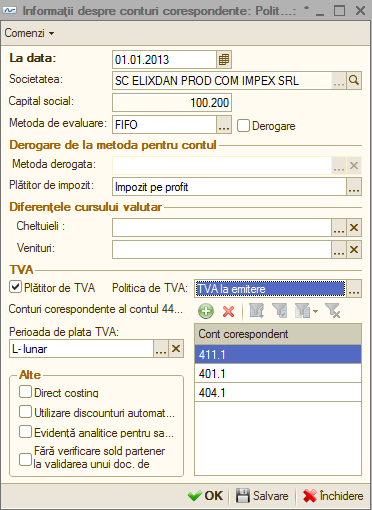
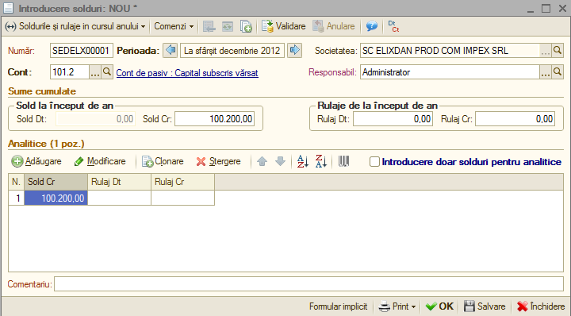
.. |image59| image:: media/image59.png
   :width: 4.52008in
   :height: 5.32205in
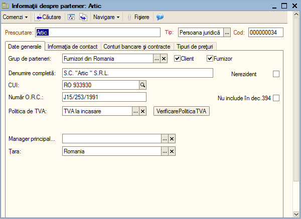
.. |image61| image:: media/image61.png
   :width: 3.03478in
   :height: 1.81739in
.. |image62| image:: media/image62.png
   :width: 6.92913in
   :height: 1.13386in
.. |image63| image:: media/image63.png
   :width: 6.08978in
   :height: 3.37391in
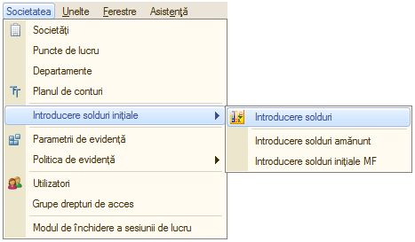
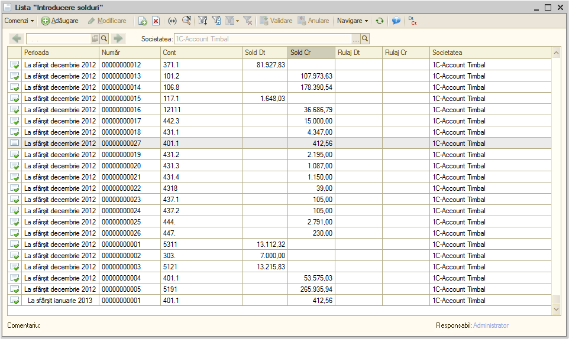
.. |image66| image:: media/image66.png
   :width: 6.51202in
   :height: 3.81739in
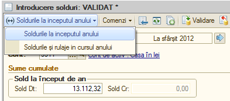
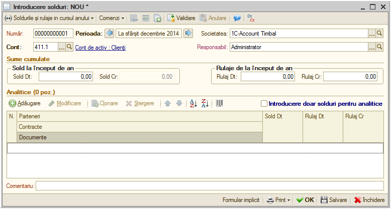
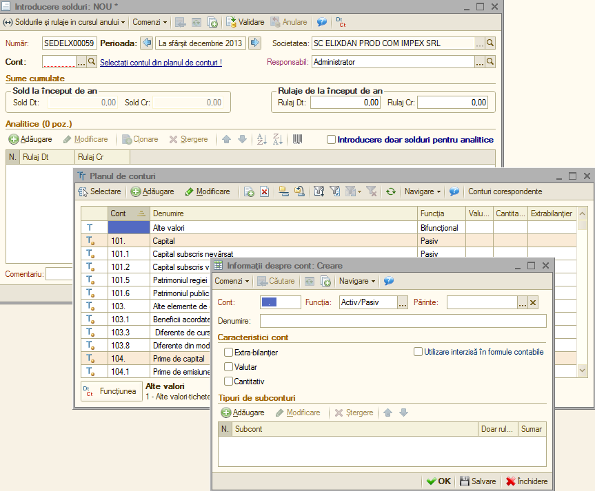
.. |image70| image:: media/image70.png
   :width: 6.92847in
   :height: 3.56852in
.. |image71| image:: media/image71.png
   :width: 7.11304in
   :height: 3.03805in
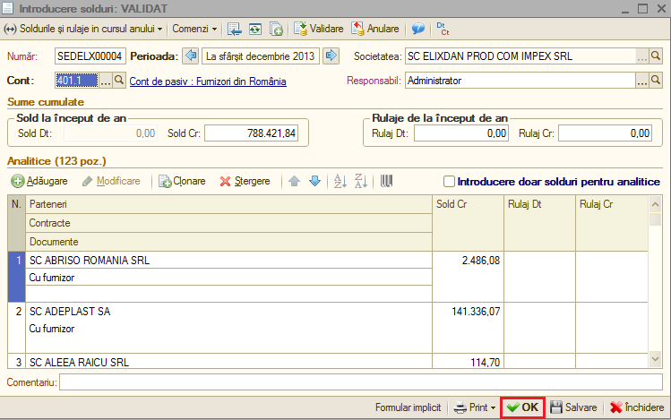
.. |image73| image:: media/image73.png
   :width: 6.42609in
   :height: 4.40869in
.. |image74| image:: media/image74.png
   :width: 6.20748in
   :height: 4.96929in
.. |image75| image:: media/image75.png
   :width: 6.92795in
   :height: 4.2374in
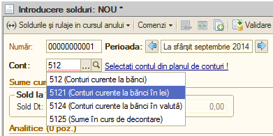
.. |image77| image:: media/image77.png
   :width: 6.92153in
   :height: 3.77361in
.. |image78| image:: media/image78.png
   :width: 4.5913in
   :height: 4.14784in
.. |image79| image:: media/image79.png
   :width: 6.85217in
   :height: 2.94381in
.. |image80| image:: media/image80.png
   :width: 6.1913in
   :height: 4.25446in
.. |image81| image:: media/image81.png
   :width: 6.92153in
   :height: 3.62639in
.. |image82| image:: media/image82.png
   :width: 6.92153in
   :height: 4.12153in
.. |image83| image:: media/image83.png
   :width: 4.53889in
   :height: 2.89583in
.. |image84| image:: media/image84.png
   :width: 6.92153in
   :height: 3.86944in
.. |image85| image:: media/image85.png
   :width: 6.92153in
   :height: 3.2in
.. |image86| image:: media/image86.png
   :width: 7.36522in
   :height: 3.84841in
.. |image87| image:: media/image87.png
   :width: 6.8087in
   :height: 3.86624in
.. |image88| image:: media/image88.png
   :width: 6.93056in
   :height: 4in

.. |image91| image:: media/image91.png
   :width: 5.11304in
   :height: 4.49639in
.. |image92| image:: media/image92.png
   :width: 7.13983in
   :height: 3.13043in
.. |image93| image:: media/image93.emf
   :width: 0.32835in
   :height: 0.27362in

.. |image95| image:: media/image95.png
   :width: 5.5913in
   :height: 4.14815in
.. |image96| image:: media/image96.emf
   :width: 0.28346in
   :height: 0.21654in
.. |image97| image:: media/image97.png
   :width: 6.5437in
   :height: 3.92717in
.. |image98| image:: media/image98.png
   :width: 6.81923in
   :height: 2.90435in

.. |image100| image:: media/image100.png
   :width: 7.22375in
   :height: 3.86087in
.. |image101| image:: media/image101.png
   :width: 5.51304in
   :height: 3.90111in
.. |image102| image:: media/image102.png
   :width: 7.13823in
   :height: 2.98261in

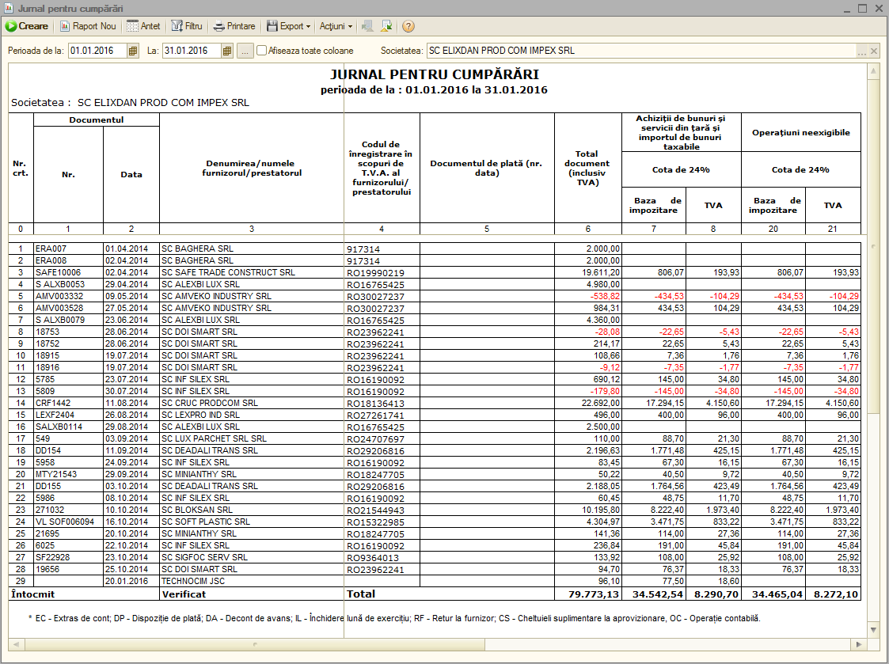

.. |image106| image:: media/image106.png
   :width: 7.15794in
   :height: 3.93913in

.. |image108| image:: media/image108.png
   :width: 4.89565in
   :height: 4.4884in
.. |image109| image:: media/image109.png
   :width: 5.5913in
   :height: 4.03381in

.. |image112| image:: media/image112.png
   :width: 5.43478in
   :height: 3.78837in
.. |image113| image:: media/image113.png
   :width: 5.53044in
   :height: 3.27934in

.. |image118| image:: media/image118.png
   :width: 5.86957in
   :height: 4.25691in
.. |image119| image:: media/image119.png
   :width: 7.23003in
   :height: 3.46087in
.. |image120| image:: media/image120.png
   :width: 5.94783in
   :height: 3.96064in
.. |image121| image:: media/image121.png
   :width: 6.93056in
   :height: 3.67847in
.. |image122| image:: media/image122.png
   :width: 7.21739in
   :height: 3.23686in
.. |image123| image:: media/image123.png
   :width: 4.95652in
   :height: 4.37836in

.. |image127| image:: media/image127.png
   :width: 4in
   :height: 3.77086in
.. |image128| image:: media/image96.emf
   :width: 0.28346in
   :height: 0.21654in
.. |image129| image:: media/image128.png
   :width: 7.25268in
   :height: 4in
.. |image130| image:: media/image129.emf
   :width: 0.28346in
   :height: 0.19724in

.. |image132| image:: media/image129.emf
   :width: 0.28346in
   :height: 0.19724in

.. |image134| image:: media/image132.png
   :width: 5.67826in
   :height: 4.02653in
.. |image135| image:: media/image133.png
   :width: 7.06957in
   :height: 5.28427in

.. |image137| image:: media/image135.png
   :width: 2.70209in
   :height: 1.11304in
.. |image138| image:: media/image136.png
   :width: 7.32421in
   :height: 0.15652in
.. |image139| image:: media/image137.png
   :width: 5.54252in
   :height: 4.29252in

.. |image141| image:: media/image139.png
   :width: 3.57391in
   :height: 1.44064in
.. |image142| image:: media/image140.png
   :width: 4.83478in
   :height: 3.27788in
.. |image143| image:: media/image141.png
   :width: 4.95652in
   :height: 2.83753in
.. |image144| image:: media/image142.png
   :width: 3.13044in
   :height: 3.13044in

.. |image146| image:: media/image144.png
   :width: 3.32205in
   :height: 1.0937in

.. |image150| image:: media/image148.png
   :width: 3.02118in
   :height: 1.1913in
.. |image151| image:: media/image149.png
   :width: 6.52174in
   :height: 3.79672in

.. |image153| image:: media/image151.png
   :width: 6.41739in
   :height: 3.66037in
.. |image154| image:: media/image152.png
   :width: 6.5913in
   :height: 3.77118in

.. |image156| image:: media/image154.png
   :width: 5.44348in
   :height: 3.53117in

.. |image159| image:: media/image157.png
   :width: 5.92174in
   :height: 4.30187in

.. |image163| image:: media/image96.emf
   :width: 0.28346in
   :height: 0.21654in
.. |image164| image:: media/image161.png
   :width: 7.14734in
   :height: 1.93043in
.. |image165| image:: media/image162.png
   :width: 7.11554in
   :height: 3.18261in
.. |image166| image:: media/image163.png
   :width: 7.15652in
   :height: 3.20956in
.. |image167| image:: media/image164.png
   :width: 6.26452in
   :height: 1.73913in

.. |image169| image:: media/image166.png
   :width: 7.13278in
   :height: 2.93913in
.. |image170| image:: media/image167.png
   :width: 7.17566in
   :height: 3.05217in
.. |image171| image:: media/image168.png
   :width: 6.73044in
   :height: 3.1542in

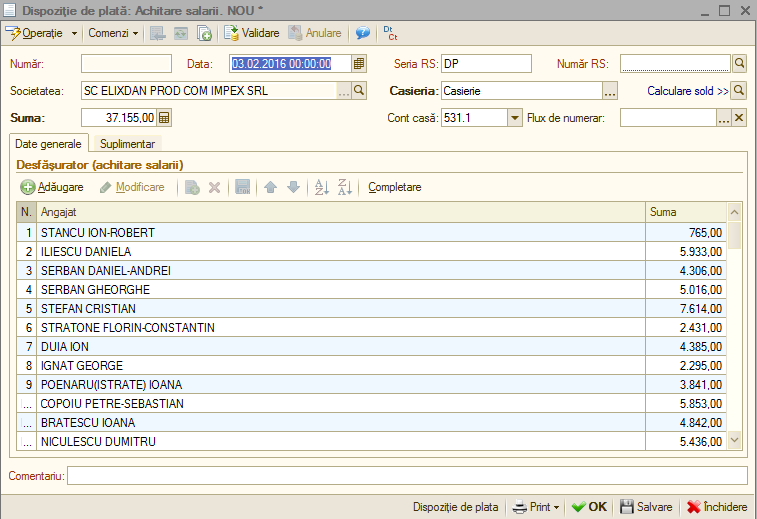

.. |image176| image:: media/image173.png
   :width: 5.72978in
   :height: 3.27826in
.. |image177| image:: media/image174.png
   :width: 5.87826in
   :height: 2.8138in

.. |image179| image:: media/image176.png
   :width: 5.49565in
   :height: 2.5893in

.. |image181| image:: media/image96.emf
   :width: 0.28346in
   :height: 0.21654in
.. |image182| image:: media/image178.png
   :width: 6.02868in
   :height: 3.58261in

.. |image185| image:: media/image181.png
   :width: 7.20366in
   :height: 3.33044in
.. |image186| image:: media/image182.png
   :width: 7.16604in
   :height: 3.31304in

.. |image190| image:: media/image186.png
   :width: 6.41739in
   :height: 3.19648in

.. |image192| image:: media/image188.png
   :width: 6.37391in
   :height: 3.49104in

.. |image195| image:: media/image191.png
   :width: 5.78261in
   :height: 3.28873in

.. |image197| image:: media/image96.emf
   :width: 0.28346in
   :height: 0.21654in

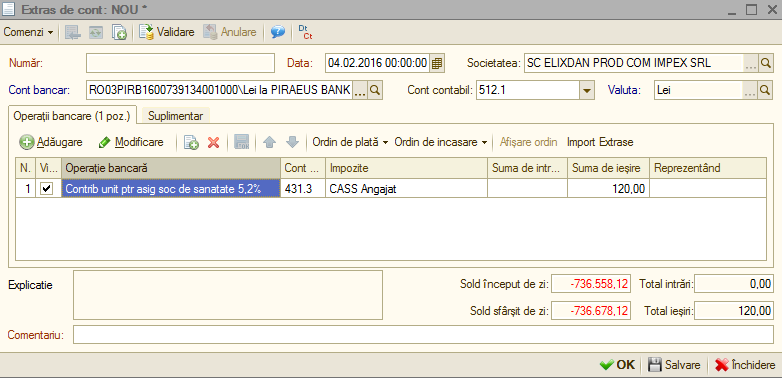
.. |image200| image:: media/image96.emf
   :width: 0.28346in
   :height: 0.21654in
.. |image201| image:: media/image195.png
   :width: 7.18261in
   :height: 2.61664in
.. |image202| image:: media/image196.png
   :width: 7.09565in
   :height: 1.75629in
.. |image203| image:: media/image197.png
   :width: 7.09565in
   :height: 1.7029in

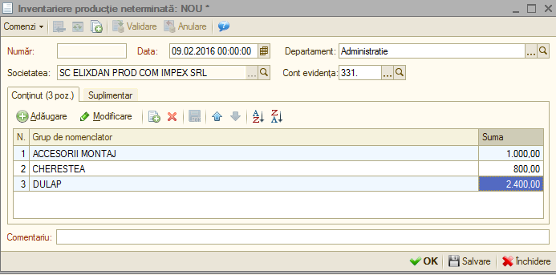

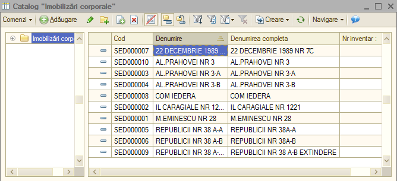
.. |image211| image:: media/image205.png
   :width: 4.26087in
   :height: 4.01066in
.. |image212| image:: media/image206.png
   :width: 6.5913in
   :height: 3.40727in
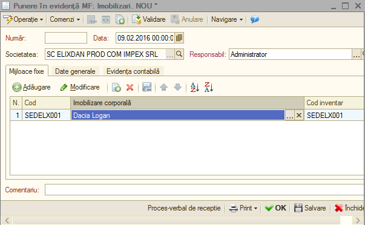
.. |image214| image:: media/image208.png
   :width: 5.66087in
   :height: 3.4827in
.. |image215| image:: media/image209.png
   :width: 5.26087in
   :height: 3.96526in
.. |image216| image:: media/image210.png
   :width: 5.1913in
   :height: 4.96363in
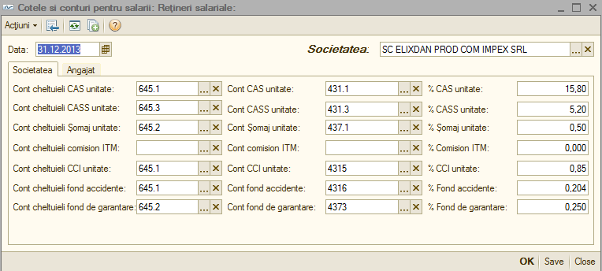
.. |image218| image:: media/image212.png
   :width: 5.33044in
   :height: 2.08097in
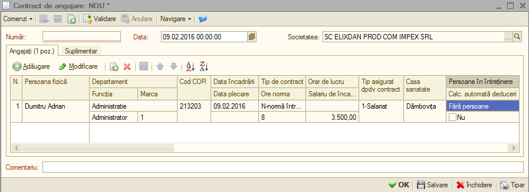
.. |image220| image:: media/image214.png
   :width: 5.38261in
   :height: 2.92059in
.. |image221| image:: media/image215.png
   :width: 6.32174in
   :height: 4.67011in
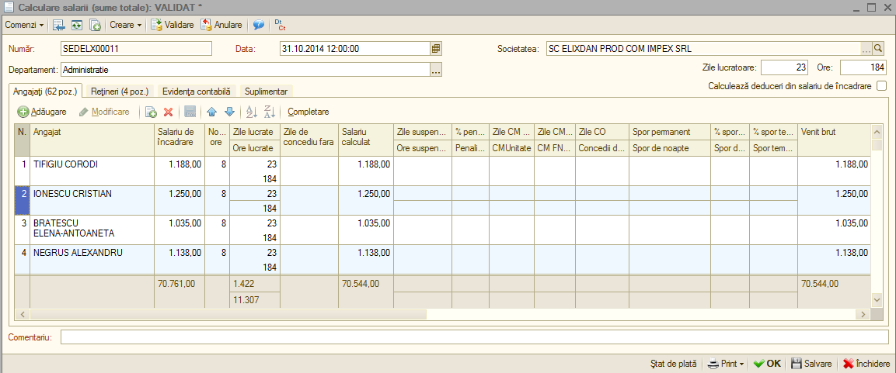
.. |image223| image:: media/image217.png
   :width: 5.84348in
   :height: 2.86282in
.. |image224| image:: media/image218.png
   :width: 6.21739in
   :height: 3.54915in
.. |image225| image:: media/image219.png
   :width: 2.86956in
   :height: 5.59604in
.. |image226| image:: media/image220.png
   :width: 7.18986in
   :height: 2.55652in
.. |image227| image:: media/image221.png
   :width: 2.3437in
   :height: 2.70827in
.. |image228| image:: media/image222.png
   :width: 6.18261in
   :height: 2.64065in
.. |image229| image:: media/image223.png
   :width: 7.12576in
   :height: 3.04348in
.. |image230| image:: media/image224.png
   :width: 5.98023in
   :height: 5.25217in
.. |image231| image:: media/image225.png
   :width: 6.66957in
   :height: 3.66167in
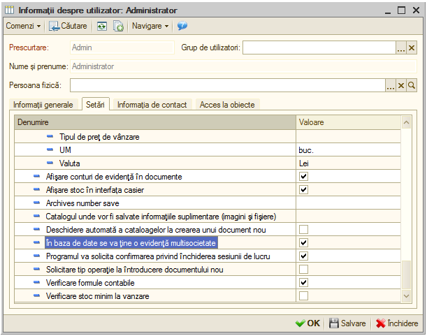
.. |image233| image:: media/image227.emf
   :width: 0.62992in
   :height: 0.17008in
.. |image234| image:: media/image1.emf
   :width: 2.83346in
   :height: 1.0626in
